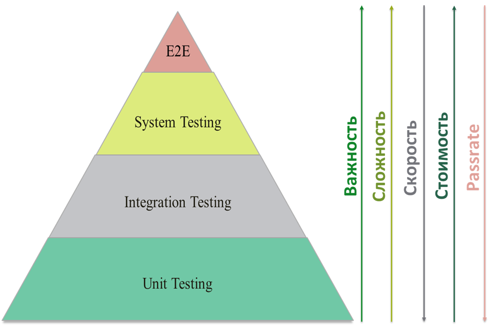
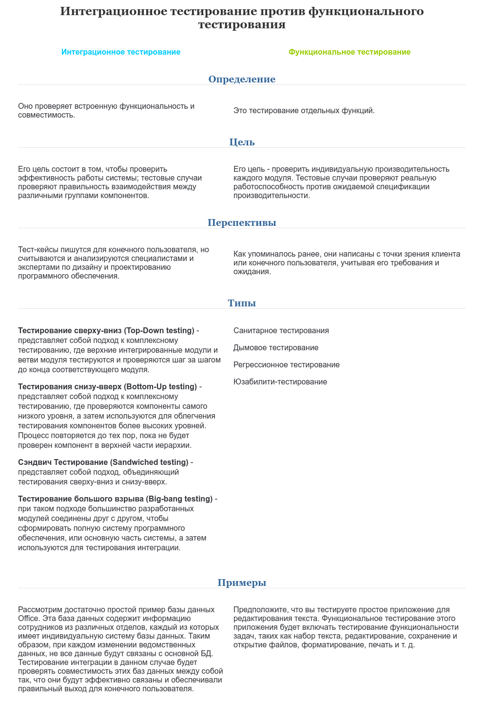

# Python

## Последовательности

### Что такое последовательность

Последовательностью в Python называется итерабельный объект, который поддерживает эффективный доступ к элементам с использованием целочисленных индексов через специальный метод `__getitem__()` и поддерживает метод `__len__()`, который возвращает длину последовательности.
К основным встроенным типам последовательностей относятся list, tuple, range, str и bytes.

Последовательности также опционально могут реализовывать методы `count()`, `index()`, `__contains__()` и `__reversed__()` и другие.

### Какие операции поддерживают большинство последовательностей

- `x in s`, `x not in s` – находится ли элемент x в последовательности s (для строк и последовательностей байтов – является ли x подстрокой s)
- `s + t` – конкатенация последовательностей
- `s * n, n * s` – конкатенация n нерекурсивных копий последовательности s
- `s[i]` – i-й элемент последовательности s
- `s[i:j]` – срез последовательности s от i до j
- `s[i:j:k]` – срез последовательности s от i до j с шагом k
- `len(s)` – длина последовательности
- `min(s)` – минимальный элемент последовательности
- `max(s)` – максимальный элемент последовательности
- `s.index(x[, i[, j]])` – индекс первого вхождения x (опционально – начиная с позиции i и до позиции j)
- `s.count(x)` – общее количество вхождений x в s
- `sum(s)` – сумма элементов последовательности

Неизменяемые последовательности обычно реализуют операцию hash(s) – хеш-значение объекта.

Большинство изменяемых последовательностей поддерживают следующие операции:

- `s[i] = x` – элемент с индексом i заменяется на x
- `s[i:j] = t`, `s[i:j:k] = t` – элементы с индексами от i до j (с шагом k) заменяются содержимым итерабельного объекта t
- `del s[i:j]`, `del s[i:j:k]` – удаление соответствующих элементов из последовательности
- `s.append(x)` – добавление x в конец последовательности
- `s.clear()` – удаление всех элементов последовательности
- `s.copy()` – нерекурсивная копия последовательности
- `s.extend(t)` – добавление всех элементов итерабельного объекта в конец последовательности
- `s.insert(i, x)` – вставка элемента x по индексу i
- `s.pop()`, `s.pop(i)` – возврат значения по индексу i (по умолчанию – последний элемент) и удаление его из последовательности
- `s.remove(x)` – удаление первого вхождения x
- `s.reverse()` – разворот последовательности в обратном порядке

### Какие виды строк бывают в питоне

Зависит от версии Питона. Во второй ветке два типа: однобайтные строки и Юникод представлены классами str и unicode соответственно. В третьем Питоне есть один вид строк str, который представляет собой Юникод. Однобайтных строк нет, вместо них есть тип bytes, то есть цепочка байт.

### Можно ли изменить отдельный символ внутри строки

Нет, строки неизменяемы. Операции замены, форматирования и конкатенации возвращают новую строку.

### Как соединить список строк в одну. Как разбить строку на список строк

Чтобы соединить, нужен метод строки `.join()`. Чтобы разбить, метод `.split()`.

### Как кодировать и декодировать строки

Кодировать – перевести Юникод в байтовую строку. Вызвать метод `.encode()` у строки.

Декодировать – восстановить строку из цепочки байт. Вызвать метод `.decode()` у объекта `str` или `bytes` (версии Питона 2 и 3 соответственно).

В обоих случаях явно передавать кодировку, иначе будет использована та, что определена в системе по умолчанию. Быть готовым поймать исключения `UnicodeEncodeError`, `UnicodeDecodeError`.

### Чем список отличается от кортежа

Списки – это изменяемые последовательности, обычно используемые для хранения однотипных данных (хотя Python не запрещает хранить в них данные разных типов). Представлены классом list.

Кортежи – это неизменяемые последовательности, обычно используемые, чтобы хранить разнотипные данные. Представлены классом tuple.

На уровне языка отличаются тем, что в кортеж нельзя добавить или убрать элемент. На уровне интерпретатора различий нет. Обе коллекции представлены массивом указателей на структуру `PyObject`.

Для списка определены функции, которые добавляют в такой массив новый элемент, удаляют имеющийся, соединяют два массива в один. Они вызываются методами списка `.append()`, `.pop()`, `.sort()` и т.д.

### Что такое диапазон

Диапазоны – неизменяемые последовательности чисел, которые задаются началом, концом и шагом. Представлены классом range (в Python 2 – xrange; range в Python 2 – это функция, которая возвращает список).
Параметры конструктора должны быть целыми числами (либо экземпляры класса int, либо любой объект с методом `__index__`)
Поддерживает все общие для последовательностей операции, кроме конкатенации и повторения, а также, в версиях Python до 3.2, срезов и отрицательных индексов.

### Как сделать список уникальным (без повторяющихся элементов)

Вариант со множеством. Не гарантирует порядок элементов. Порядок сохраняется только для маленьких списков.

```python
list(set([1, 2, 2, 2, 3, 3, 1]))
>>> [1, 2, 3]
```

Вариант с OrderedDict. Гарантирует порядок элементов.

```python
>>> from collections import OrderedDict
>>> list(OrderedDict.fromkeys([1, 2, 2, 2, 3, 3, 1]))
[1, 2, 3]
```

Вариант с циклом. Медленно, но гарантирует порядок. Подходит, если элементы нельзя помещать внутрь множества (например, словари).

```python
res = []
for x in [1, 2, 2, 2, 3, 3, 1]:
    if x not in res:
        res.append(x)
>>> [1, 2, 3]
```

### Есть кортеж из трех элементов. Назначить переменным a, b, c его значения

`a, b, c = (1, 2, 3)`

### Как сравниваются последовательности

Две последовательности равны, если они имеют одинаковый тип, равную длину и соответствующие элементы обоих последовательностей равны.

Последовательности одинаковых типов можно сравнивать. Сравнения происходят в лексикографическом порядке: последовательность меньшей длины меньше, чем последовательность большей длины, если же их длины равны, то результат сравнения равен результату сравнения первых отличающихся элементов.

## Множества и отображения

### Как понять хешируемый ли объект

Объект называется хешируемым, если он имеет хеш-значение (целое число), которое никогда не изменяется на протяжении его жизненного цикла и возвращается методом `__hash__()`, и может сравниваться с другими объектами (реализует метод `__eq__()`). Равные хешируемые объекты должны иметь равные хеш-значения.
Все стандартные неизменяемые объекты хешируемые. Все стандартные изменяемые объекты не хешируемые.

### Что такое множество

Множество – это неупорядоченная коллекция хешируемых объектов, которые не повторяются.
В множествах нет понятия позиции элемента. Соответственно, они не поддерживают индексацию и срезы.
Встроенные классы множеств: set (изменяемое множество), frozenset (неизменяемое множество).

### Для чего применяются множества

Обычно используются для проверки элемента на вхождение в множество и удаление повторений элементов и выполнения таких операций, как объединение, пересечение, разница и симметрическая разница.

### Какие операции можно производить над множествами

- `set([iterable])`, `frozenset([iterable])` – создание множества (пустого или из элементов итерабельного объекта)
- `len(s)` – количество элементов множества
- `x in s`, `x not in s` – проверка нахождения элемента в множестве
- `s.isdisjoint(t)` – проверка того, что данное множество не имеет общих элементов с заданным
- `s.issubset(t)`, `s <= t` – проверка того, что все элементы множества s являются элементами множества t
- `s < t` – проверка того, что s <= t и s != t
- `s.isuperset(t)`, `s >= t` – проверка того, что все элементы множества t являются элементами множества s
- `s > t` – проверка того, что `s >= t` и `s != t`
- `s.union(t, ...)`, `s | t | ...` – создание нового множества, которое является объединением данных множеств
- `s.intersection(t, ...)`, `s & t & ...` – создание нового множества, которое является пересечением данных множеств
- `s.difference(t, ...)`, `s - t - ...` – создание нового множества, которое является разницей данных множеств
- `s.symmetric_difference(t)`, `s ^ t` – создание нового множества, которое является симметрической разницей данных множеств (то есть, разница объединения и пересечения множеств)
- `s.copy()` – неполная копия множества s

Операции над множествами, которые являются методами, принимают в качестве аргументов любые итерабельные объекты. Операции над множествами, записанные в виде бинарных операций, требуют, чтобы второй операнд операции тоже был множеством, и возвращают множество того типа, которым было первое множество.

Операции над изменяемыми множествами:

- `s.update(t, ...)`, `s |= t | ...` – добавить в данное множество элементы из других множеств
- `s.intersection_update(t, ...)`, `s &= t & ...` – оставить в данном множестве только те элементы, которые есть и в других множествах
- `s.difference_update(t, ...)`, `s -= t | ...` – удалить из данного множества те элементы, которые есть в других множествах
- `s.symmetric_difference_update(t)`, `s ^= t` – оставить или добавить в s элементы, которые есть либо в s, либо в t, но не в обоих множествах
- `s.add(element)` – добавить новый элемент в множество
- `s.remove(element)` – удалить элемент из множества; если такого элемента нет, возникает исключение KeyError
- `s.discard(element)` – удалить элемент из множества, если он в нём находится
- `s.pop()` – удалить из множества и вернуть произвольный элемент; если множество пустое, возникает исключение KeyError
- `s.clear()` – удалить все элементы множества.

### Как происходит проверка множеств на равенство

Проверка множеств на равенство происходит поэлементно, независимо от типов множеств.

### Что такое отображение

Отображение (mapping) – это объект-контейнер, который поддерживает произвольный доступ к элементам по ключам и описывает все методы, описанные в абстрактном базовом классе `collections.Mapping` (`get()`, `items()`, `keys()`, `values()`) или `collections.MutableMapping` (`clear()`, `get()`, `items()`, `keys()`, `pop()`, `popitem()`, `setdefault()`, `update()`, `values()`).
К отображениям относятся классы `dict`, `collections.defaultdict`, `collections.OrderedDict` и `collections.Counter`.

### Какие нюансы есть в использовании чисел как ключей

Числовые ключи в словарях подчиняются правилам сравнения чисел. Таким образом, `int(1)` и `float(1.0)` считаются одинаковым ключом. Однако из-за того, что значения типа float сохраняются приближенно, не рекомендуется использовать их в качестве ключей.

```python
>>> {True: 'yes', 1: 'no', 1.0: 'maybe'}
{True: 'maybe'}
```

### Какие операции можно производить над отображениями

- `len(d)` – количество элементов.
- `d[key]` – получение значения с ключом key. Если такой ключ не существует и отображение реализует специальный метод `__missing__(self, key)`, то он вызывается. Если ключ не существует и метод `__missing__` не определён, выбрасывается исключение KeyError.
- `d[key] = value` – изменить значение или создать новую пару ключ-значение, если ключ не существует.
- `key in d`, `key not in d` – проверка наличия ключа в отображении.
- `iter(d)` – то же самое, что iter(d.keys()).
- `clear()` – удалить все элементы словаря.
- `copy()` – создать неполную копию словаря.
- `(метод класса) dict.fromkeys(sequence[, value])` – создаёт новый словарь с ключами из последовательности sequence и заданным значением (по умолчанию – None).
- `d.get(key[, default])` – безопасное получение значения по ключу (никогда не выбрасывает KeyError). Если ключ не найден, возвращается значение default (по-умолчанию – None).
- `d.items()` – в Python 3 возвращает объект представления словаря, соответствующий парам (двухэлементным кортежам) вида (ключ, значение). В Python 2 возвращает соответствующий список, а метод iteritems() возвращает итератор. Аналогичный метод в Python 2.7 – viewitems().
- `d.keys()` – в Python 3 возвращает объект представления словаря, соответствующий ключам словаря. В Python 2 возвращает соответствующий список, а метод iterkeys() возвращает итератор. Аналогичный метод в Python 2.7 – viewkeys().
- `d.pop(key[, default])` – если ключ key существует, удаляет элемент из словаря и возвращает его значение. Если ключ не существует и задано значение default, возвращается данное значение, иначе выбрасывается исключение KeyError.
- `d.popitem()` – удаляет произвольную пару ключ-значение и возвращает её. Если словарь пустой, возникает исключение KeyError. Метод полезен для алгоритмов, которые обходят словарь, удаляя уже обработанные значения (например, определённые алгоритмы, связанные с теорией графов).
- `d.setdefault(key[, default])` – если ключ key существует, возвращает соответствующее значение. Иначе создаёт элемент с ключом key и значением default. default по умолчанию равен None.
- `d.update(mapping)` – принимает либо другой словарь или отображение, либо итерабельный объект, состоящий из итерабельных объектов – пар ключ-значение, либо именованные аргументы. Добавляет соответствующие элементы в словарь, перезаписывая элементы с существующими ключами.
- `d.values()` – в Python 3 возвращает объект представления словаря, соответствующий значениям. В Python 2 возвращает соответствующий список, а метод itervalues() возвращает итератор. Аналогичный метод в Python 2.7 – viewvalues().

### Что возвращает метод items

Объекты, возвращаемые методами `items()`, `keys()` и `values()` (`viewitems()`, `viewkeys()`, `viewvalues()` в Python 2.7) – это объекты *представления словаря*. Они предоставляют динамическое представление элементов словаря, то есть изменения данного словаря автоматически отображаются и на этих объектах.

Операции с представлениями словарей:

- `iter(dictview)` – получение итератора по ключам, значениям или парам ключей и значений. Все представления словарей при итерировании возвращают элементы словаря в одинаковом порядке. При попытке изменить словарь во время итерирования может возникнуть исключение RuntimeError
- `len(dictview)` – количество элементов в словаре.
- `x in dictview` – проверка существования ключа, значения или пары ключ-значение в словаре.

### Как отсортировать список словарей по определенному полю

Метод списка `.sort()` и встроенная функция `sorted()` принимают параметр `key`. Им должен быть вызываемый объект, который принимает очередной элемент (в нашем случае словарь) и возвращает значение-критерий сортировки.

Код ниже показывает, как отсортировать список людей по возрасту:

```python
users = [{'age': 30}, {'age': 20}, {'age': 10}]
users.sort(key=lambda user: user['age'])
>>> [{'age': 10}, {'age': 20}, {'age': 30}]
```

### Что может являться ключом словаря. Что не может. Почему

Ключом словаря может быть любой хешируемый неизменяемый объект: число, строка, datetime, функция и даже модуль. Такие объекты имеют метод `__hash__()`, который однозначно сопоставляет объект с некоторым числом. По этому числу словарь ищет значение для ключа.

Списки, словари и множества изменяемы и не имеют метода хеширования. При подстановке их в словарь возникнет ошибка.

Хеш кортежа вычисляется рекурсивно по всем элементам. Так, кортеж

`(1, (True, (42, ('hello', ))))`
состоит только из неизменяемых элементов, поэтому может быть ключом. Однако, такой кортеж

`(1, (True, (42, ({'hello': 'world'}, ))))`
содержит глубоко внутри словарь, поэтому хеш не может быть рассчитан.

### Есть два списка – ключи и значения. Как составить из них словарь

```python
keys = ['foo', 'bar', 'baz']
vals = [1, 2, 3]
dict(zip(keys, vals))
>>> {'baz': 3, 'foo': 1, 'bar': 2}
```

Функция `zip` отдает список пар N-ых элементов. Конструктор `dict` принимает список пар. Каждую пару он рассматривает как ключ и значение соответственно.

### Как работает хэш-таблица

Хэш-таблица это разреженный массив (массив, в котором имеются незаполненные позиции). В стандартных англоязычных учебниках ячейки хэш-таблицы называются "bucket". В хэш-таблице dict каждому элементу соотвествует ячейка, содержащая два поля: ссылку на ключ и ссылку на значение элемента. Поскольку размер всех ячеек одинаков, доступ к отдельной ячейке производится по смещению.

Python стремится оставить не менее трети ячеек пустыми; если хэш-таблица становится чрезмерно заполненной, то она копируется в новый участок памяти, где есть место для большего числа ячеек.

Для помещения элемента в хэш-таблицу нужно первым делом вычислить хэш-значение ключа элемента. Это делает встроенная функция `hash()`.

Для выборки значения с помощью выражения `my_dict[search_key]` Python обращается к функции `hash(search_key)`, чтобы получить хэш-значение search_key, и использует несколько младших битов полученного числа как смещение ячейки относительно начала хэш-таблицы (сколько именно битов зависит от текущего размера таблицы). Если найденная ячейка пуста, возбуждается исключение `KeyError`. В противном случае в найденной ячейке есть какой-то элемент - пара `ключ:значение` - и тогда Python проверяет, верно ли то, что search_key == found_key. Если да, то элемент найден и возвращается found_value. Если же search_key и found_key не совпали, то имеет место *коллизия хэширования*. Для разрешения коллизии алгоритм берет различные биты хэш-значения, производит над ними определенные действия и использует результат как смещение другой ячейки.

### Что такое коллизия

Когда хеш-функция возвращает один и тот же ответ для разных данных.

### Где будет быстрее поиск, а где перебор и почему: dict, list, set, tuple

Поиск будет быстрее в dict и set, потому что это хэш-таблицы, доступ к элементу которых выполняется за O(1). Для list и tuple поиск будет выполняться в среднем за O(n).

Исключение работает только для очень маленьких списков длиной до 5 элементов. В этом случае интерпретатору будет быстрей пробежаться по списку, чем считать хеш.

В Python 2 методы словаря `keys`, `values`, `items` возвращают список. Тоесть перед итерацией по словарю (или сету) интерпретатор сначала создает новый список, что занимает дополнительное время и память, но после создания это уже обыкновенный список. Тоесть в Python 2 итерация по словарям и сетам выполняется дольше, за счет создания нового списка и копирования в него элементов.

В Python 3 эти методы создают объект-представление. Это определенно происходит быстрее чем создание нового списка в Python2. Но итерирование по такому представлению должно происходить немного дольше, чем по списку из-за того что данные в словарях хранятся разреженно (редко, негусто). В подтверждение вышесказанного (Python 3):

```python
>>> l = list(range(1000000))
>>> d = dict.fromkeys(l)
>>> s = set(l)
>>> def iter_list():
...     for i in l:
...         pass
...
>>> def iter_dict():
...     for i in d:
...         pass
...
>>> def iter_set():
...     for i in s:
...         pass
...
>>> timeit.timeit(iter_list, number=1000)
 6.727667486004066
>>> timeit.timeit(iter_dict, number=1000)
 9.293120226997416
>>> timeit.timeit(iter_set, number=1000)
 8.627948219014797
```

## Функции

### Что такое args, kwargs. В каких случаях они требуются

Выражения `*args` и `**kwargs` объявляют в сигнатуре функции. Они означают, что внутри функции будут доступны переменные с именами `args` и `kwargs` (без звездочек). Можно использовать другие имена, но это считается дурным тоном.

`args` – это кортеж, который накапливает позиционные аргументы. `kwargs` – словарь именованных аргументов, где ключ – имя параметра, значение – значение параметра.

**Важно:** если в функцию не передано никаких параметров, переменные будут соответственно равны пустому кортежу и пустому словарю, а не `None`.

Пожалуйста, не путайте кортеж со списком. Следующий вопрос объясняет, почему.

### Почему использовать изменяемые объекты как параметры по-умолчанию плохо. Приведите пример плохого случая. Как исправить

Функция создается однажды при загрузке модуля. Именованные параметры и их дефолтные значения тоже создаются один раз и хранятся в одном из полей объекта-функции.

В нашем примере `bar` равен пустому списку. Список – изменяемая коллекция, поэтому значение `bar` может изменяться от вызова к вызову. Пример:

```python
def foo(bar=[]):
    bar.append(1)
    return bar
foo()
>>> [1]
foo()
[1, 1]
foo()
>>> [1, 1, 1]
```

Хорошим тоном считается указывать параметру пустое неизменяемое значение, например `0`, `None`, `''`, `False`. В теле функции проверять на заполненность и создавать новую коллекцию:

```python
def foo(bar=None):
    if bar is None:
        bar = []
    bar.append(1)
    return bar
foo()
>>> [1]
foo()
>>> [1]
foo()
>>> [1]
```

Сказанное выше актуально в т.ч. для множеств и словарей.

### Можно ли передавать функцию в качестве аргумента другой функции

Можно, функция в Питоне объект первого порядка: допускает присваивание, передачу в функцию, удаление.

### Можно ли объявлять функцию внутри другой функции. Где она будет видна

Можно. Такая функция будет видна только внутри первой функции.

### Что такое лямбды. Каковы их особенности

Это анонимные функции. Они не резервируют имени в пространстве имен. Лямбды
часто передают в функции `map`, `reduce`, `filter`.

Лямбды в Питоне могут состоять только из одного выражения. Используя синтаксис
скобок, можно оформить тело лямбды в несколько строк.

Использовать точку с запятой для разделения операторов нельзя.

### Допустимы ли следующие выражения

- `nope = lambda: pass`
- `riser = lambda x: raise Exception(x)`

Нет, при загрузке модуля выскочит исключение `SyntaxError`. В теле лямбды может
быть только выражение. `pass` и `raise` являются операторами.

### Как передаются значения аргументов в функцию или метод

- [How do I write a function with output parameters (call by reference)?](https://docs.python.org/3/faq/programming.html#how-do-i-write-a-function-with-output-parameters-call-by-reference)
- [Интересности и полезности python. Часть 3](https://habr.com/ru/post/422951/)

В таких языках как C++ есть переменные, хранящиеся на стеке и в динамической памяти. При вызове функции мы помещаем все аргументы на стек, после чего передаём управление функции. Она знает размеры и смещения переменных на стеке, соответственно может их правильно интерпретировать.
При этом у нас есть два варианта: скопировать на стек память переменной или положить ссылку на объект в динамической памяти (или на более высоких уровнях стека).
Очевидно, что при изменении значений на стеке функции, значения в динамической памяти не поменяются, а при изменении области памяти по ссылке, мы модифицируем общую память, соответственно все ссылки на эту же область памяти «увидят» новое значение.

В python отказались от подобного механизма, заменой служит механизм *связывания (assignment)* имени переменной с объектом, например при создании переменной:
`var = "john"`

Интерпретатор создаёт объект «john» и «имя» var, а затем связывает объект с данным именем.
При вызове функции, новых объектов не создаётся, вместо этого в её области видимости создаётся имя, которое связывается с существующим объектом.
Но в python есть изменяемые и неизменяемые типы. Ко вторым, например, относятся числа: при арифметических операциях существующие объекты не меняются, а создаётся новый объект, с которым потом связывается существующее имя. Если же со старым объектом после этого не связано ни одного имени, оно будет удалено с помощью механизма подсчёта ссылок.
Если же имя связано с переменной изменяемого типа, то при операциях с ней изменяется память объекта, соответственно все имена, связанные с данной областью памяти «увидят» изменения.

### Что такое замыкание

Синтаксически это выглядит как функция, находящаяся целиком в теле другой функции. При этом вложенная внутренняя функция содержит ссылки на локальные переменные внешней функции. Каждый раз при выполнении внешней функции происходит создание нового экземпляра внутренней функции, с новыми ссылками на переменные внешней.

## Итераторы и генераторы

- [Генераторы-итераторы Python](https://xakep.ru/2014/10/06/generatora-iteratory-python/)
- [Итерируемый объект, итератор и генератор](https://habr.com/ru/post/337314/)

### Что такое контейнер

Контейнер – это тип данных, который инкапсулирует в себе значения других типов. Списки, кортежи, множества, словари и т.д. являются контейнерами.

### Что такое итерабельный объект

*Итерабельный объект* (в оригинальной терминологии – «iterable») – это объект, который может возвращать значения по одному за раз.
Примеры: все контейнеры и последовательности (списки, строки и т.д.), файлы, а также экземпляры любых классов, в которых определён метод `__iter__()` или `__getitem__()`.
Итерабельные объекты могут быть использованы внутри цикла `for`, а также во многих других случаях, когда ожидается последовательность (функции `sum()`, `zip()`, `map()` и т.д.).

**Подробнее**:

Рассмотрим итерируемый объект (`Iterable`). В стандартной библиотеке он объявлен как абстрактный класс `collections.abc.Iterable`:

```python
class Iterable(metaclass=ABCMeta):

    __slots__ = ()

    @abstractmethod
    def __iter__(self):
        while False:
            yield None

    @classmethod
    def __subclasshook__(cls, C):
        if cls is Iterable:
            return _check_methods(C, "__iter__")
        return NotImplemented
```

У него есть абстрактный метод `__iter__` который должен вернуть объект итератора. И метод `__subclasshook__` который проверяет наличие у класса метод `__iter__`. Таким образом, получается, что итерируемый объект это любой объект который реализует метод `__iter__`

```python
class SomeIterable1(collections.abc.Iterable):
    def __iter__(self):
        pass

class SomeIterable2:
    def __iter__(self):
        pass

print(isinstance(SomeIterable1(), collections.abc.Iterable))
# True
print(isinstance(SomeIterable2(), collections.abc.Iterable))
# True
```

Но есть один момент, это функция `iter()`. Именно эту функцией использует например цикл for для получения итератора. Функция `iter()` в первую очередь для получения итератора из объекта, вызывает его метод `__iter__`. Если метод не реализован, то она проверяет наличие метода `__getitem__` и если он реализован, то на его основе создается итератор. `__getitem__` должен принимать индекс с нуля. Если не реализован ни один из этих методов, тогда будет вызвано исключение `TypeError`.

```python
from string import ascii_letters

class SomeIterable3:
    def __getitem__(self, key):
        return ascii_letters[key]

for item in SomeIterable3():
    print(item)
```

### Что такое итератор

*Итератор* (iterator) – это объект, который представляет поток данных. Повторяемый вызов метода `__next__()` (`next()` в Python 2) итератора или передача его встроенной функции `next()` возвращает последующие элементы потока.

Если больше не осталось данных, выбрасывается исключение `StopIteration`. После этого итератор исчерпан и любые последующие вызовы его метода `__next__()` снова генерируют исключение `StopIteration`.

Итераторы обязаны иметь метод `__iter__`, который возвращает сам объект итератора, так что любой итератор также является итерабельным объектом и может быть использован почти везде, где принимаются итерабельные объекты.

**Подробнее:**

Итераторы представлены абстрактным классом `collections.abc.Iterator`:

```python
class Iterator(Iterable):

    __slots__ = ()

    @abstractmethod
    def __next__(self):
        'Return the next item from the iterator. When exhausted, raise StopIteration'
        raise StopIteration

    def __iter__(self):
        return self

    @classmethod
    def __subclasshook__(cls, C):
        if cls is Iterator:
            return _check_methods(C, '__iter__', '__next__')
        return NotImplemented
```

`__next__` Возвращает следующий доступный элемент и вызывает исключение `StopIteration`, когда элементов не осталось.
`__iter__` Возвращает `self`. Это позволяет использовать итератор там, где ожидается итерируемых объект, например `for`.
`__subclasshook__` Проверяет наличие у класса метода `__iter__` и `__next__`

### Что такое генератор

В зависимости от контекста, может означать либо функцию-генератор, либо итератор генератора (чаще всего, последнее).
Методы `__iter__` и `__next__` у генераторов создаются автоматически.

С точки зрения реализации, *генератор* в Python — это языковая конструкция, которую можно реализовать двумя способами: как функция с ключевым словом `yield` или как генераторное выражение. В результате вызова функции или вычисления выражения, получаем объект-генератор типа `types.GeneratorType`. Канонический пример - генератор, порождающий последовательность чисел Фибоначчи, которая, будучи бесконечна, не смогла бы поместиться ни в одну коллекцию. Иногда термин применяется для самой генераторной функции, а не только объекта, возвращенного ей в качестве результата.

Так как в объекте-генераторе определены методы `__next__` и `__iter__`, то есть реализован протокол итератора, с этой точки зрения, в Python любой генератор является итератором.

Когда выполнение функции-генераторы завершается (при помощи ключевого слова `return` или достижения конца функции), возникает исключение `StopIteration`.

### Что такое генераторная функция

*Генераторная функция* - функция, в теле которой встречается ключевое слово `yield`. Будучи вызвана, такая функция возвращает объект-генератор (generator object) (итератор генератора (generator iterator)).

### Что делает yield

`yield` замораживает состояние функции-генератора и возвращает текущее значение. После следующего вызова `__next__()` функция-генератор продолжает своё выполнение с того места, где она была приостановлена.

### В чем отличие \[x for x in y\] от (x for x in y)

Первое выражение возвращает список (списковое включение), второе – генератор.

### Что особенного в генераторе

Генератор хранит в памяти не все элементы, а только внутреннее состояние для вычисления очередного элемента. На каждом шаге можно вычислить только следующий элемент, но не предыдущий. Пройти генератор в цикле можно только один раз.

### Как объявить генератор

- использовать синтаксис `(x for x in seq)`
- оператор `yield` в теле функции вместо `return`
- встроенная функция `iter`, которая вызывает у объекта метод `__iter__()`. Этот метод должен возвращать генератор.

### Как получить из генератора список

Передать его в конструктор списка: `list(x for x in some_seq)`. Важно, что после этого по генератору уже нельзя будет итерироваться.

### Что такое подгенератор

В Python 3 существуют так называемые подгенераторы (subgenerators). Если в функции-генераторе встречается пара ключевых слов `yield from`, после которых следует объект-генератор, то данный генератор делегирует доступ к подгенератору, пока он не завершится (не закончатся его значения), после чего продолжает своё исполнение.

На самом деле `yield` является выражением. Оно может принимать значения, которые отправляются в генератор. Если в генератор не отправляются значения, результат данного выражения равен `None`.

`yield from` также является выражением. Его результатом является то значение, которое подгенератор возвращает в исключении `StopIteration` (для этого значение возвращается при помощи ключевого слова `return`).

### Какие методы есть у генераторов

- `__next__()` – начинает или продолжает исполнение функции-генератора. Результат текущего yield-выражения будет равен None. Выполнение затем продолжается до следующего yield-выражения, которое передаёт значение туда, где был вызван `__next__`. Если генератор завершается без возврата значения при помощи `yield`, возникает исключение `StopIteration`. Метод обычно вызывается неявно, то есть циклом `for` или встроенной функцией `next()`.
- `send(value)` – продолжает выполнение и отправляет значение в функцию-генератор. Аргумент value становится значением текущего yield-выражения. Метод `send()` возвращает следующее значение, возвращённое генератором, или выбрасывает исключение `StopIteration`, если генератор завершается без возврата значения. Если `send()` используется для запуска генератора, то единственным допустимым значением является `None`, так как ещё не было выполнено ни одно yield-выражение, которому можно присвоить это значение.
- `throw(type[, value[, traceback]])` – выбрасывает исключение типа type в месте, где был приостановлен генератор, и возвращает следующее значение генератора (или выбрасывает `StopIteration`). Если генератор не обрабатывает данное исключение (или выбрасывает другое исключение), то оно выбрасывается в месте вызова.
- `close()` – выбрасывает исключение `GeneratorExit` в месте, где был приостановлен генератор. Если генератор выбрасывает `StopIteration` (путём нормального завершения или по причине того, что он уже закрыт) или `GeneratorExit` (путём отсутствия обработки данного исключения), `close` просто возвращается к месту вызова. Если же генератор возвращает очередное значение, выбрасывается исключение `RuntimeError`. Метод `close()` ничего не делает, если генератор уже завершён.

### Можно ли извлечь элемент генератора по индексу

Нет, будет ошибка. Генератор не поддерживает метод `__getitem__`.

### Что возвращает итерация по словарю

Ключ. Порядок следования ключей не гарантируется (в 3.6 гарантируется неофициально, в 3.7 гарантируется). Для маленьких словарей порядок будет тот же, что и в объявлении. Для больших порядок зависит от расположения элементов в памяти. Особый класс `OrderedDict` учитывает порядок добавления ключей.

```python
for key in {'foo': 1, 'bar': 2}:
    process_key(key)
```

### Как итерировать словарь по парам ключ-значение

Метод словаря `.items()` возвращает генератор кортежей `(key, value)`.

### Что такое сопрограмма

Сопрограмма (англ. coroutine) — компонент программы, обобщающий понятие подпрограммы, который дополнительно поддерживает множество входных точек (а не одну, как подпрограмма) и остановку и продолжение выполнения с сохранением определённого положения.
Расширенные возможности генераторов в Python (выражения yield и yield from, отправка значений в генераторы) используются для реализации сопрограмм.
Сопрограммы полезны для реализации асинхронных неблокирующих операций и кооперативной многозадачности в одном потоке без использования функций обратного вызова (callback-функций) и написания асинхронного кода в синхронном стиле.
Python 3.5 включает в себе поддержку сопрограмм на уровне языка. Для этого используются ключевые слова async и await.

## Классы, объекты

### Как получить список атрибутов объекта

Функция `dir` возвращает список строк – полей объекта. Поле `__dict__` содержит словарь вида `{поле -> значение}`.

### Что такое магические методы, для чего нужны

Магическими метода называют методы, имена которых начинаются и заканчиваются двойным подчеркиванием. Магические они потому, что почти никогда не вызываются явно. Их вызывают встроенные функции или синтаксические конструкции. Например, функция `len()` вызывает метод `__len__()` переданного объекта. Метод `__add__(self, other)` вызывается автоматически при сложении оператором `+`.

Перечислим некоторые магические методы:

- `__init__`: инициализатор класса
- `__add__`: сложение с другим объектом
- `__eq__`: проверка на равенство с другим объектом
- `__iter__`: возвращает итератор

### Как в классе сослаться на родительский класс

Функция `super` принимает класс и экземпляр:

```python
class NextClass(FirstClass):
    def __init__(self, x):
        super(NextClass, self).__init__()
        self.x = x
```

### Возможно ли множественное наследование

Да, можно указать более одного родителя в классе потомка.

### Что такое MRO

*MRO* – method resolution order, порядок разрешения методов. Алгоритм, по которому следует искать метод в случае, если у класса два и более родителей.

В классических классах поиск при наследовании по ссылкам на имена осуществляется в следующем порядке:

1. Сначала экземпляр
2. Затем его класс
3. Далее все суперклассы его класса с обходом сначала с глубину, а затем слева направо

Используется первое обнаруженное вхождение. Такой порядок называется DFLR (Обход вглубину и слева направо).

При наследовании классов нового стиля применяется правило MRO (порядок разрешения методов), т.е линеаризованный обход дерева классов, причем вложенный элемент наследования становится доступным в атрибуте `__mro__` данного класса. Такой алгорим называется *C3-линеаризация*. Наследование по правилу MRO осуществляется приблизительно в следующем порядке.

1. Перечисление всех классов, наследуемых экземпляром, по правилу поиска DFLR для классических классов, причем класс включается в результат поиска столько раз, сколько он встречается при обходе.
2. Просмотр в полученном списке дубликатов классов, из которых удаляются все, кроме последнего (крайнего справа) дубликата в списке.

Упорядочение по правилу MRO применяется при наследовании и вызове встроенной функции super(), которая всегда вызывает следующий по правилу MRO класс (относительно точки вызова).

**Пример наследования в неромбовидных иерархаических деревьях:**

```python
class D:          attr = 3      #  D:3   E:2
class B(D)        pass          #   |     |
class E:          attr = 2      #   B    C:1
class C(E):       attr = 1      #    /   /
class A(B, C):    pass          #      A
X = A()                         #      |
print(X.attr)                   #      X

# DFLR = [X, A, B, D, C, E]
# MRO = [X, A, B, D, C, E, object]
# И в версии 3.х и в версии 2.х (всегда) выводит строку "3"
```

**Пример наследования в ромбовидных иерархаических деревьях:**

```python
class D:          attr = 3      #  D:3   D:3
class B(D)        pass          #   |     |
class C(D):       attr = 1      #   B    C:1
class A(B, C):    pass          #    /   /
X = A()                         #      A
print(X.attr)                   #      |
                                #      X

# DFLR = [X, A, B, D, C, D]
# MRO = [X, A, B, C, D, object] (сохраняет только последний дубликат D)
# Выводит строку "1" в версии 3.х, строку "3" в версии 2.х  ("1" если D(object))
```

### Что такое Diamond problem

При ромбовидном наследовании определить метод какого класса должен быть вызван

### Что такое миксины

Миксин (mix-in, анг. “примесь”), паттерн проектирования в ООП, когда в цепочку наследования добавляется небольшой класс-помощник. Например, есть класс

```python
class NowMixin(object):
    def now():
        return datetime.datetime.utcnow()
```

Тогда любой класс, наследованный с этим миксином, будет иметь метод `now()`.

В названия миксинов принято добавлять слово `Mixin`, так как не существует никакого механизма для понимания полноценный это класс или миксин. Миксин технически является самым обычным классом.

### Что такое контекстный менеджер. Как написать свой

В питоне есть оператор `with`. Размещенный внутри код выполняется с особенностью: до и после гарантированно срабатывают события входа в блок `with`и выхода из него. Объект, который определяет эту логику, называется контекстным менеджером.

События входа и выхода из блока определены методами `__enter__` и `__exit__`. Первый срабатывает в тот момент, когда ход исполнения программы переходит внутрь `with`. Метод может вернуть значение. Оно будет доступно низлежащему внутри блока `with` коду.

`__exit__` срабатывает в момент выхода из блока, в т.ч. и по причине исключения. В этом случае в метод будет передана тройка значений `(exc_class, exc_instance, traceback)`.

Самый распространённый контекстный менеджер – класс, порожденный функцией `open`. Он гарантирует, что файл будет закрыт даже в том случае, если внутри блока возникнет ошибка.

Нужно стараться выходить из контекстного менеджера как можно быстрее, чтобы освобождать контекст и ресурсы.

```python
with open('file.txt') as f:
    data = f.read()
process_data(data)
```

Пример реализации своего контекстного менеджера на основе класса:

```python
class Printable:
    def __enter__(self):
        print('enter')

    def __exit__(self, type, value, traceback):
        print('exit')
```

Пример реализации своего контекстного менеджера с использованием встроенной библиотеки contextlib:

```python
from contextlib import contextmanager

@contextmanager
def printable():
    print('enter')
    try:
      yield
    finally:
      print('exit')
```

Контекстные менеджеры также можно использовать для временной замены параметров, переменных окружения, транзакций БД.

### Прокомментировать выражение

`object() == object()`

Всегда ложь, поскольку по умолчанию объекты сравниваются по полю id (адрес в памяти), если только не переопределен метод `__eq__`.

### Что такое \_\_slots\_\_. Плюсы, минусы

Классы хранят поля и их значения в секретном словаре `__dict__`. Поскольку словарь – изменяемая структура, вы можете на лету добавлять и удалять из класса поля. Параметр `__slots__` в классе жестко фиксирует набор полей класса. Слоты используются когда у класса может быть очень много полей, например, в некоторых `ORM`, либо когда критична производительность, потому что доступ к слоту срабатывает быстрее, чем поиск в словаре, или когда в процессе выполнения программы создаются миллионы экземпляров класса, применение `__slots__` позволит сэкономить память.

Слоты активно используются в библиотеках `requests` и `falcon`.

Недостатотк: нельзя присвоить классу поле, которого нет в слотах. Не работают методы `__getattr__` и `__setattr__`.
Решение: включить в `__slots__` элемент `__dict__`

### В чем смысл параметров _value, __value

Поле класса с одним лидирующим подчеркиванием говорит о том, что параметр используется только внутри класса. При этом он доступен для обращения извне. Это ограничение доступа только на уровне соглашения.

```python
class Foo(object):
    def __init__(self):
        self._bar = 42

Foo()._bar
>>> 42
```

Современные IDE вроде `PyCharm` подсвечивают обращение к полю с подчеркиванием, но ошибки в процессе исполнения не будет.

Поля с двойным подчеркиванием доступны внутри класса, но недоступны извне. Это достигается хитрым приемом: интерпретатор назначает таким полям имена вида `_<ClassName>__<fieldName>`. Описанный механизм называется *name mangling* или *name decoration*

```python
class Foo(object):
    def __init__(self):
        self.__bar = 42

Foo().__bar
>>> AttributeError: 'Foo' object has no attribute '__bar'
Foo()._Foo__bar
>>> 42
```

### Что такое \_\_new\_\_. И чем он отличается от \_\_init\_\_. В какой последовательности они выполняются

Основное различие между этими двумя методами состоит в том, что `__new__` обрабатывает создание объекта, а `__init__` обрабатывает его инициализацию.

`__new__` вызывается автоматически при вызове имени класса (при создании экземпляра), тогда как `__init__` вызывается каждый раз, когда экземпляр класса возвращается `__new__`, передавая возвращаемый экземпляр в `__init__` в качестве параметра `self`, поэтому даже если вы сохранили экземпляр где-нибудь глобально/статически и возвращали его каждый раз из `__new__`, для него все-равно будет каждый раз вызываться `__init__`.

Из вышесказанного вытекает что сначала вызывается `__new__`, а потом `__init__`

### Что такое и чем отличается old-style от new-style classes

Классы нового стиля (3.х доступны только они, в 2.х при наследовании от `object`) отличаются от классических (по умолчанию в 2.х) следующими особенностями:

- Причиной создания new style classes послужила идея убрать отличие встроенных типов от определённых пользователем типов. [Unifying types and classes in Python 2.2](https://www.python.org/download/releases/2.2.3/descrintro/)
- Ромбовидные шаблоны множественного наследования имеют несколько иной порядок поиска. Поиск в них осуществляется скорее в ширину, чем в глубину, перед тем как начать обход снизу вверх (см. вопрос про MRO)
- Классы теперь обозначают типы, а типы являются классами. Так, в результате вызова встроенной функции `type(I)` возвращается класс, из которого получается экземпляр, а не тип экземпляра, что, как правило, равнозначно выражению `I.__class__`. От класса `type` могут быть произведены подклассы для создания специальных классов. Все классы наследуют от встроенного класса `object`, предоставляющего по умолчанию небольшой набор методов

### Что такое утиная типизация

Неявная типизация, латентная типизация или *утиная типизация* (англ. Duck typing) – вид динамической типизации, применяемой в некоторых языках программирования (Perl, Smalltalk, Python, Objective-C, Ruby, JavaScript, Groovy, ColdFusion, Boo, Lua, Go, C#), когда границы использования объекта определяются его текущим набором методов и свойств, в противоположность наследованию от определённого класса.
То есть считается, что объект реализует интерфейс, если он содержит все методы этого интерфейса, независимо от связей в иерархии наследования и принадлежности к какому-либо конкретному классу.

Утиная типизация решает такие проблемы иерархической типизации, как:

- невозможность явно указать (путём наследования) на совместимость интерфейса со всеми настоящими и будущими интерфейсами, с которыми он идейно совместим;
- экспоненциальное увеличение числа связей в иерархии типов при хотя бы частичной попытке это сделать.

## Модули, пакеты

### Что такое модуль

Модуль – функционально законченный фрагмент программы, оформленный в виде отдельного файла с исходным кодом или поименованной непрерывной её части. Модули позволяют разбивать сложные задачи на более мелкие в соответствии с принципом модульности.
Файл, который содержит исходный код на языке Python, является модулем.
Модули могут объединяться в пакеты и, далее, в библиотеки.

### Как можно получить имя модуля

Название модуля доступно в его глобальной переменной `__name__`. Если модуль не импортирован, а запущен как скрипт, то `__name__` устанавливается в значение `"__main__"`.

### Что такое модульное программирование

Модульное программирование – это организация программы как совокупности небольших независимых блоков, называемых модулями, структура и поведение которых подчиняются определенным правилам. Использование модульного программирования позволяет упростить тестирование программы и обнаружение ошибок. Аппаратно-зависимые подзадачи могут быть строго отделены от других подзадач, что улучшает мобильность создаваемых программ.

### Как Python ищет модули при импорте

При импортировании модулей интерпретатор Python ищет их в директориях и архивах, список которых доступен как для чтения, так и для модификации в виде переменной path встроенного модуля sys.
По умолчанию sys.path состоит из директории с запускаемым скриптом, содержимого переменной окружения PYTHONPATH и стандартного расположения модулей, специфичного для конкретной платформы и интерпретатора.

### Что такое пакет

Модули могут объединяться в пакеты. Пакеты служат как пространства имён для модулей и способ их структурирования.
Любой пакет является модулем, но не каждый модуль является пакетом.
Как правило, модули представляются в виде файлов, а пакеты – каталогов в файловой системе (но не всегда).
Для того, чтобы каталог был пакетом, в нём должен находиться файл `__init__.py`. Он автоматически выполняется при импортировании соответствующего модуля и может содержать определённые действия для инициализации или быть пустым.

### Что вы можете сказать о конструкции import package.item

При использовании оператора from package import item, item может быть пакетом, модулем или любым именем, описанным в пакете. При использовании оператора import package.item, item должен быть модулем или пакетом.

## Исключения

### Что такое обработка исключений

Обработка *исключительных ситуаций* или обработка *исключений* (англ. exception handling) — механизм языков программирования, предназначенный для описания реакции программы на ошибки времени выполнения и другие возможные проблемы (исключения), которые могут возникнуть при выполнении программы и приводят к невозможности (бессмысленности) дальнейшей отработки программой её базового алгоритма.

Код на Python может сгенерировать исключение при помощи ключевого слова raise. После него указывается объект исключения. Также можно указать класс исключения, в таком случае будет автоматически вызван конструктор без параметров. raise может выбрасывать в качестве исключений только экземпляры класса BaseException и его наследников, а также (в Python 2) экземпляры классов старого типа.

### Для чего могут применять конструкцию try finally без except

```python
try:
    # some code
finally:
    # some code
```

Если в блоке try произойдет ошибка, то блок finally все-равно будет выполнен и внутри него можно будет сделать "cleanup", например.

### Как правильно по-разному обрабатывать исключения

Блоки except обрабатываются сверху вниз и управление передаётся не больше, чем одному обработчику. Поэтому при необходимости по-разному обрабатывать исключения, находящиеся в иерархии наследования, сначала нужно указывать обработчики менее общих исключений, а затем – более общих.
Также именно поэтому *bare except* может быть только последним (иначе SyntaxError). Причём если сначала расположить обработчики более общих исключений, то обработчики менее общих будут просто проигнорированы.

### Что будет если ошибку не обработает блок except

Если ни один из заданных блоков except не перехватывает возникнувшее исключение, то оно будет перехвачено ближайшим внешним блоков try/except, в котором есть соответствующий обработчик. Если же программа не перехватывает исключение вообще, то интерпретатор завершает выполнение программы и выводит информацию об исключении в стандартный поток ошибок sys.stderr.
Из этого правила есть два исключения:

- Если исключение возникло в деструкторе объекта, выполнение программы не завершается, а в стандартный поток ошибок выводится предупреждение “Exception ignored” с информацией об исключении.
- При возникновении исключения SystemExit происходит только завершение программы без вывода информации об исключении на экран (не касается предыдущего пункта, в деструкторе поведение данного исключения будет таким же, как и остальных).

### Что делать если нужно перехватить исключение, выполнить действия и опять возбудить это же исключение

Для того, чтобы в обработчике исключения выполнить определённые действия, а затем передать исключение дальше, на один уровень обработчиков выше (то есть, выбросить то же самое исключение ещё раз), используется ключевое слово raise без параметров.

```python
try:
    1 / 0
except ZeroDivisionError:
  # some logic
  raise
```

### Что такое сцепление исключений

В Python 3 при возбуждении исключения в блоке except, старое исключение сохраняется в атрибуте данных `__context__` и если новое исключение не обработано, то будет выведена информация о том, что новое исключение возникло при обработке старого («During handling of the above exception, another exception occurred:»).
Также, можно связывать исключения в одну цепь или заменять старые новыми. Для этого используется конструкция `raise новое_исключение from старое_исключение` либо `raise новое_исключение from None`.
В первом случае указанное исключение сохраняется в атрибуте `__cause__` и атрибут `__suppress_context__` (который подавляет вывод исключения из `__context__`) устанавливается в True. Тогда, если новое исключение не обработано, будет выведена информация о том, что старое исключение является причиной нового («The above exception was the direct cause of the following exception:»).
Во втором случае `__suppress_context__` устанавливается в True и `__cause__` в None. Тогда при выводе исключения оно, фактически, будет заменено новым (хотя старое исключение всё ещё хранится в `__context__`).

В Python 2 нет сцепления исключений. Любое исключение, выброшенное в блоке except, заменяет старое.

### Зачем нужен блок else

Блок else выполняется, если в процессе выполнения блока try не возникло исключений. Он предназначен для того, чтобы отделить код, который может вызвать исключение, которое должно быть обработано в данном блоке try/except, от кода, который может вызвать исключение того же класса, которое должно быть перехвачено на уровне выше, и свести к минимуму количество операторов в блоке try.

### Что можно передать в конструктор исключения

Исключения могут принимать в качестве параметра конструктора любые неименованные аргументы. Они помещаются в атрибуте данных args в виде кортежа (неизменяемого списка). Чаще всего используется один строковой параметр, который содержит сообщение об ошибке. Во всех исключениях определён метод `__str__`, который по умолчанию вызывает str(self.args).
В Python 2 также имеется атрибут message, в который помещается `args[0]`, если `len(args) == 1`.

### Какие есть классы исключений

- Базовые:
  - BaseException – базовый класс для всех исключений.
  - Exception – класс-наследник BaseException, базовый класс для для всех стандартных исключений, которые не указывают на обязательное завершение программы, и всех пользовательских исключений.
  - StandardError (Python 2) – базовый класс для всех встроенных исключений, кроме StopIteration, GeneratorExit, KeyboardInterrupt и SystemExit.
  - ArithmeticError – базовый класс для всех исключений, связанных с арифметическими операциями.
  - BufferError – базовый класс для исключений, связанных с операциями над буфером.
  - LookupError – базовый класс для исключений, связанных с неверным ключом или индексом коллекции.
  - EnvironmentError (Python 2) – базовый класс для исключений, связанных с ошибками, которые происходят вне интерпретатора Python. В Python 3 его роль выполняет OSError.
- Некоторые из конкретных стандартных исключений:
  - AssertionError – провал условия в операторе assert.
  - AttributeError – ошибка обращения к атрибуту.
  - FloatingPointError – ошибка операции над числами с плавающей точкой.
  - ImportError – ошибка импортирования модуля или имени из модуля.
  - IndexError – неверный индекс последовательности (например, списка).
  - KeyboardInterrupt – завершение программы путём нажатия Ctrl+C в консоли.
  - MemoryError – нехватка памяти.
  - NameError – имя не найдено.
  - NotImplementedError – действие не реализовано. Предназначено, среди прочего, для создания абстрактных методов.
  - OSError – системная ошибка.
  - OverflowError – результат арифметической операции слишком большой, чтобы быть представлен.
  - RuntimeError – общая ошибка времени выполнения, которая не входит ни в одну из категорий.
  - SyntaxError – ошибка синтаксиса.
  - IndentationError – подкласс SyntaxError – неверный отступ.
  - TabError – подкласс IndentationError – смешанное использование символов табуляции и пробелов.
  - SystemError – некритичная внутренняя ошибка интерпретатора. При возникновении данного исключения следует оставить отчёт об ошибке на сайте [bugs.python.org](https://bugs.python.org/)
  - SystemExit – исключение, которое генерируется функцией sys.exit(). Служит для завершения работы программы.
  - TypeError – ошибка несоответствия типов данных.
  - UnboundLocalError – подкласс NameError – обращение к несуществующей локальной переменной.
  - ValueError – генерируется, когда функции или операции передан объект корректного типа, но с некорректным значением, причём эту ситуацию нельзя описать более точным исключением, таким как IndexError.
  - ZeroDivisionError – деление на ноль.

### В каких случаях можно обработать SyntaxError

Ошибка синтаксиса возникает, когда синтаксический анализатор Python сталкивается с участком кода, который не соответствует спецификации языка и не может быть интерпретирован.
Поскольку, в случае синтаксической ошибки в главном модуле, она возникает до начала выполнения программы и не может быть перехвачена, учебник для начинающих в документации языка Python даже разделяет синтаксические ошибки и исключения. Однако SyntaxError – это тоже исключение, которое наследуется от Exception, и существуют ситуации, когда оно может возникнуть во время исполнения и быть обработано, а именно:

- ошибка синтаксиса в импортируемом модуле;
- ошибка синтаксиса в коде, который представляется строкой и передаётся функции eval или exec.

### Можно ли создавать собственные исключения

Можно. Они должны быть наследниками класса Exception. Принято называть исключения так, что имя их класса заканчивается словом Error.

### Для чего нужны предупреждения (warnings) и как создать собственное

Предупреждения обычно выводятся на экран в ситуациях, когда не гарантируется ошибочное поведение и программа, как правило, может продолжать работу, однако пользователя следует уведомить о чём-либо.
Базовым классом для предупреждений является Warning, который наследуется от Exception.
Базовым классом-наследником Warning для пользовательских предупреждений является UserWarning.

### Для чего нужен модуль warning

В модуле warning собраны функции для работы с предупреждениями.
Основной является функция warn, которая принимает один обязательный параметр message, который может быть либо строкой-сообщением, либо экземпляром класса или подкласса Warning (в таком случае параметр category устанавливается автоматически) и два опциональных параметра: category (по умолчанию – UserWarning) – класс предупреждения и stacklevel (по умолчанию – 1) – уровень вложенности функций, начиная с которого необходимо выводить содержимое стека вызовов (полезно, например, для функций-обёрток для вывода предупреждений, где следует задать stacklevel=2, чтобы предупреждение относилось к месту вызова данной функции, а не самой функции).

## Декораторы

- [Понимаем декораторы в Python'e, шаг за шагом. Шаг 1](https://habr.com/ru/post/141411/)
- [Понимаем декораторы в Python'e, шаг за шагом. Шаг 2](https://habr.com/ru/post/141501/)

### Что такое декораторы. Зачем нужны

Декоратор в широком смысле - паттерн проектирования, когда один объект изменяет поведение другого. В Питоне декоратор, как правило, это функция A, которая принимает функцию B и возвращает функцию C. При этом функция C задействует в себе функцию B.

Задекорировать функцию значит заменить ее на результат работы декоратора.

### Что может быть декоратором. К чему может быть применен декоратор

Декоратором может быть любой вызываемый объект: функция, лямбда, класс, экземпляр класса. В последнем случае определите метод `__call__`.

Применять декоратор можно к любому объекту. Чаще всего к функциям, методам и классам. Декорирование встречается настолько часто, что под него выделен особый оператор `@`.

```python
def auth_only(view):
    ...

@auth_only
def dashboard(request):
    ...
```

Если бы оператора декорирования не существовало, мы бы записали код выше так:

```python
def auth_only(view):
    ...

def dashboard(request):
    ...

dashboard = auth_only(dashboard)
```

### Что будет, если декоратор не возвращает ничего

Если в теле функции нет оператора `return`, вызов вернет `None`. Помним, результат декоратора замещает декорируемый объект. В нашем случае декоратор вернет `None` и функция, которую мы декорируем, тоже станет `None`. При попытке вызвать ее после декорирования получим ошибку "NoneType is not callable".

### В чем отличие \@foobar от \@foobar()

Первое -- обычное декорирование функцией foobar.

Второй случай -- декорирование функцией, которую вернет вызов foobar. По-другому это называется параметрический декоратор или фабрика декораторов. См. следующий вопрос.

### Что такое фабрика декораторов

Это функция, которая возвращает декоратор. Например, вам нужен декоратор для проверки прав. Логика проверки одинакова, но прав может быть много. Чтобы не плодить копипасту, напишем фабрику декораторов.

```python
from functools import wraps

def has_perm(perm):
    def decorator(view):
        @wraps(view)
        def wrapper(request):
            if perm in request.user.permissions:
                return view(request)
            else:
                return HTTPRedirect('/login')
        return wrapper
    return decorator

@has_perm('view_user')
def users(request):
    ...
```

### Зачем нужен wraps

`wraps` - декоратор из стандартной поставки Python, модуль `functools`. Он назначает функции-врапперу те же поля `__name__`, `__module__`, `__doc__`, что и у исходной функции, которую вы декорируете. Это нужно для того, чтобы после декорирования функция-враппер в стектрейсах выглядела как декорируемая функция.

## Метаклассы

- [Метаклассы в Python: что это такое и с чем его едят](https://proglib.io/p/metaclasses-in-python/)
- [Метаклассы в Python](https://habr.com/ru/post/145835/)

### Что такое метаклассы

Метакласс это «штука», которая создаёт классы.

Мы создаём класс для того, чтобы создавать объекты, так? А классы являются объектами. Метакласс это то, что создаёт эти самые объекты.

### Что такое type. Как работает поиск метакласса при создании объекта

`type` это метакласс, который Питон внутренне использует для создания всех классов.

Когда вы пишете:

```python
class Foo(Bar):
  pass
```

Питон делает следующее:

- Есть ли у класса Foo атрибут `__metaclass__`?
- Если да, создаёт в памяти объект-класс с именем Foo, используя то, что указано в `__metaclass__`.
- Если Питон не находит `__metaclass__`, он ищет `__metaclass__` в родительском классе Bar и попробует сделать то же самое.
- Если же `__metaclass__` не находится ни в одном из родителей, Питон будет искать `__metaclass__` на уровне модуля.
- И если он не может найти вообще ни одного `__metaclass__`, он использует `type` для создания объекта-класса.

### Как работают метаклассы

- перехватить создание класса
- изменить класс
- вернуть модифицированный

### Зачем вообще использовать метаклассы

Основное применение метаклассов это создание API. Типичный пример — Django ORM.

Она позволяет написать что-то в таком духе:

```python
class Person(models.Model):
  name = models.CharField(max_length=30)
  age = models.IntegerField()
```

Однако если вы выполните следующий код:

```python
guy = Person(name='bob', age='35')
print guy.age

```

вы получите не `IntegerField`, а `int`, причём значение может быть получено прямо из базы данных.

Это возможно, потому что `models.Model` определяет `__metaclass__`, который сотворит некую магию и превратит класс `Person`, который мы только что определили простым выражением в сложную привязку к базе данных.

Django делает что-то сложное выглядящее простым, выставляя наружу простой API и используя метаклассы, воссоздающие код из API и незаметно делающие всю работу.

## Ввод-Вывод

### Что такое файловый объект

Файловый объект – объект, предоставляющий файл-ориентированный API (методы `read()`, `write()` и т.д.) для доступа к ресурсу. В зависимости от способа создания, файловый объект может предоставлять доступ к реальному файлу на диске или другому виду устройства хранения или передачи данных (стандартные потоки ввода/вывода, буферы в памяти, сокеты и т.д.).
Файловые объекты также называют потоками.
Файловые объекты являются контекстными менеджерами.

### Какие есть виды файловых объектов

На уровне типов данных в Python 2 нет отличия между текстовыми и бинарными файлами. При открытии можно указать текстовый либо бинарный режим, но это влияет только на преобразования концов строк при выполнении под ОС Windows, а под Unix-системами, где преобразования концов строк не требуются, не влияет ни на что.

В Python 3 существует три вида файловых объектов: текстовые файлы (text files), «обычные» (небуферизированные) бинарные файлы (raw binary files) и буферизированные бинарные файлы (buffered binary files). Разные виды потоков представляются соответствующими классами модуля io.

Модуль io был обратно портирован в последние версии Python 2, поэтому в Python 2 также при желании можно использовать систему ввода-вывода, аналогичную Python 3.

### В чем отличие текстовых и бинарных файлов

Текстовые файлы записывают и считывают данные типа str и автоматически выполняют преобразования кодировок и концов строк. Бинарные файлы записывают и считывают данные типов bytes и bytearray и не производят никаких манипуляций с данными: всё записывается и считывается в таком же виде, как и сохраняется.

### Как пользоваться функцией open

Сигнатура функции в Python 2: `open(file, mode='r', buffering=-1)`.

Сигнатура функции в Python 3 (и в Python 2 при использовании функции io.open):
`open(file, mode='r', buffering=-1, encoding=None, errors=None, newline=None, closefd=True, opener=None)`.

Основные параметры:

- file – имя файла или файловый дескриптор;
- mode – режим открытия файла;
- encoding – кодировка файла;
- buffering – использовать ли буферизацию: отрицательное число (по умолчанию, указывать явно не нужно) – стандартное значение для данного вида файлового объекта, 0 – отключить буферизацию, 1 – построчная буферизация (для текстовых файлов), другое значение – включить буферизацию и задать соответствующий размер буфера.

Обязательным параметром является только первый. Чаще всего функция `open()` используется с двумя параметрами.

mode может начинаться с символов «r» (чтение), «w» (запись, очищает файл, если уже существует), «x» (исключительное создание, неуспешно, если файл уже существует), «a» (добавление, запись в конец файла).
Также параметр mode может иметь вторую букву для определения типа файла: «t» для текстового (по умолчанию) и «b» для бинарного.
Также можно добавить символ «+» для открытия в режиме чтения и записи одновременно. Порядок последних двух символов не имеет значения: «rb+» и «r+b» задают один и тот же режим.

### Для чего необходимо закрывать файлы

После окончания работы с файлом следует обязательно его закрыть при помощи метода `close()`, особенно если он был открыт для записи. При использовании буферизированного вывода данные, которые записываются в файл, не попадают в него сразу, а записываются в буфер.
Содержимое буфера записывается в файл при его заполнении или вызове методов `flush()` или `close()`. Кроме того, если файл открыт для записи, он будет заблокирован для открытия для записи другими процессами до момента закрытия. Все открытые файлы автоматически закрываются при удалении соответствующих файловых объектов из памяти сборщиком мусора интерпретатора Python и при завершении работы самого интерпретатора, однако следует держать файлы открытыми минимально требуемое время.

### Что делают методы tell и seek

Метод `tell()` возвращает текущую позицию считывания/записи в файле. Метод `seek(offset, whence)` устанавливает её. Параметр offset задаёт отступ, а whence – точку, от которой данный отступ считается: `io.SEEK_SET(0)` – начало файла, `io.SEEK_CUR(1)` – текущая позиция, `io.SEEK_END(2)` – конец файла.

### Что делают StringIO и BytesIO

Классы `io.StringIO` и `io.BytesIO`, представляют собой потоки для считывания и записи в строки или байтовые строки в памяти. Они могут быть использованы для того, чтобы использовать строки и байтовые строки в качестве текстовых и бинарных файлов.

### Являются ли файловые объекты контекстными менеджерами

Да, являются

### Что такое сериализация

Сериализация – это процесс сохранения объектов в двоичном или строковом виде для хранения, передачи и восстановления. Обратный процесс называется десериализацией. Термины-синонимы маршалинг/анмаршалинг

### json.dumps / json.dump , json.loads / json.load

Функция dumps модуля json сохраняет JSON-представление объекта в строку. Функция dump – в текстовый файл.
Функция loads модуля json загружает объект из строки. Функция load – из текстового файла.

### Что делать если нужно сериализовать данные, которые не поддерживаются стандартным модулем json

Можно использовать pickle или расширить классы JSONEncoder и JSONDecoder.

### pickle.dumps / pickle.dump, pickle.loads / pickle.load

Функции dump, dumps, load и loads модуля pickle аналогичны по своему предназначению соответствующим функциям модуля JSON, но работают с байтовыми строками и бинарными файлами.

Опциональный параметр protocol данных функций задаёт версию протокола. Последнюю версию протокола можно получить как константу pickle.HIGHEST_PROTOCOL, текущую версию по умолчанию – pickle.DEFAULT_PROTOCOL.

На момент написания данного текста существует пять версий протокола:

- 0 и 1 – это устаревшие версии, которые использовались в Python 2.2 и ниже;
- 2 – это основная версия протокола для Python 2;
- 3 – версия протокола, которая появилась в Python 3, стандартный протокол в Python 3 на текущий момент, не может быть десериализован в Python 2;
- 4 – версия протокола, появившаяся в Python 3.4, поддерживает очень большие по объёму памяти объекты, поддерживает большее количество типов объектов, добавлены некоторые оптимизации.
- 5 - версия протокола, появившаяся в Python 3.8. Он добавляет поддержку данных out-of-band и ускорение для in-band данных. PEP 574 более подробно описывает изменения.

## Тестирование

### Пирамида тестирования



### Что такое mocking

- [Модуль Mock: макеты-пустышки в тестировании](https://habr.com/ru/post/141209/)

Mock на английском значит «имитация», «подделка». Принцип его работы простой: если нужно тестировать функцию, то всё, что не относится к ней самой (например, чтение с диска или из сети), можно подменить макетами-пустышками. При этом тестируемые функции не нужно адаптировать для тестов: Mock подменяет объекты в других модулях, даже если код не принимает их в виде параметров. То есть, тестировать можно вообще без адаптации под тесты.

### Что делать, если тестируемая функция использует удалённое подключение к внешним сервисам, которое иногда видает ошибку таймаута, 404 и им подобные

Если мы говорим про юнит тесты, то они не должны вызывать внешние ресурсы, то есть делать http запросы и тд. Следовательно нужно либо замокать http-клиент, который использует функция для вызова сервиса, либо, что обычно является лучшим решением, передавать то что вызывает этот сервис в функцию зависимостью (если конечно мы не тестируем сам клиент для вызова сервиса).

### Что делать, если тестируемая функция занимает много времени на выполнение повторяющихся операций внутри неё

Например, внутри цикл от 1 до 1000000, где что-то считывается, записывается, рассчитывается.

Допустим у этой функции не проблем с декомпозицией - это функция, которая выполняет одно действие и разбивать ее на несколько других не имеет никакого смысла. В таком случае я бы:

- сделал бы возможным заменить из теста верхнюю границу цикла (через параметр или мокая константу, настройку и т.д.)
- если функция вызывает для расчетов другую ресурсоёмкую функцию, стороннюю или из своей кодовой базы, то возможно замокал бы ее и проверил что она вызывается с нужными параметрами
- по возможности подготовил бы для теста такой входящий набор данных, при котором она выполялась быстро

Если функция не соответсвует условиям, описанным в первом предложении, следовало бы сначала заняться ее декомпозицией.

### Какие вы знаете виды тестов
  
- [Пирамида тестов на практике](https://habr.com/ru/post/358950/)
- [Тесты, которые должен писать разработчик](https://medium.com/front-end-in-regions-grodno/%D1%82%D0%B5%D1%81%D1%82%D1%8B-%D0%BA%D0%BE%D1%82%D0%BE%D1%80%D1%8B%D0%B5-%D0%B4%D0%BE%D0%BB%D0%B6%D0%B5%D0%BD-%D0%BF%D0%B8%D1%81%D0%B0%D1%82%D1%8C-%D1%80%D0%B0%D0%B7%D1%80%D0%B0%D0%B1%D0%BE%D1%82%D1%87%D0%B8%D0%BA-a04cab35f45b)
- [Различные виды тестирования и их особенности](https://techrocks.ru/2018/12/08/different-types-of-testing/)

#### Unit-тесты
  
*Что проверяется?*
Модульные тесты проверяют, правильно ли работает каждый отдельный модуль (юнит) вашего кода. В идеале при планировании и написании модульных тестов нужно изолировать функционал, который нельзя разделить на более мелкие составляющие, и протестировать его.
  
  Модульные тесты не должны проверять внешние зависимости или взаимодействия. Вам определенно нужно сымитировать (mock out) api-вызовы. Борцы за чистоту модульных тестов будут также настаивать на имитации вызовов базы данных, чтобы убедиться, что ваш код, получая корректный input из внешних источников, ведет себя правильно. Модульные тесты должны быть быстрыми, иначе они значительно замедляют разработку.
  
*Когда их запускать?*
Вы должны писать и запускать модульные тесты параллельно со своим кодом.

#### Интеграционные тесты (Integration tests)
  
Этот термин употребляют чаще к тестам, покрывающим непосредственно публичный API сервиса. Фокус устремлен на проверку взаимодействия разных систем по принципу “сервис-клиент”.

*Что проверяется?*
Интеграционные тесты проверяют взаимодействие между двумя (или больше, чем двумя) отдельными юнитами вашего кода.
  
  Ваше приложение состоит из отдельных модулей, выполняющих определенные маленькие функции. Каждый из них может хорошо работать в изолированном состоянии, но ломаться в связке с другими.
  
  Интеграционные тесты также проверяют интеграцию вашего кода с внешними зависимостями, вроде соединений с базой данных или сторонними API.
  
*Когда их запускать?*
Интеграционные тесты это следующий шаг после модульных тестов.
  
*Что, если тесты провалены?*
Провал интеграционных тестов означает, что две (или больше) функции вашего приложения не работают вместе. Это могут быть два написанных вами модуля, которые приходят в противоречие из-за какой-то сложной бизнес-логики. Также провал может случиться из-за того, что изменилась структура ответа стороннего API. Провал тестов может быть предупреждением о плохой обработке ошибок в случае сбоя подключения к базе данных.
  
#### Функциональное тестирование

- Функциональное тестирование может быть определено как тестирование отдельных функций модулей.
- Это относится к тестированию программного продукта на индивидуальном уровне, чтобы проверить его функциональность.
- Оно сильно отличается от модульного или интеграционного тестирования; вы не можете написать бесчисленное множество тест-кейсов для функционального тестирования, поскольку оно является более сложным, чем модульное.
- Инструменты функционального тестирования стремятся проверить функциональные возможности (работоспособность) программного обеспечения. Тестовые примеры используются для проверки ожидаемых и неожиданных результатов тестирования программного обеспечения.
- Этот тип тестирования проводится больше с точки зрения пользователя. То есть, он рассматривает ожидание пользователя в выбранном типе ввода данных.
- Selenium является одним из наиболее распространенных инструментов, используемых для функционального тестирования.

#### Системный тест (System test, Service test)
  
  Автоматизированные тесты, проверяющие работу всей интегрированной системы. По сути, они представляют собой предельный случай интеграционных тестов. Системные тесты не проверяют бизнес-правила напрямую. Вместо этого они проверяют, что компоненты системы правильно связаны друг с другом, а взаимодействие между ними проходит по исходному плану. Тесты производительности и пропускной способности обычно относятся к этой категории.

Системное — это тестирование программы в целом. Для небольших проектов это, как правило, ручное тестирование — запустил, пощелкал, убедился, что (не) работает. Можно автоматизировать. К автоматизации есть два подхода.

Эти тесты пишутся системными архитекторами и ведущими специалистами с технической стороны. Как правило, они пишутся на том же языке и в той же среде, что и интеграционные тесты пользовательского интерфейса. Системные тесты выполняются относительно редко (в зависимости от продолжительности их выполнения), но чем чаще – тем лучше.

Системные тесты покрывают 10 % системы. Это объясняется тем, что они предназначены для проверки правильности не поведения системы, а ее конструкции. Правильность поведения нижележащего кода и компонентов уже была проверена на нижних уровнях пирамиды.

#### Проверка работоспособности (Smoke test, Sanity check)
  
  Это частный случай интеграционного теста. Обычно это очень небольшие тесты, которые прогоняются перед запуском системы, чтобы убедиться в работоспособности стороннего ПО, которое необходимо для корректного функционирования нашей системы. В случае провала таких тестов, мы можем оповестить пользователя о проблеме или и вовсе остановить запуск системы.
  
  Дымовое тестирование - пришло из сферы проверки оборудования, если, после подачи питания, появляется дым и запах гари, то оборудование неисправно.
  
Также дымовыми тестами можно сопровождать рефакторинг legacy кода, потому что написание полноценных юниттестов может быть сильно затратно по времени.

#### Регрессионное тестирование (Regression testing)
  
  Это может быть любой вид теста из описанных выше, который пишется после того, как была обнаружена проблема. Тест должен эмулировать в точности шаги для воспроизведения проблемы. Наличие такого теста после исправления проблемы дает гарантию, что точно такой же баг, больше не появится в системе.
  
*Что проверяется?*
Регрессионные тесты проверяют набор сценариев, которые раньше работали и должны быть относительно стабильными.

#### Прочее

- Приемочное тестирование
- Проверка на уязвимости (Penetration test, Pentest)
- Нагрузочное тестирование (Load testing)
- Тестирование производительности (Performance testing)
- Фаззинг тест (Fuzzing test, Fuzztest, Random test)
  
### Чем интеграционное тестирование отличается от функционального

- [Сравнение интеграционного и функционального тестирования](http://juice-health.ru/program/software-testing/497-integration-and-functional-testing)

Интеграционное и функциональное тестирования - это две фазы в процессе тестирования программного обеспечения. Первое проводится после модульного тестирования, а второе - метод тестирования черного ящика.

*Функциональное тестирование также упоминается как тестирование Е2Е для тестирования браузера.*



## Функциональное программирование

### Что такое функциональное программирование

- [Функциональное программирование в примерах](https://medium.com/@kiky.tokamuro/%D1%84%D1%83%D0%BD%D0%BA%D1%86%D0%B8%D0%BE%D0%BD%D0%B0%D0%BB%D1%8C%D0%BD%D0%BE%D0%B5-%D0%BF%D1%80%D0%BE%D0%B3%D1%80%D0%B0%D0%BC%D0%BC%D0%B8%D1%80%D0%BE%D0%B2%D0%B0%D0%BD%D0%B8%D0%B5-%D0%B2-%D0%BF%D1%80%D0%B8%D0%BC%D0%B5%D1%80%D0%B0%D1%85-be5ebe4a6053)

Функциональное программирование – раздел дискретной математики и парадигма программирования, в которой процесс вычисления трактуется как вычисление значений функций в математическом понимании последних (в отличие от функций как подпрограмм в процедурном программировании).
Противопоставляется парадигме императивного программирования, которая описывает процесс вычислений как последовательное изменение состояний (в значении, подобном таковому в теории автоматов)

### Как у Python с поддержкой функционального программирования

Python частично поддерживает парадигму функционального программирования и позволяет писать код в функциональном стиле. Кроме того, в нём присутствуют определённые возможности, характерные для функциональных языков или впервые появившиеся в функциональных языках (списковые включения, лямбда-функции, функции высшего порядка и т.д.).

### Что такое объект первого класса

Объектами первого класса (англ. first-class object, first-class entity, first-class citizen) в контексте конкретного языка программирования называются сущности, которые могут быть переданы как параметр, возвращены из функции, присвоены переменной.

Объект называют «объектом первого класса», если он:

- может быть сохранен в переменной или структурах данных;
- может быть передан в функцию как аргумент;
- может быть возвращен из функции как результат;
- может быть создан во время выполнения программы;
- внутренне самоидентифицируем (независим от именования).

Термин «объект» используется здесь в общем смысле, и не ограничивается объектами языка программирования.
В Python, как и в функциональных языках, функции являются объектами первого класса.

### Что такое функция высшего порядка

Функция высшего порядка – функция, принимающая в качестве аргументов другие функции или возвращающая другую функцию в качестве результата. Основная идея состоит в том, что функции имеют тот же статус, что и другие объекты данных.

### Что такое каррирование

*Карринг* — это преобразование функции от многих аргументов в набор функций, каждая из которых является функцией от одного аргумента. Мы можем передать часть аргументов в функцию и получить обратно функцию, ожидающую остальные аргументы. Это преобразование было введено М. Шейнфинкелем и Г. Фреге и получило свое название в честь Х. Карри.

Создадим простую функцию greet, которая принимает в качестве аргументов приветствие и имя:

```python
def greet(greeting, name):
    print(greeting + ', ' + name)

greet('Hello', 'German')
```

Небольшое улучшение позволит нам создать новую функцию для любого типа приветствия и передать этой новой функции имя:

```python
def greet_curried(greeting):
    def greet(name):
        print(greeting + ', ' + name)
    return greet

greet_hello = greet_curried('Hello')

greet_hello('German')
greet_hello('Ivan')
```

Или напрямую `greet_curried`

```python
greet_curried('Hi')('Roma')

А дальше можно сделать это с любым количеством аргументов:

def greet_deeply_curried(greeting):
    def w_separator(separator):
        def w_emphasis(emphasis):
            def w_name(name):
                print(greeting + separator + name + emphasis)
            return w_name
        return w_emphasis
    return w_separator

greet = greet_deeply_curried("Hello")("...")(".")
greet('German')
greet('Ivan')
```

### Опишите функции map, reduce, filter модуля functools

Функция `map` применяет функцию к каждому элементу последовательности. В Python 2 возвращает список, в Python 3 – объект-итератор.

Функция `filter` оставляет лишь те элементы последовательности, для которых заданная функция истинна. В Python 2 возвращает список, в Python 3 – объект-итератор.

Функция `reduce` (в Python 2 встроенная, в Python 3 находится в модуле functools) принимает функцию от двух аргументов, последовательность и опциональное начальное значение и вычисляет свёртку (fold) последовательности как результат последовательного применения данной функции к текущему значению (так называемому аккумулятору) и следующему элементу последовательности.

### Какие еще вы знаете функции из модуля functools

Модуль functools содержит большое количество стандартных функций высшего порядка. Среди них особенно полезны:

- lru_cache – декоратор, который кеширует значения функций, которые не меняют свой результат при неизменных аргументах; полезен для кеширования данных, мемоизации (сохранения результатов для возврата без вычисления функции) значений рекурсивных функций (например, такого типа, как функция вычисления n-го числа Фибоначчи) и т.д.;
- partial – частичное применение функции (вызов функции с меньшим количеством аргументов, чем она ожидает, и получение функции, которая принимает оставшиеся параметры).

### Какие вы функции знаете из модуля itertools

Модуль itertools содержит функции для работы с итераторами и создания итераторов.
Некоторые из его функций:

- `product` – декартово произведение итераторов (для избегания вложенных циклов for);
- `permutations` – генерация перестановок;
- `combinations` – генерация сочетаний;
- `combinations_with_replacement` – генерация размещений;
- `chain` – соединение нескольких итераторов в один;
- `takewhile` – получение значений последовательности, пока значение функции-предиката для её элементов истинно;
- `dropwhile` – получение значений последовательности начиная с элемента, для которого значение функции-предиката перестанет быть истинно.

### Для чего нужен модуль operator

Модуль operator содержит функции, которые соответствуют стандартным операторам. Таким образом, вместо lambda x, y: x + y можно использовать уже готовую функцию operator.add и т.д.

## GIL, потоки, процессы

### Что такое GIL. Какие у него есть проблемы

- [GlobalInterpreterLock](https://wiki.python.org/moin/GlobalInterpreterLock)
- [Как устроен GIL в Python](https://habr.com/ru/post/84629/)

В любой момент может выполняться только один поток Python. Глобальная блокировка интерпретатора — GIL — тщательно контролирует выполнение тредов. GIL гарантирует каждому потоку эксклюзивный доступ к переменным интерпретатора (и соответствующие вызовы C-расширений работают правильно).

Принцип работы прост. Потоки удерживают GIL, пока выполняются. Однако они освобождают его при блокировании для операций ввода-вывода. Каждый раз, когда поток вынужден ждать, другие, готовые к выполнению, потоки используют свой шанс запуститься.

Когда поток начинает работу, он выполняет захват GIL. Спустя какое-то время планировщик процессов решает, что текущий поток поработал достаточно, и передает управление следующему потоку. Поток №2 видит, что GIL захвачен, так что он не продолжает работу, а погружает себя в сон, уступая процессор потоку №1.

Но поток не может удерживать GIL бесконечно. До Python 3.3 GIL переключался каждые 100 инструкций машинного кода. В поздних версиях GIL может быть удержан потоком не дольше 5 мс. GIL так-же освобождается, если поток совершает системный вызов, работает с диском или сетью.

Проблема в том, что из-за GIL далеко не все задачи могут быть решены в тредах. Напротив, их использование чаще всего снижает быстродействие программы (при CPU-bound задачах). С использованием тредов требуется следить за доступом к общим ресурсам: словарям, файлам, соединением к БД.

- GIL упрощает интеграцию non thread safe библиотек на С. Благодаря GIL у нас так много быстрых модулей и биндингов почти ко всему.
- Библиотекам на C доступен механизм управления GIL. Так например NumPy отпускает его на долгих операциях.

По сути, GIL в питоне делает бесполезной идею применять потоки для параллелизма в вычислительных задачах. Они будут работать последовательно даже на многопроцессорной системе. На CPU Bound задачах программа не ускорится, а только замедлится, так как теперь потокам придется делить пополам процессорное время. При этом I/O операции GIL не замедлит, так как перед системным вызовом поток отпускает GIL.

### Работали ли Вы с asyncio. В чём его особенность

- [Асинхронное программирование в Python](https://webstudio-uwk.ru/asinhronnoe-programmirovanie-v-python/)

Представим, что мы пишем HTTP или WebSocket сервер, который каждое подключение обрабатывает в отдельном потоке.

Здесь вполне можно создать 100, может даже 500 потоков, чтобы обработать нужное количество одновременных соединений. Для коротких запросов это даже будет работать и позволит выдержать нагрузку в 5000 RPS на самом дешевом инстансе в DO за пять баксов — вполне неплохо. Если у вас меньше, возможно здесь и не нужны никакие AsyncIO/Tornado/Twisted.

Но что, если их количество стремится к бесконечности? Скажем, это большой чат с кучей каналов, где количество одновременных участников не ограничено. В такой ситуации создать столько потоков, чтобы хватило каждому пользователю я бы уже не рискнул. И вот почему:

Как говорилось выше, пока GIL захвачен одним потоком, другие работать не будут. Планировщик операционной системы, при этом, о GIL ничего не знает и все равно будет отдавать процессор заблокированный потокам. Такой поток, конечно, увидит что GIL захвачен и сразу же уснет, но на переключение контекста процессора будет тратиться драгоценное время.

Переключение контекста — вообще дорогая для процессора операция, которая требует сброса регистров, кэша и таблицы отображения страниц памяти. Чем больше потоков запущено, тем больше процессор совершает холостых переключений на потоки, заблокированные GIL, прежде чем дойдет до того самого, который этот GIL удерживает. Не очень-то эффективно.

Есть старые добрые сопрограммы — то, что сейчас предлагает AsyncIO и Tornado. Их еще называют корутинами или просто потоками на уровне пользователя. Модная нынче штука, но, далеко не новая, а использовалась еще во времена, когда в ходу были ОС без поддержки многозадачности.

В отличи от потоков, сопрограммы выполняют только полезную работу, а переключение между ними происходит только в тот момент, когда сопрограмма ожидает завершения какой-то внешней операции.

Как и в случае с тредами, асинхронщина бесполезна для вычислений. Тут ситуация даже хуже, так как зависший на вычислениях поток рано или поздно GIL отпустит, а вот блокирующий код в сопрограмме заблокирует весь поток, до тех пор, пока не исполнится весь. В отличии от нативных тредов, у сопрограмм отсутствует прерывание по таймеру. Передача управления следующей сопрограмме происходит вручную, при явном вызове конструкции await (или yield, если используются generator-based корутины). Поэтому важно следить, чтобы в асинхронных программах не было блокирующего кода и использовались только асинхронные вызовы, а все вычисления происходили в отдельных процессах.

Потоки будут проще, если у вас типичное веб-приложение, которое не зависит от внешних сервисов, и относительно конечное количество клиентов, для которых время ответа будет предсказуемо-коротким.

AsyncIO подойдет, если приложение большую часть времени тратит на чтение/запись данных, а не их обработку. Например, у вас много медленных запросов — вебсокеты, long polling или есть медленные внешние синхронные бекенды, запросы к которым неизвестно когда завершатся.

### Что такое async/await, для чего они нужны и как их использовать

Ключевое слово `async` идет до `def`, чтобы показать, что метод является асинхронным. Ключевое слово `await` показывает, что вы ожидаете завершения сопрограммы.

```python
import asyncio
import aiohttp

urls = ['http://www.google.com', 'http://www.yandex.ru', 'http://www.python.org']

async def call_url(url):
    print('Starting {}'.format(url))
    response = await aiohttp.get(url)
    data = await response.text()
    print('{}: {} bytes: {}'.format(url, len(data), data))
    return data

futures = [call_url(url) for url in urls]

loop = asyncio.get_event_loop()
loop.run_until_complete(asyncio.wait(futures))
```

Программа состоит из метода async. Во время выполнения он возвращает сопрограмму, которая затем находится в ожидании.

`async/await` нужен для того, чтобы не блокировать поток выполнения на время ожидания какого-нибудь асинхронного события. Конструкция `async/await` превращает по сути процедуру в корутину (сопрограмму): она прекращает своё выполнение на время `await`, дожидается асинхронного события, и возобновляет работу.

В не-async-варианте ожидание получается блокирующим, или нужно вручную делать трюки: запускать операцию и подписываться на её окончание. Async делает код более простым, линейным.

### Как в питоне реализуется многопоточность. Какими модулями

Многопоточность достигается модулем Threading. Это нативные Posix-треды. Такие треды исполняются операционной системой, а не виртуальной машиной.

### В чем отличие тредов от мультипроцессинга

Главное отличие в разделении памяти. Процессы независимы друг от друга, имеют раздельные адресные пространства, идентификаторы, ресурсы. Треды исполняются в совместном адресном порстранстве, имеют общий доступ к памяти, переменным, загруженным модулям.

### Какие задачи хорошо параллелятся, какие плохо

Хорошо параллелятся задачи, которые порождают долгий IO. Когда тред упирается в ожидание сокета или диска, интерпретатор бросает этот тред и стартует следующий. Это значит, не будет простоя из-за ожидания. Наоборот, если ходить в сеть в одном треде (в цикле), то каждый раз придется ждать ответа.

Однако, если затем в треде обрабатывает полученные данные, то выполнятся будет только он один. Это не только не даст прироста в скорости, но и замедлит программу из-за переключения на другие треды.

Короткий ответ: хорошо ложатся на треды задачи по работе с сетью. Например, выкачать сто урлов. Полученные данные обрабатывайте вне тредов.

### Нужно посчитать 100 уравнений. Делать это в тредах или нет

Нет, потому что в этой задаче нет ввода-вывода. Интерпретатор только будет тратить лишнее время на переключение тредов. Сложные математические задачи лучше выносить в отдельные процессы, либо использовать фреймворк для распределенных задач Celery, либо подключать как C-библиотеки.

### Треды в Питоне — это нативные треды или нет

Да, это нативные Posix-совместимые треды, которые исполняются на уровне операционной системы.

### Что такое гринлеты. Общее понятие. Примеры реализаций

Greenlet == Green thread == Зеленые треды == легковесные треды внутри виртуальной машины. Могут называться корутинами, сопроцессами, акторами и т.д. в зависимости от платформы. Операционная система не видит их. С точки зрения ОС запущен один процесс виртуальной машины, а что внутри нее – неизвестно. Такими тредами управляет сама вируальная машина: порождает, исполняет, согласует доступ к ресурсам.

Примеры: корутины в языках Go и Lua, легковесные процессы в Erlang, модуль greenlet для Python. Модуль gevent использует гринлеты

## Какие варианты реализации шаблона Singleton на питоне

- [Creating a singleton in Python](https://stackoverflow.com/questions/6760685/creating-a-singleton-in-python)

**Декоратор:**

```python
def singleton(class_):
    instances = {}
    def getinstance(*args, **kwargs):
        if class_ not in instances:
            instances[class_] = class_(*args, **kwargs)
        return instances[class_]
    return getinstance

@singleton
class MyClass(BaseClass):
    pass
```

*Достоиства:*

- Декораторы зачастую более интуитивны, чем множественное наследование.

*Недостатки:*

- Хотя объекты, созданные с использованием `MyClass()`, будут настоящими singleton объектами, сам `MyClass` является функцией, а не классом, поэтому вы не можете вызывать методы класса из него.
- Увеличивает сложность тестирования

**Base class:**

```python
class Singleton(object):
    _instance = None
    def __new__(class_, *args, **kwargs):
        if not isinstance(class_._instance, class_):
            class_._instance = object.__new__(class_, *args, **kwargs)
        return class_._instance

class MyClass(Singleton, BaseClass):
    pass
```

*Достоиства:*

- Это настоящий класс.

*Недостатки:*

- Множественное наследование усложняет код. `__new__` может быть перезаписан во время наследования от второго базового класса?

**Метаклассы:**

```python
class Singleton(type):
    _instances = {}
    def __call__(cls, *args, **kwargs):
        if cls not in cls._instances:
            cls._instances[cls] = super(Singleton, cls).__call__(*args, **kwargs)
        return cls._instances[cls]

#Python2
class MyClass(BaseClass):
    __metaclass__ = Singleton

#Python3
class MyClass(BaseClass, metaclass=Singleton):
    pass
```

*Достоиства:*
  
- Это настоящий класс
- Автомагически покрывает наследование
- Используем метаклассы по их прямому назначению
  
*Недостатки:*

- А они есть?

**Модуль:**

*Достоиства:*
  
- Простота
  
*Недостатки:*

- Не инициализируется лениво

## Какие вы знаете инструменты для проверки кодстайл

- [Инструменты для анализа кода Python. Часть 1](https://proglib.io/p/python-code-analysis/)
- [Инструменты для анализа кода Python. Часть 2](https://proglib.io/p/python-code-analysis-tools/)

**Pycodestyle** — простая консольная утилита для анализа кода Python, а именно для проверки кода на соответствие PEP8. Один из старейших анализаторов кода, до 2016 года носил название pep8, но был переименован по просьбе создателя языка Python Гвидо ван Россума.

**Pydocstyle** проверяет наличие docstring у модулей, классов, функций и их соответствие официальному соглашению PEP257.

**Pylint** совместил в себе как поиск логических так и стилистических ошибок. Этот мощный, гибко настраиваемый инструмент для анализа кода Python отличается большим количеством проверок и разнообразием отчетов.

**Vulture** — небольшая утилита для поиска “мертвого” кода в программах Python. Она использует модуль ast стандартной библиотеки и создает абстрактные синтаксические деревья для всех файлов исходного кода в проекте. Далее осуществляется поиск всех объектов, которые были определены, но не используются. Vulture полезно применять для очистки и нахождения ошибок в больших базовых кодах.

**Flake8** — обвязка к входящим в нее утилитам — pyflakes, pycodestyle, mccabe. Flake8 имеет схожий с pylint основной функционал. Однако она имеет ряд отличий и особенностей:

- Возможности статистических отчетов ограничены подсчетом количества каждой из ошибок (—statistics) и их общим количеством (—count).
- Для запуска в несколько потоков (`—jobs=<num>`) используется модуль multiprocessing, по этой причине многопоточность не будет работать на Windows системах.
- Отсутствует возможность генерации отчетов в формате json, при вызове с ключом —bug-report создается только заголовок для отчета с указанием платформы и версий входящих утилит.
- Комментарии в коде блокирующие вывод. Добавление в строку с ошибкой комментария # noqa, уберет ее из отчета.
- Во время редактирования для подавления отдельных ошибок “на лету” можно перечислить исключаемые ошибки в ключе `—extend-ignore=<errors>`
- Проверка синтаксиса в строках doctest (—doctests).
- Наличие Version Control Hooks. Интеграция с системами контроля версий происходит буквально с помощью двух команд (поддерживаются git и mercurial).
- Расширяемость. Flake8 для анализа кода Python позволяет создавать и использовать плагины. С помощью плагинов в Flake8 можно: добавить дополнительные проверки, использовать другие форматы отчетов или автоматически исправлять найденные ошибки. На PyPi можно найти большое количество open-source плагинов.

**Prospector** — это инструмент для анализа кода Python. Объединяет функциональность других инструментов анализа Python, таких как pylint, pep8, mccabe, Pyflakes, Dodgy, pydocstyle (экспериментально, возможны ошибки). Дополнительно можно подключить mypy, pyroma, vulture. Главной особенностью prospector является наличие предустановленных профилей, которые содержат настройки входящих в него утилит, призванных подавить наиболее придирчивые предупреждения и оставить только важные сообщения.

**Pylama** — инструмент аудита кода для Python и JavaScript. Служит оберткой на такими утилитами как: pydocstyle, pycodestyle, pyflakes, mccabe, pylint, radon (инструмент для сбора и вычисления различных метрик из исходного кода). Для работы с работы с JavaScript кодом используется gjslint.

**autopep8** модифицирует код, не совместимый с PEP8. Проверка соответствия соглашениям осуществляется с помощью утилиты pycodestyle. В autopep8 есть поддержка многопоточности, рекурсивного обхода каталогов, возможность сохранения настроек в файле, задание диапазона строк для исправления, фильтрация ошибок и непосредственное изменение проверяемого файла.

**yapf** похож на autopep8, но использует другой подход, который основан на «clang-format», разработанном Дэниелом Джаспером. Отформатированный yapf код, будет не только соблюдать принятые соглашения, но и выглядеть так, словно был написан хорошим программистом. Вторым важным отличием является возможность задавать стили. Для этого воспользуйтесь ключом —style и в качестве аргумента передайте файл с настройками или одно из предопределенных значений (pep8, google, chromium, facebook).

**black** — это бескомпромиссный форматировщик, который работает быстро и экономит время и умственную энергию программистов для более важных вопросов.

## Что такое list/dict comprehension

Выражение заключенное в квадратные/фигурные скобки, в котором используются ключевые слова `for` и `in` для построения списка/словаря путем обработки и фильтрации элементов из одного или нескольких итерируемых объектов. Списковое включение работает энергично.

*Энергичный* - итерируемый объект, который сразу строит все свои элементы. В Python включения - энергичные операции. Противоположность - *ленивый*.

## Какая разница между одинарным и двойным подчеркиванием

- [Understanding the underscore of Python](https://hackernoon.com/understanding-the-underscore-of-python-309d1a029edc)

Есть 5 кейсов использования подчеркивая в Python:

1. Для хранения значения последнего выражения в REPL
2. Игнорирования значения
3. Для опеределения специального значения функции или переменной
    - одинарное в начале или конце названия
    - двойное в начале
    - двойное в начале и конце
4. Для использования в качестве функции локализации
5. Для разделения символов числа (`1_00 == 100`)

## Отличие copy() от deepcopy()

- [Deep vs Shallow Copies in Python](https://stackabuse.com/deep-vs-shallow-copies-in-python/)

Глубокая копия `deepcopy()` создает новую и отдельную копию всего объекта или списка со своим уникальным адресом памяти. Это означает, что любые изменения, внесенные вами в новую копию объекта или списка, не будут отражаться в исходной. Этот процесс происходит следующим образом: сначала создается новый список или объект, а затем рекурсивно копируются все элементы из исходного в новый.

Поверхностное копирование `copy()` также создает отдельный новый объект или список, но вместо копирования дочерних элементов в новый объект оно просто копирует ссылки на их адреса памяти. Следовательно, если вы сделаете изменение в исходном объекте, оно будет отражено в скопированном объекте, и наоборот. Короче говоря, обе копии зависят друг от друга.

## Что такое garbage collector. В чём его плюсы и минусы

- [Всё, что нужно знать о сборщике мусора в Python](https://habr.com/ru/post/417215/)

GC (generational garbage collector) - это сборщик мусора, создавался он в первую очередь для обнаружения и удаления циклических ссылок.
`gc` является встроенным в python модулем и при необходимости его можно выключить и запускать вручную (или не запускать). Чтобы понимать для чего был создан GC нужно понимать как в Python работает менеджер памяти и как эта память высвобождается.

В отличие от других популярных языков, Python не освобождает всю память обратно операционной системе как только он удаляет какой либо объект. Вместо этого, он использует дополнительный менеджер памяти, предназначенный для маленьких объектов (размер которых меньше чем 512 байт). Для работы с такими объектами он выделяет большие блоки памяти, в которых в дальнейшем будет хранится множество маленьких объектов.

Как только один из маленьких объектов удаляется — память из под него не переходит операционной системе, Python оставляет её для новых объектов с таким же размером. Если в одном из выделенных блоков памяти не осталось объектов, то Python может высвободить его операционной системе. Как правило, высвобождение блоков случается когда скрипт создает множество временных объектов.

Таким образом, если долгоживущий Python процесс с течением времени начинает потреблять больше памяти, то это совсем не означает, что в вашем коде есть проблема с утечкой памяти.

Стандартный интерпретатор питона (CPython) использует сразу два алгоритма сборки мусора, подсчет ссылок и generational garbage collector (далее GC), более известный как стандартный модуль gc из Python.

Алгоритм подсчета ссылок очень простой и эффективный, но у него есть один большой недостаток. Он не умеет определять циклические ссылки. Именно из-за этого, в питоне существует дополнительный сборщик, именуемый поколенческий GC, который следит за объектами с потенциальными циклическими ссылками.

В Python, алгоритм подсчета ссылок является фундаментальным и не может быть отключен, тогда как GC опционален и может быть отключен.

В отличие от алгоритма подсчета ссылок, циклический GC не работает в режиме реального времени и запускается периодически. Каждый запуск сборщика создаёт микропаузы в работе кода, поэтому CPython (стандартный интерпретатор) использует различные эвристики, для определения частоты запуска сборщика мусора.

Циклический сборщик мусора разделяет все объекты на 3 поколения (генерации). Новые объекты попадают в первое поколение. Если новый объект выживает после процесса сборки мусора, то он перемещается в следующее поколение. Чем выше поколение, тем реже оно сканируется на мусор. Так-как новые объекты зачастую имеют очень маленький срок жизни (являются временными), то имеет смысл опрашивать их чаще, чем те, которые уже прошли через несколько этапов сборки мусора.

В каждой генерации есть специальный счетчик и порог срабатывания, при достижении которых срабатывает процесс сборки мусора. Каждый счетчик хранит количество аллокаций минус количество деаллокаций в данной генерации. Как только в Python создается какой либо контейнерный объект, он проверяет эти счетчики. Если условия срабатывают, то начинается процесс сборки мусора.

Если сразу несколько или больше поколений преодолели порог, то выбирается наиболее старшее поколение. Это сделано из-за того, что старые поколения также сканируют все предыдущие. Чтобы сократить число пауз сборки мусора для долгоживущих объектов, самая старшая генерация имеет дополнительный набор условий.

Стандартные пороги срабатывания для поколений установлены на 700, 10 и 10 соответственно, но вы всегда можете их изменить с помощью функций gc.get_threshold и gc.set_threshold.

## Что такое интроспекция

- [Introspection in Python](http://zetcode.com/lang/python/introspection/)

*Интроспекция* — это способность программы исследовать тип или свойства объекта во время работы программы. Вы можете поинтересоваться, каков тип объекта, является ли он экземпляром класса. Некоторые языки даже позволяют узнать иерархию наследования объекта. Возможность интроспекции есть в таких языках, как Ruby, Java, PHP, Python, C++ и других. В целом, инстроспекция — это очень простое и очень мощное явление. Вот несколько примеров использования инстроспекции:

```java
// Java

if(obj instanceof Person){
   Person p = (Person)obj;
   p.walk();
}
```

```php
//PHP

if ($obj instanceof Person) {
   // делаем что угодно
}
```

В Python самой распространённой формой интроспекции является использование метода dir для вывода списка атрибутов объекта:

```python
# Python

class foo(object):
  def __init__(self, val):
    self.x = val
  def bar(self):
    return self.x

...

dir(foo(5))
=> ['__class__', '__delattr__', '__dict__', '__doc__', '__getattribute__', '__hash__', '__init__', '__module__',
'__new__', '__reduce__', '__reduce_ex__', '__repr__', '__setattr__', '__str__', '__weakref__', 'bar', 'x']
```

## Что такое рефлексия

Интроспекция позволяет вам изучать атрибуты объекта во время выполнения программы, а рефлексия — манипулировать ими. *Рефлексия* — это способность компьютерной программы изучать и модифицировать свою структуру и поведение (значения, мета-данные, свойства и функции) во время выполнения. Простым языком: она позволяет вам вызывать методы объектов, создавать новые объекты, модифицировать их, даже не зная имён интерфейсов, полей, методов во время компиляции. Из-за такой природы рефлексии её труднее реализовать в статически типизированных языках, поскольку ошибки типизации возникают во время компиляции, а не исполнения программы (подробнее об этом здесь). Тем не менее, она возможна, ведь такие языки, как Java, C# и другие допускают использование как интроспекции, так и рефлексии (но не C++, он позволяет использовать лишь интроспекцию).

По той же причине рефлексию проще реализовать в интерпретируемых языках, поскольку когда функции, объекты и другие структуры данных создаются и вызываются во время работы программы, используется какая-то система распределения памяти. Интерпретируемые языки обычно предоставляют такую систему по умолчанию, а для компилируемых понадобится дополнительный компилятор и интерпретатор, который следит за корректностью рефлексии.

*Пример*:

```python
# Без рефлексии
Foo().hello()

# С рефлексией
getattr(globals()['Foo'](), 'hello')()
```

# Django

## Что такое Middleware, для чего, как реализуется

Middleware – особый объект, который обычно изменяет входящий запрос или исходящий ответ. Например, добавляет заголовки, делает предварительные проверки. Middleware нужен, когда требуется подвергнуть обработке все запросы приложения.

На уровне языка это объект с методами `process_request` и `process_response`. Методы должны вернуть принятый объект (запрос или ответ) для дальнейшей обработки или выкинуть исключение, если что-то не в порядке. В этом случает дальнейшая обработка прекращается.

Чтобы включить Middleware, достаточно добавить путь к нему в список `MIDDLEWARE`.

## Назовите основные мидлвари. Зачем они нужны

- `SessionMiddleware` – поддержка сессий. Добавляет в запрос объект `session`
- `CsrfViewMiddleware` – проверяет, что POST-запросы отправлены с текущего домена
- `AuthenticationMiddleware` – авторизует пользователя. Добавляет в запрос поле `user`
- `MessageMiddleware` – передает пользователю короткие сообщения

## Опишите алгоритм работы CSRF middleware

На каждый запрос система генерирует уникальный токен и выставляет его в куках. В каждой форме размещается скрытое поле `csrf-token` с этим же токеном. При отправке формы методом `POST` Джанго проверяет, что поле формы и значение в куках совпадают. Если нет, это значит, что запрос подделан или отправлен с другого домена.

Чтобы освободить какую-то вьюху от проверки (если это API, например), достаточно обернуть ее декоратором `csrf_except`.

Промежуточный слой CSRF и шаблонный тег предоставляют легкую-в-использовании защиту против Межсайтовой подделки запроса. Этот тип атак случается, когда злонамеренный Web сайт содержит ссылку, кнопку формы или некоторый javascript, который предназначен для выполнения некоторых действий на вашем Web сайте, используя учетные данные авторизованного пользователя, который посещал злонамеренный сайт в своем браузере. Сюда также входит связанный тип атак, ‘login CSRF’, где атакуемый сайт обманывает браузер пользователя, авторизируясь на сайте с чужими учетными данными.

Первая защита против CSRF атак - это гарантирование того, что GET запросы (и другие ‘безопасные’ методы, определенные в 9.1.1 Safe Methods, HTTP 1.1, [RFC 2616#section-9.1.1](https://tools.ietf.org/html/rfc2616.html#section-9.1.1)) свободны от побочных эффектов. Запросы через ‘небезопасные’ методы, такие как POST, PUT и DELETE могут быть защищены при помощи шагов, описанных ниже.

*Как это работает:*

CSRF базируется на следующих вещах:

1. CSRF кука, которая устанавливается как случайное число (сессия независимого случайного слова, как это еще иногда называют), к которой другие сайты не будут иметь доступа. Эта кука устанавливается при помощи CsrfViewMiddleware. Она должно быть постоянной, но так как нет способа установить куки, у которых никогда не истекает время жизни, то она отправляется с каждым ответом, который вызывал django.middleware.csrf.get_token() (функция использовалась внутри для получения CSRF токена).

2. Все POST формы содержат скрытое поле ‘csrfmiddlewaretoken’. Значение поля равно CSRF куке. Эта часть выполняет шаблонным тегом.
3. Все HTTP запросы, которые не GET, HEAD, OPTIONS или TRACE, должны содержать CSRF куку, и поле ‘csrfmiddlewaretoken’ с правильным значением. Иначе пользователь получит 403 ошибку. Эта проверка выполняется в CsrfViewMiddleware.
4. В дополнение для HTTPS запросов в CsrfViewMiddleware проверяется “referer”(источник запроса). Это необходимо для предотвращения MITM-атаки(Man-In-The-Middle), которая возможна при использовании HTTPS и токена не привязанного к сессии, т.к. клиенты принимают(к сожалению) HTTP заголовок ‘Set-Cookie’, несмотря на то, что коммуникация с сервером происходит через HTTPS. (Такая проверка не выполняется для HTTP запросов т.к. “Referer” заголовок легко подменить при использовании HTTP.) Если указана настройка CSRF_COOKIE_DOMAIN, значение “referer” будет сравниваться с этим значением. Значение поддерживает под-домены. Например, CSRF_COOKIE_DOMAIN = '.example.com' позволить отправлять POST запросы с www.example.com и api.example.com. Если настройка не указана, “referer” должен быть равен HTTP заголовку Host. Чтобы расширить список доступных доменов, кроме текущего хоста и домена кук, используйте CSRF_TRUSTED_ORIGINS.

Такой подход гарантирует, что только формы, отправленные с доверенных доменов, могут передавать POST данные.

GET игнорируются сознательно (и все другие запросы, которые считаются “безопасными” в соответствии с RFC 2616). Эти запросы никогда не должны выполнять каких-либо потенциально опасные действия, и CSRF атаки через GET запрос должен быть безвредным. RFC 2616 определяет POST, PUT и DELETE как “небезопасные”.

## Что такое сигналы? Зачем нужны? Назовите основные

Сигналы – это события в экосистеме Джанго. С помощью сигналов подсистемы оповещают приложение о том, что случилось. Чтобы читать сигналы, программист регистрирет обработчики сигналов. Сигналы распространяются синхронно. Это значит, подписав на один сигнал сотню обработчиков, мы увеличим время, необходимое на отдачу ответа.

Основные сигналы это начало запроса и его окончание, перед сохранением модели и после, обращение к базе данных.

**Важно:** сигналы моделей работают поштучно, то есть для одной модели. При пакетной обработке, например, `queryset.all().delete()` или `queryset.all().update({'foo'=42})`, события об удалении или изменения не будут вызваны.

## Как реализуется связь m2m на уровне базы данных

Если есть модели A и B со связью многие ко многим, то создается таблица-мост с именем `a_to_b`, которая хранит ключ на A, ключ на B и дополнительные сведения, например, время, когда была создана связь. Эта таблица сцепляется с A и B оператором `JOIN`.

## Чем лучше отправлять форму — GET или POST

Форму можно отправлять обоими способами. В первом случае переменные прикрепляются к строке запроса после вопросительного знака. Во втором – передаются в теле запроса.

Техническое ограничение метода GET в том, что им нельзя передать файл, в отличие от POST.

Форму желательно передавать методом POST по следующим причинам:

- GET-запросы могут быть кешированы, особенно в браузерах семейства IE
- GET-запросы оседают в логах провайдера, сервера, истории браузера. Пароль и логин в таком случае может засветиться во многих местах
- некоторые вирусы отслеживают содержимое адресной строки и пересылают третьим лицам.

## Как работает Serializer в Django REST Framework

Serializer преобразует информацию, хранящуюся в базе данных и определенную с помощью моделей Django, в формат, который легко и эффективно передается через API.

Модели Django интуитивно представляют данные, хранящиеся в базе, но API должен передавать информацию в менее сложной структуре. Хотя данные будут представлены как экземпляры классов Model, их необходимо перевести в формат JSON для передачи через API.

Сериализатор DRF производит это преобразование. Когда пользователь передает информацию (например, создание нового экземпляра) через API, сериализатор берет данные, проверяет их и преобразует в нечто, что Django может сложить в экземпляр модели. Аналогичным образом, когда пользователь обращается к информации через API, соответствующие экземпляры передаются в сериализатор, который преобразовывает их в формат, который может быть легко передан пользователю как JSON.

Наиболее распространенной формой, которую принимает сериализатор DRF, является тот, который привязан непосредственно к модели Django:

```python
class ThingSerializer(serializers.ModelSerializer):
  class Meta:
    model = Thing
    fields = (‘name’, )
```

Настройки fields позволяют точно указать, какие поля доступны этому сериализатору. В качестве альтернативы, может быть установлен exclude вместо fields, которое будет включать все поля модели, кроме тех, которые указаны в exclude.

Сериализаторы — это невероятно гибкий и мощный компонент DRF. Хотя подключение сериализатора к модели является наиболее распространенным, сериализаторы могут использоваться для создания любой структуры данных Python через API в соответствии с определенными параметрами.

## Что такое Meta в классах Django и для чего нужен

Django во многом работает через метаклассы.

Если коротко, то метаклассы - это классы, которые конструируют другие классы. Объявляются они через атрибут класса `__metaclass__` (в джанге через слой совместимости с python 3 через модуль six до версии 2).

Поэтому когда Django конструирует ваш класс, она делает это с помощью своего метакласса. Чтобы при конструировании ей знать какие-то параметры вашего класса, ну, например модель или поля в вашем случае, она ищет в вашем классе класс с названием Meta.

Вообще вся эта магия с метаклассами очень важна в джанге и поэтому лучше саму логику становления класса не переопределять.

Если взять за пример Serializer, то можно посмотреть на код джанги:

```python
@six.add_metaclass(SerializerMetaclass)
class Serializer(BaseSerializer):
  ...
```

SerializerMetaclass - это тот самый метакласс, который конструирует класс ModelForm.

## За что отвечает Meta в сериализаторе

В классе Meta сериализатора можно задать модель по которой будет создан сериализатор, поля, которые будут включены (или exclude для исключения), `list_serializer_class`, например для того чтобы задать специфическую валидацию списков и тд.

## Какая разница в быстродействии между django и Flask (и почему)

Насчет быстродействия затрудняюсь ответить, потому что это довольно каверзный вопрос, тестов лично я не проводил. Но, что касается отличий этих двух фреймворков:

- Flask предоставляет простоту, гибкость и аккуратность в работе, позволяя пользователю самому выбирать, как реализовать те или иные вещи.
- Django предоставляет пакет «все включено»: у вас есть панель админа, интерфейсы баз данных, ORM, и структура каталогов для ваших приложений и проектов.

Под каждую задачу нужно брать свой инструмент, Django хорошо подойдет для новостных сайтов, блогов и тд, благодаря тому что у него уже из коробки есть многое (в том числе админка), да и создавался он именно под такой тип сайтов. Flask же из коробки напротив, практически ничего не имеет и лучше подойдет для каких-либо микросервисов или приложений для которых стек технологий с которыми поставляется Django не подходит.

## Как в django работает система аутентификации

Django поставляется с системой аутентификации пользователей. Она обеспечивает пользовательские аккаунты, группы, права и сессии на основе куки.

Система аутентификации Django отвечает за оба аспекта: аутентификацию и авторизацию. Если коротко, то аутентификация проверяет пользователя, а авторизация определяет, что аутентифицированный пользователь может делать. Далее термин “аутентификация” будет использоваться для обозначения обоих аспектов ([User authentication in Django](https://docs.djangoproject.com/en/2.2/topics/auth/)).

Система аутентификации состоит из:

- Пользователей
- Прав: Бинарные (да/нет) флаги, определяющие наличие у пользователя права выполнять определённые действия.
- Групп: Общий способ назначения меток и прав на множество пользователей.
- Настраиваемой системы хеширования паролей
- Инструментов для форм и представлений для аутентификации пользователей или для ограничения доступа к контенту
- Системы плагинов

Аутентификационная система Django старается быть очень простой и не предоставляет некоторые фичи, распространённые в других системах веб аутентификации. Такие фичи реализованы в сторонних пакетах:

- Проверка сложности пароля
- Ограничение попыток входа
- Аутентификация через сторонние сервисы (OAuth, например)

# Веб-разработка

## Что такое CGI. Плюсы, минусы

Common Gateway Interface. Соглашение о том, как веб-сервер взаимодействует с программой, написанной на каком-то языке. Веб-сервер запускает программу как исполняемый файл. Параметры запроса, например, метод, путь, заголовки и т.д. передаются через переменные окружения.

Программа должна прочитать эти переменные и записать в стандартный поток вывода HTTP-ответ.

Плюсы:

- Протокол не накладывает условия на язык, на котором написана программа. Это     может быть и скрипт, и бинарный файл.
- Протокол экстремально прост.
- Программа не хранит состояние, что удобно для отладки.

Минусы:

- Запуск процесса ОС на каждый запрос отрабатывает очень медленно.
- Передача данных через `stdout` медленней юникс-сокетов.

## Как защитить куки от воровства и от подделки

Зависит от того, насколько строгие критерии безопасности на сайте. Если в куках хранятся вспомогательные данные, например, индекс последнего выбранного в дропдауне элемента, правилами ниже можно пренебречь.

Для платежных систем, сайтов с приватными данными приведенные правила обязательны.

- Выставлять кукам флаг `httponly`. Браузер не даст прочесть и изменить такие куки на клиенте Джаваскриптом.
- Использовать флаг `secure`. Куки будут переданы только по безопасному соединению.
- Устанавливать короткий срок жизни куки.
- Устанавливать короткий срок сессии на сервере.
- Добавлять в ключ сессии заголовок `User-Agent`. Тогда если украсть куки и установить на другой машине, ключ сессии будет другим.
- Аналогично пункту выше, но добавлять `IP` пользователя.
- Подписывать куки секретным ключом. Добавлять поле `sig`, которое равно `HMAC-SHA1(cookie-body, secret_key)`. На сервере проверять, что подпись совпадает.

## Какая разница между аутентификацией и авторизацией

**Идентификация** (от латинского identifico — отождествлять): присвоение субъектам и объектам идентификатора и / или сравнение идентификатора с перечнем присвоенных идентификаторов. Например, представление человека по имени отчеству - это идентификация.

**Аутентификация** (от греческого: αυθεντικός ; реальный или подлинный): проверка соответствия субъекта и того, за кого он пытается себя выдать, с помощью некой уникальной информации (отпечатки пальцев, цвет радужки, голос и тд.), в простейшем случае - с помощью имени входа и пароля.

**Авторизация** - это проверка и определение полномочий на выполнение некоторых действий (например, чтение файла /var/mail/eltsin) в соответствии с ранее выполненной аутентификацией.

Все три процедуры взаимосвязаны:

1. Сначала определяют имя (логин или номер) – идентификация
2. Затем проверяют пароль (ключ или отпечаток пальца) – аутентификация
3. И в конце предоставляют доступ – авторизация

## Что такое XSS. Примеры. Как защитить приложение

XSS – межсайтовые запросы. Страница, подверженная уязвимости, вынуждает пользователя выполнить запрос к другой странице, либо запустить нежелательный js-код.

Например, пользователь отправил комментарий, в котором был код:

```html
<script>alert('foo');</script>
```

Движок сайта не фильтрует текст комментария, поэтому тег `<script>` становится частью страницы и исполняется браузером. Каждый, кто зайдет на страницу с опасным комментарием, увидит всплывающее окно с тестом `foo`.

Другой пример. Страница поиска принимает поисковой терм `q`. В заголовке фраза “Результат поиска по запросу” + текст параметра. Если не экранировать параметр, то запрос `/search?q=<script>alert('foo');</script>` приведет к аналогичному результату.

Зная, что страница выполняет js-код, хакер может подгрузить на страницу контекстную рекламу, баннеры, заставить браузей перейти на любую страницу, похитить куки.

Уязвимость устраняется экранированием небезопасных символов, чисткой (санацией) HTML-тегов.

## REST & SOAP

### Что такое REST

- [REST Principles and Architectural Constraints](https://restfulapi.net/rest-architectural-constraints/)

REST (Representational state transfer «передача состояния представления») – соглашение о том, как выстраивать сервисы. Под REST часто имеют в виду т.н HTTP REST API. Как правило, это веб-приложение с набором урлов – конечных точек. Урлы принимают и возвращают данные в формате JSON. Тип операции задают методом HTTP-запроса, например:

- `GET` – получить объект или список объектов
- `POST` – создать объект
- `PUT` – обновить существующий объект
- `PATCH` – частично обновить существующий объект
- `DELETE` – удалить объект
- `HEAD` – получить метаданные объекта

REST-архитектура активно использует возможности протокола HTTP, чтобы избежать т.н. “велосипедов” – собственных решений. Например, параметры кеширования передаются стандартными заголовками `Cache`, `If-Modified-Since`, `ETag`. Авторизациция – заголовком `Authentication`.

REST это архитектурный стиль для проектирования слабо связанных HTTP приложений, что часто используется при разработке веб-сервисов. REST не диктует правил как это должно быть имплементировано на low уровне, он лишь дает высокоуровненые гайдлайны и оставляет тебе свободу для того чтобы воплотить собственную реализацию.

Для веб-служб, построенных с учётом REST (то есть не нарушающих накладываемых им ограничений), применяют термин «RESTful».

В отличие от веб-сервисов (веб-служб) на основе SOAP, не существует «официального» стандарта для RESTful веб-API. Дело в том, что REST является архитектурным стилем, в то время как SOAP является протоколом.

REST определяет 6 архитектурных ограничений, соблюдение которых позволит создать настоящий RESTful API:

1. Единообразие интерфейса
2. Клиент-сервер
3. Отсутствие состояния
4. Кэширование
5. Слои
6. Код по требованию (необязательное ограничение)

**Единообразие интерфейса**
Вы должны придумать API интерфейс для ресурсов системы, доступный для пользователей системы и следовать ему во что бы то ни стало. Ресурс в системе должен иметь только один логичный URI, который должен обеспечивать способ получения связанных или дополнительных данных. Всегда лучше ассоциировать (синонимизировать) ресурс с веб страницей.

Любой ресурс не должен быть слишком большим и содержать все и вся в своем представлении. Когда это уместно, ресурс должен содержать ссылки (HATEOAS: Hypermedia as the Engine of Application State), указывающие на относительные URI для получения связанной информации.

Кроме того, представления ресурсов в системе должны следовать определенным рекомендациям, таким как соглашения об именах, форматы ссылок или формат данных (xml или / и json).

>Как только разработчик ознакомится с одним из ваших API, он сможет следовать аналогичному подходу для других API.

**Клиент-сервер**
По сути, это означает, что клиентское приложение и серверное приложение ДОЛЖНЫ иметь возможность развиваться по отдельности без какой-либо зависимости друг от друга. Клиент должен знать только URI ресурса и больше ничего. Сегодня это нормальная практика в веб-разработке, поэтому с вашей стороны ничего особенного не требуется. Будь проще.

>Серверы и клиенты также могут заменяться и разрабатываться независимо, если интерфейс между ними не изменяется.

**Отсутствие состояния**
Рой Филдинг черпал вдохновение из HTTP, и это отражается в этом ограничении. Сделайте все клиент-серверное взаимодействие без состояний. Сервер не будет хранить информацию о последних  HTTP-запросах клиента. Он будет рассматривать каждый запрос как новый. Нет сессии, нет истории.

Если клиентское приложение должно быть приложением с отслеживанием состояния для конечного пользователя, когда пользователь входит в систему один раз и после этого выполняет другие авторизованные операции, то каждый запрос от клиента должен содержать всю информацию, необходимую для обслуживания запроса, включая сведения об аутентификации и авторизации.

>Клиентский контекст не должен храниться на сервере между запросами. Клиент отвечает за управление состоянием приложения.

**Кэширование**
В современном мире кэширование данных и ответов имеет первостепенное значение везде, где это применимо/возможно. Кэширование повышает производительность на стороне клиента и расширяет возможности масштабирования для сервера, поскольку нагрузка уменьшается.

В REST кэширование должно применяться к ресурсам, когда это применимо, и тогда эти ресурсы ДОЛЖНЫ быть объявлены кешируемыми. Кэширование может быть реализовано на стороне сервера или клиента.

>Хорошо настроенное кэширование частично или полностью исключает некоторые взаимодействия клиент-сервер, что еще больше повышает масштабируемость и производительность.

**Слои**
REST позволяет вам использовать многоуровневую архитектуру системы, в которой вы развертываете API-интерфейсы на сервере A, храните данные на сервере B, a запросы аутентифицируете, например, на сервере C. Клиент обычно не может сказать, подключен ли он напрямую к конечному серверу или к посреднику.

**Код по требованию (необязательное ограничение)**
Это опциональное ограничение. Большую часть времени вы будете отправлять статические представления ресурсов в форме XML или JSON. Но когда вам нужно, вы можете вернуть исполняемый код для поддержки части вашего приложения, например, клиенты могут вызывать ваш API для получения кода визуализации виджета интерфейса пользователя. Это разрешено

Все вышеперечисленные ограничения помогают вам создать действительно RESTful API, и вы должны следовать им. Тем не менее, иногда вы можете столкнуться с нарушением одного или двух ограничений. Не беспокойтесь, вы все еще создаете API RESTful, но не «труЪ RESTful».

### Что такое SOAP

SOAP (от англ. Simple Object Access Protocol - простой протокол доступа к объектам; вплоть до спецификации 1.2) - протокол обмена структурированными сообщениями в распределённой вычислительной среде. Первоначально SOAP предназначался в основном для реализации удалённого вызова процедур (RPC). Сейчас протокол используется для обмена произвольными сообщениями в формате XML, а не только для вызова процедур. Официальная спецификация последней версии 1.2 протокола никак не расшифровывает название SOAP. SOAP является расширением протокола XML-RPC.
SOAP может использоваться с любым протоколом прикладного уровня: SMTP, FTP, HTTP, HTTPS и др. Однако его взаимодействие с каждым из этих протоколов имеет свои особенности, которые должны быть определены отдельно. Чаще всего SOAP используется поверх HTTP.

### В чем разница между REST и SOAP веб сервисами

Некоторые отличия:

- REST поддерживает различные форматы: text, JSON, XML; SOAP - только XML,
- REST работает только по HTTP(S), а SOAP может работать с различными протоколами,
- REST может работать с ресурсами. Каждый URL это представление какого-либо ресурса. SOAP работает с операциями, которые реализуют какую-либо бизнес логику с помощью нескольких интерфейсов,
- SOAP на основе чтения не может быть помещена в кэш, а REST в этом случае может быть закэширован,
- SOAP поддерживает SSL и WS-security, в то время как REST - только SSL, SOAP поддерживает ACID (Atomicity, Consistency, Isolation, Durability). REST поддерживает транзакции, но не один из ACID не совместим с двух фазовым коммитом.

### Можем ли мы посылать SOAP сообщения с вложением

Да, это возможно. Можно посылать вложением различные форматы: PDF, изображения или другие двоичные данные. Сообщения SOAP работают вместе с расширением MIME, в котором предусмотрено multipart/related

### Как бы вы решили какой из REST или SOAP веб сервисов использовать

REST против SOAP можно перефразировать как "Простота против Стандарта". В случае REST (простота) у вас будет скорость, расширяемость и поддержка многих форматов. В случае с SOAP у вас будет больше возможностей по безопасности (WS-security) и транзакционная безопасность (ACID).

## Какие способы для мониторинга веб-приложений в production вы использовали или знаете

- [51 инструмент для APM и мониторинга серверов](https://habr.com/ru/company/pc-administrator/blog/304356/)

# HTTP

## Как устроен протокол HTTP

HTTP – текстовый протокол, работающий поверх TCP/IP. HTTP состоит из запроса и ответа. Их структуры похожи: стартовая строка, заголовки, тело ответа.

Стартовая строка запроса состоит из метода, пути и версии протокола:

```plaintext
GET /index.html HTTP/1.1
```

Стартовая строка ответа состоит из версии протокола, кода ответа и текстовой расшифровке ответа.

```plaintext
HTTP/1.1 200 OK
```

Заголовки – это набор пар ключ-значение, например, `User-Agent`, `Content-Type`. В заголовках передают метаданные запроса: язык пользователя, авторизацию, перенаправление. Заголовок `Host` должен быть в запросе всегда.

Тело ответа может быть пустым, либо может передавать пары переменных, файлы, бинарные данные. Тело отделяется от заголовков пустой строкой.

## Написать raw запрос главной Яндекса

```plaintext
GET / HTTP/1.1
Host: ya.ru
```

## Как клиенту понять, удался запрос или нет

Проверить статус ответа. Ответы разделены старшему разряду. Имеем пять групп со следующей семантикой:

- `1xx`: используется крайне редко. В этой группе только один статус `100 Continue`.
- `2xx`: запрос прошел успешно (данные получены или созданы)
- `3xx`: перенаправление на другой ресурс
- `4xx`: ошибка по вине пользователя (нет такой страницы, нет прав на доступ)
- `5xx`: ошибка по вине сервера (ошибка в коде, сети, конфигурации)

## Что нужно отправить браузеру, чтобы перенаправить на другую страницу

Минимальный ответ должен иметь статус `301` или `302`. Заголовок `Location` указывает адрес ресурса, на который следует перейти.

В теле ответа можно разместить `HTML` со ссылкой на новый ресурс. Тогда пользователи старых браузеров смогут перейти вручную.

## Как управлять кешированием в HTTP

Существуют несколько способов кешировать данные на уровне протокола.

- Заголовки `Cache` и `Cache-Control` регулируют сразу несколько критериев кеша: время жизни, политику обновления, поведение прокси-сервера, тип данных (публичные, приватные).
- Заголовки `Last-Modified` и `If-Modified-Since` задают кеширование в зависимости от даты обновления документа.
- Заголовок `Etag` кеширует документ по его уникальному хешу.

## Как кэшируются файлы на уровне протокола

Когда `Nginx` отдает статичный файл, он добавляет заголовок `Etag` – `MD5`-хеш файла. Клиент запоминает этот хеш. В следующий раз при запросе файла клиент посылает хеш. Сервер проверяет хеш клиента для этого файла. Если хеш не совпадает (файл обновили), сервер отвечает с кодом `200` и выгружает актуальный файл с новым хешем. Если хеши равны, сервер отвечает с кодом `304 Not Modified` с пустым телом. В этом случае браузер подставляет локальную копию файла.

## Что такое HTTP

- [Простым языком об HTTP](https://habr.com/ru/post/215117/)
- [Обзор протокола HTTP - HTTP](https://developer.mozilla.org/ru/docs/Web/HTTP/Overview)

HTTP — широко распространённый протокол передачи данных, изначально предназначенный для передачи гипертекстовых документов (то есть документов, которые могут содержать ссылки, позволяющие организовать переход к другим документам).

Аббревиатура HTTP расшифровывается как HyperText Transfer Protocol, «протокол передачи гипертекста». В соответствии со спецификацией OSI, HTTP является протоколом прикладного (верхнего, 7-го) уровня. Актуальная на данный момент версия протокола, HTTP 1.1, описана в спецификации RFC 2616.

Протокол HTTP предполагает использование клиент-серверной структуры передачи данных. Клиентское приложение формирует запрос и отправляет его на сервер, после чего серверное программное обеспечение обрабатывает данный запрос, формирует ответ и передаёт его обратно клиенту. После этого клиентское приложение может продолжить отправлять другие запросы, которые будут обработаны аналогичным образом.

Задача, которая традиционно решается с помощью протокола HTTP — обмен данными между пользовательским приложением, осуществляющим доступ к веб-ресурсам (обычно это веб-браузер) и веб-сервером. На данный момент именно благодаря протоколу HTTP обеспечивается работа Всемирной паутины.

Также HTTP часто используется как протокол передачи информации для других протоколов прикладного уровня, таких как SOAP, XML-RPC и WebDAV. В таком случае говорят, что протокол HTTP используется как «транспорт».

## Чем отличаются HTTP и HTTPS

HTTP — прикладной протокол передачи данный, используемый для получения информации с веб-сайтов.

HTTPS — расширение протокола HTTP, поддерживающее шифрование по протоколам SSL и TLS.

# Общее

## ООП

### Инкапсуляция

*Инкапсуляция* - механизм языка, позволяющий объединить данные и методы, работающие с этими данными, в единый объект и скрыть детали реализации от пользователя.

Подлинное назначение инкапсуляции — собрать в одном месте знания, относящиеся к устройству некой сущности, правилам обращения и операциям с ней. Инкапсуляция появилась гораздо раньше, чем принято думать. Модули в программах на C — это инкапсуляция. Подпрограммы на ассемблере — это инкапсуляция. Противоположность инкапсуляции — размазывание знаний о функционировании чего-либо по всей программе.

*Пример*: работа с денежными величинами. Не секрет, что во многих e-commerce системах денежные величины реализованы в виде чисел с плавающей запятой. Думаю, все из нас в курсе, что при простом сложении двух «целых» чисел, представленных в виде переменных с плавающих запятой, может образоваться «немного не целое число». Поэтому при такой реализации там и тут приходится вставлять вызов функции округления. Это и есть размазывание знаний об устройстве сущности по всей программе. Инкапсуляция в данном случае — собрать (спрятать) в одном месте знание о том, что деньги представлены в виде величины с плавающей запятой, и что её постоянно приходится округлять при самых невинных операциях. Спрятать так, чтобы при использовании сущности «деньги» речь об округлении даже не заходила. При инкапсуляции не будет никаких проблем заменить реализацию «денег» с числа с плавающей на число с фиксированной запятой.

Можно сказать, что сокрытие – это одна из задач инкапсуляции. Но само по себе сокрытие данных инкапсуляцией не является. Также сказать, что инкапсуляция – это сокрытие данных, тоже было бы неверно. Потому что её задачи выходят за рамки сокрытия.

Если мы говорим, что данный метод инкапсулирует некий алгоритм, то подразумеваем, что в данном методе происходит определённое вычисление, детали которого нам знать необязательно, но результатам которого мы можем доверять и пользоваться ими. Также мы можем сказать, что объект, в котором инкапсулированы данные, может скрывать их – то есть защищать от несанкционированного доступа. Таким образом, разграничивать понятие инкапсуляции и сокрытия данных всё-таки нужно и важно видеть грань между ними. Инкапсуляция – технология объединения собственно данных и методов их обработки. В результате и сами данные, и алгоритмы работы с ними становятся логически неотделимы. Типичный пример из C++ – поля и методы класса.

Итак, если инкапсуляция обеспечивает своего рода целостность объекта, то сокрытие - скрывает детали о процессе. Для "настройки" доступа к данным в классе и к классу непосредственно используются так называемые модификаторы доступа. Так вот использование этих модификаторов доступа и есть сокрытие.

### Наследование

*Наследование* - механизм языка, который позволяет описывать новый класс на основе существующего. В "истинном" ООП нужно для обеспечения реализации полиморфизма, как самостоятельная единица, не нужно и даже вредно, потому что является причиной сильного связывания. Наследованию лучше предпочитать композицию.

### Полиморфизм

*Полиморфизм* имеет несколько форм:

- Специальный (Ad-Hoc) (в некоторых языках представлен механизмом перегрузки методов)
- Параметрический (в некоторых языках представлен дженериками)
- Полиморфизм подтипов (достигается с помощью механизмов наследования и апкаста). Когда говорят о полиморфизме чаще всего имеют в виду его

*Полиморфизм* - возможность схожим типам данных, которые явно заданы иерархией наследования иметь различные реализации (с помощью переопределения методов и апкаста)

Также в языках программирования и теории типов полиморфизмом называется способность функции обрабатывать данные разных типов.

### Абстракция

*Абстракция* гласит что мы должны выделять важные характеристики объекта. Мысль в том, чтобы мы могли определить минимально необходимый набор этих характеристик для того чтобы можно было решить поставленную задачу.
Часто путают с инкапсуляцией, потому что и то и другое косвенно влияет на формирование публичного интерфейса типа.
Довольно тривиальная парадигма и поэтому часто не указывается как таковая.

## Какие принципы программирования вы знаете

- [10 Coding principles and acronyms demystified!](https://areknawo.com/10-coding-principles-and-acronyms-demystified/)

### KISS

Принцип *Keep It Stupid Simple* («Придерживайся простоты») велит вам следить за тем, чтобы код оставался как можно более простым. Чем код проще, тем легче в нем разобраться, как вам, так и другим людям, занимающимся его поддержкой. Под простотой главным образом имеется в виду отказ от использования хитроумных приемов и ненужного усложнения.

В качестве примеров нарушения этого принципа можно назвать написание отдельной функции только лишь для осуществления операции сложения или использование побитового оператора (right shift >> 1) для деления целых чисел на 2. Последнее, безусловно, более эффективно, чем обычное (/2), но при этом очень сильно снижается понятность кода. Применяя такой подход, вы осуществляете clever coding («заумный кодинг») и over-optimization (чрезмерную оптимизацию). И то, и другое в долгосрочной перспективе не слишком хорошо сказывается на здоровье вашего кода.

### DRY

Принцип *Don’t Repeat Yourself* («Не повторяйся») напоминает нам, что каждое повторяемое поведение в коде следует обособлять (например, выделять в отдельную функцию) для возможности многократного использования. Когда у вас в кодовой базе есть два совершенно одинаковых фрагмента кода, это не хорошо. Это часто приводит к рассинхронизации и прочим багам, не говоря уже о том, что от этого увеличивается размер программы.

### YAGNI

Принцип *You Aren’t Gonna Need It* («Тебе это не понадобится») говорит о том, что нежелательно оставлять в продакшене «точки расширения» (места, предназначенные только для того, чтобы позволить вам в будущем легко добавить новый функционал). Конечно, мы не говорим о случаях, когда речь идет об уже заказанном функционале. Такие точки расширения вносят ненужную сложность и увеличивают размер вашей кодовой базы.

### SLAP

Принцип *Single Level of Abstraction Principle* («Принцип единого уровня абстракций») означает, что функции должны иметь единый уровень абстракции. Скажем, функция, читающая input, не должна также обрабатывать полученные данные. Для этого она должна задействовать отдельную функцию, находящуюся на другом, более низком уровне абстракции. Чем более общей является функция и чем больше других функций она использует, тем выше она располагается в абстракционной иерархии.

### SOLID принципы

*SOLID* - это аббревиатура от 5 принципов, описанных Робертом Мартином, которые способствуют созданию хорошего объектно-ориентированного (и не только) кода.

**S**: Single Responsibility Principle (Принцип единственной ответственности).
>Каждый класс должен решать лишь одну задачу.

**O**: Open-Closed Principle (Принцип открытости-закрытости).
>Программные сущности (классы, модули, функции) должны быть открыты для расширения, но не для модификации.

**L**: Liskov Substitution Principle (Принцип подстановки Барбары Лисков).
>Необходимо, чтобы подклассы могли бы служить заменой для своих суперклассов.

**I**: Interface Segregation Principle (Принцип разделения интерфейса).
>Создавайте узкоспециализированные интерфейсы, предназначенные для конкретного клиента. Клиенты не должны зависеть от интерфейсов, которые они не используют.

**D**: Dependency Inversion Principle (Принцип инверсии зависимостей).
>Объектом зависимости должна быть абстракция, а не что-то конкретное.

- Модули верхних уровней не должны зависеть от модулей нижних уровней. Оба типа модулей должны зависеть от абстракций.
- Абстракции не должны зависеть от деталей. Детали должны зависеть от абстракций.

## Что такое code cohesion & code coupling

**Связанность модулей (coupling)**, часто называемую **зацеплением**, характеризует степень независимости модулей. При проектировании систем необходимо стремиться, чтобы модули имели минимальную зависимость друг от друга, т.е. были минимально «сцеплены» между собой (отсюда и термин «сцепление» или связанность). Это требование вытекает из одного из основных принципов системного подхода, требующего минимизации информационных потоков между подсистемами.

**Связность (cohesion)** характеризует целостность, «плотность» модуля, т.е. насколько модуль является простым с точки зрения его использования. В идеале модуль должен выполнять одну единственную функцию и иметь минимальное число «ручек управления». Примером модуля имеющего максимальную связность является модуль проверки орфографии, вычисления заработной платы сотрудника, вычисления логарифма функции. Если связанность является характеристикой системы, то связность характеризует отдельно взятый модуль.

## Какие шаблоны проектирования вы знаете

- "Марк Саммерфилд - Python на практике"
- [GitHub - pkolt/design_patterns: Паттерны проектирования](https://github.com/pkolt/design_patterns)
- [GitHub - faif/python-patterns: A collection of design patterns/idioms in Python](https://github.com/faif/python-patterns)
- [Python Design Patterns](https://python-patterns.guide/)

### Порождающие (Creational)

Порождающие паттерны проектирования описывают, как создавать объекты. Обычно объект создается путем вызова констуктора, но иногда требуется большая гибкость именно для этого порождающие паттерны и полезны.

#### Абстрактная фабрика (Abstract factory)

Предназначен для случаев, когда требуется создать сложный объект, состоящий из других объектов, причем все составляющие объекты принадлежат одному "семейству". Предоставляет интерфейс для создания семейств взаимосвязанных или взаимозависимых объектов, не специфицируя их конкретных классов.

Например, в системе с GUI может быть абстрактная фабрика виджетов, которой наследуют три конкретных фабрики: MacWidgetFactory, XfceWidgetFactory, WindowsWidgetFactory, каждая из которых предоставляет методы для создания одних и тех же объектов (make_button(), make_spinbox() и т.д), стилизованных, однако, как принято на конкретной платформе. Это дает возможность создать обобщенную функцию create_dialog(), которая принимает экземпляр фабрики в качестве аргумента и создает диалоговое окно, выглядещее как в OS X, Xfce или Windows - в зависимости от того какую фабрику мы передали.

Классы абстрактной фабрики часто реализуются фабричными методами, но могут быть реализованы и с помощью паттерна прототип.

```python
"""
*What is this pattern about?
In Java and other languages, the Abstract Factory Pattern serves to provide an interface for
creating related/dependent objects without need to specify their
actual class.
The idea is to abstract the creation of objects depending on business
logic, platform choice, etc.
In Python, the interface we use is simply a callable, which is "builtin" interface
in Python, and in normal circumstances we can simply use the class itself as
that callable, because classes are first class objects in Python.
*What does this example do?
This particular implementation abstracts the creation of a pet and
does so depending on the factory we chose (Dog or Cat, or random_animal)
This works because both Dog/Cat and random_animal respect a common
interface (callable for creation and .speak()).
Now my application can create pets abstractly and decide later,
based on my own criteria, dogs over cats.
*Where is the pattern used practically?
*References:
https://sourcemaking.com/design_patterns/abstract_factory
http://ginstrom.com/scribbles/2007/10/08/design-patterns-python-style/
*TL;DR
Provides a way to encapsulate a group of individual factories.
"""

import random


class PetShop:

    """A pet shop"""

    def __init__(self, animal_factory=None):
        """pet_factory is our abstract factory.  We can set it at will."""

        self.pet_factory = animal_factory

    def show_pet(self):
        """Creates and shows a pet using the abstract factory"""

        pet = self.pet_factory()
        print("We have a lovely {}".format(pet))
        print("It says {}".format(pet.speak()))


class Dog:
    def speak(self):
        return "woof"

    def __str__(self):
        return "Dog"


class Cat:
    def speak(self):
        return "meow"

    def __str__(self):
        return "Cat"


# Additional factories:

# Create a random animal
def random_animal():
    """Let's be dynamic!"""
    return random.choice([Dog, Cat])()


# Show pets with various factories
if __name__ == "__main__":

    # A Shop that sells only cats
    cat_shop = PetShop(Cat)
    cat_shop.show_pet()
    print("")

    # A shop that sells random animals
    shop = PetShop(random_animal)
    for i in range(3):
        shop.show_pet()
        print("=" * 20)

# OUTPUT #
# We have a lovely Cat
# It says meow
#
# We have a lovely Dog
# It says woof
# ====================
# We have a lovely Cat
# It says meow
# ====================
# We have a lovely Cat
# It says meow
# ====================
```

#### Построитель (Builder)

Построитель аналогичен паттерну Абстрактная фабрика в том смысле, что оба предназначены для создания сложных объектов, составленных из других объектов. Но отличается тем, что не только предоставляет методы для построения сложного объекта, но и хранит внутри себя его полное представление.

Этот паттерн допускает такую же композиционную структуру как и Абстрактная фабрика (то есть сложные объекты, составленные из нескольких более простых) но особенно удобен в ситуациях, когда представление составного объета должно быть отделено от алгоритмов композиции

Отделяет конструирование сложного объекта от его представления, так что в результате одного и того же процесса конструирования могут получаться разные представления. От абстрактной фабрики отличается тем, что делает акцент на пошаговом конструировании объекта. Строитель возвращает объект на последнем шаге, тогда как абстрактная фабрика возвращает объект немедленно. Строитель часто используется для создания паттерна компоновщик.

```python
"""
*What is this pattern about?
It decouples the creation of a complex object and its representation,
so that the same process can be reused to build objects from the same
family.
This is useful when you must separate the specification of an object
from its actual representation (generally for abstraction).
*What does this example do?
The first example achieves this by using an abstract base
class for a building, where the initializer (__init__ method) specifies the
steps needed, and the concrete subclasses implement these steps.
In other programming languages, a more complex arrangement is sometimes
necessary. In particular, you cannot have polymorphic behaviour in a constructor in C++ -
see https://stackoverflow.com/questions/1453131/how-can-i-get-polymorphic-behavior-in-a-c-constructor
- which means this Python technique will not work. The polymorphism
required has to be provided by an external, already constructed
instance of a different class.
In general, in Python this won't be necessary, but a second example showing
this kind of arrangement is also included.
*Where is the pattern used practically?
*References:
https://sourcemaking.com/design_patterns/builder
*TL;DR
Decouples the creation of a complex object and its representation.
"""


# Abstract Building
class Building:
    def __init__(self):
        self.build_floor()
        self.build_size()

    def build_floor(self):
        raise NotImplementedError

    def build_size(self):
        raise NotImplementedError

    def __repr__(self):
        return 'Floor: {0.floor} | Size: {0.size}'.format(self)


# Concrete Buildings
class House(Building):
    def build_floor(self):
        self.floor = 'One'

    def build_size(self):
        self.size = 'Big'


class Flat(Building):
    def build_floor(self):
        self.floor = 'More than One'

    def build_size(self):
        self.size = 'Small'


# In some very complex cases, it might be desirable to pull out the building
# logic into another function (or a method on another class), rather than being
# in the base class '__init__'. (This leaves you in the strange situation where
# a concrete class does not have a useful constructor)


class ComplexBuilding:
    def __repr__(self):
        return 'Floor: {0.floor} | Size: {0.size}'.format(self)


class ComplexHouse(ComplexBuilding):
    def build_floor(self):
        self.floor = 'One'

    def build_size(self):
        self.size = 'Big and fancy'


def construct_building(cls):
    building = cls()
    building.build_floor()
    building.build_size()
    return building


def main():
    """
    >>> house = House()
    >>> house
    Floor: One | Size: Big
    >>> flat = Flat()
    >>> flat
    Floor: More than One | Size: Small
    # Using an external constructor function:
    >>> complex_house = construct_building(ComplexHouse)
    >>> complex_house
    Floor: One | Size: Big and fancy
    """


if __name__ == "__main__":
    import doctest
    doctest.testmod()
```

#### Фабричный метод (Factory method)

Паттерн Фабричный метод применяется, когда мы хотим, чтобы подклассы выбирали, какой класс инстанциировать, когда запрашивается объект. Это полезно само по себе, но можно пойти дальше и использовать в случае, когда класс заранее неизвестен (например, зависит от информации, прочитанной из файла или введенных пользователем данных).

Абстрактная фабрика часто реализуется с помощью фабричных методов.
Фабричные методы часто вызываются внутри шаблонных методов.

```python
"""*What is this pattern about?
A Factory is an object for creating other objects.
*What does this example do?
The code shows a way to localize words in two languages: English and
Greek. "get_localizer" is the factory function that constructs a
localizer depending on the language chosen. The localizer object will
be an instance from a different class according to the language
localized. However, the main code does not have to worry about which
localizer will be instantiated, since the method "localize" will be called
in the same way independently of the language.
*Where can the pattern be used practically?
The Factory Method can be seen in the popular web framework Django:
http://django.wikispaces.asu.edu/*NEW*+Django+Design+Patterns For
example, in a contact form of a web page, the subject and the message
fields are created using the same form factory (CharField()), even
though they have different implementations according to their
purposes.
*References:
http://ginstrom.com/scribbles/2007/10/08/design-patterns-python-style/
*TL;DR
Creates objects without having to specify the exact class.
"""


class GreekLocalizer:
    """A simple localizer a la gettext"""

    def __init__(self):
        self.translations = {"dog": "σκύλος", "cat": "γάτα"}

    def localize(self, msg):
        """We'll punt if we don't have a translation"""
        return self.translations.get(msg, msg)


class EnglishLocalizer:
    """Simply echoes the message"""

    def localize(self, msg):
        return msg


def get_localizer(language="English"):
    """Factory"""
    localizers = {
        "English": EnglishLocalizer,
        "Greek": GreekLocalizer,
    }
    return localizers[language]()


def main():
    """
    # Create our localizers
    >>> e, g = get_localizer(language="English"), get_localizer(language="Greek")
    # Localize some text
    >>> for msg in "dog parrot cat bear".split():
    ...     print(e.localize(msg), g.localize(msg))
    dog σκύλος
    parrot parrot
    cat γάτα
    bear bear
    """


if __name__ == "__main__":
    import doctest
    doctest.testmod()
```

#### Прототип (Prototype)

Паттерн Прототип применяется для создания нового объекта путем клонирования исходного с последующей модификацией клона.

Способы создания нового объекта в Python:

```python
class Point:
    __slots__ = ('x', 'y',)

    def __init__(self, x, y):
        self.x = x
        self.y = y

# При таком классическом определении класса Point создать новую точку можно семью способами

def make_object(cls, *args, **kwargs):
    return cls(*args, **kwargs)

point1 = Point(1, 2)
point2 = eval('{}({}, {})'.format('Point', 2, 4)) # Опасно
point3 = getattr(sys.modules[__name__], 'Point')(3, 6)
point4 = globals()['Point'](4, 8)
point5 = make_object(Point, 5, 10)
point6 = copy.deepcopy(point5)
point6.x = 6
point6.y = 12
point7 = point1.__class__(7, 14)
```

При создании point6 используется классический подход на основе прототипа: сначала мы клонируем существующий объект, а затем  инициализируем и конфигурируем его. Для создания point7 мы берем объект класса точки point1 и передаем ему другие аргументы.

На примере point6 мы видим, чтов  Python уже встроена поддержка прототипов в виде функции copy.deepcopy(). Однако пример point7 показывает, что в Python есть средства и поулчше: вместо того чтобы клонировать существующий объект и модифицировать клон, Python предоставляет доступ к объекту класса имеющегося объекта и таким образом мы можем создать новый объект непосредственно, что гораздо эффективнее клонирования.

Прототип - паттерн, порождающий объекты. Задает виды создаваемых объектов с помощью экземпляра-прототипа и создает новые объекты путем копирования этого прототипа.

```python
"""
*What is this pattern about?
This patterns aims to reduce the number of classes required by an
application. Instead of relying on subclasses it creates objects by
copying a prototypical instance at run-time.
This is useful as it makes it easier to derive new kinds of objects,
when instances of the class have only a few different combinations of
state, and when instantiation is expensive.
*What does this example do?
When the number of prototypes in an application can vary, it can be
useful to keep a Dispatcher (aka, Registry or Manager). This allows
clients to query the Dispatcher for a prototype before cloning a new
instance.
Below provides an example of such Dispatcher, which contains three
copies of the prototype: 'default', 'objecta' and 'objectb'.
*TL;DR
Creates new object instances by cloning prototype.
"""


class Prototype:

    value = 'default'

    def clone(self, **attrs):
        """Clone a prototype and update inner attributes dictionary"""
        # Python in Practice, Mark Summerfield
        obj = self.__class__()
        obj.__dict__.update(attrs)
        return obj


class PrototypeDispatcher:
    def __init__(self):
        self._objects = {}

    def get_objects(self):
        """Get all objects"""
        return self._objects

    def register_object(self, name, obj):
        """Register an object"""
        self._objects[name] = obj

    def unregister_object(self, name):
        """Unregister an object"""
        del self._objects[name]


def main():
    """
    >>> dispatcher = PrototypeDispatcher()
    >>> prototype = Prototype()
    >>> d = prototype.clone()
    >>> a = prototype.clone(value='a-value', category='a')
    >>> b = prototype.clone(value='b-value', is_checked=True)
    >>> dispatcher.register_object('objecta', a)
    >>> dispatcher.register_object('objectb', b)
    >>> dispatcher.register_object('default', d)
    >>> [{n: p.value} for n, p in dispatcher.get_objects().items()]
    [{'objecta': 'a-value'}, {'objectb': 'b-value'}, {'default': 'default'}]
    """


if __name__ == '__main__':
    import doctest
    doctest.testmod()
```

#### Одиночка (Singleton)

Паттерн Одиночка (Синглтон) применяется, когда необходим класс, у которого должен быть единственный экземпляр во всей программе.

С помощью паттерна одиночка могут быть реализованы многие паттерны (абстрактная фабрика, строитель, прототип).

В сборнике рецептов приводится простой класс Singleton, которому любой класс может унаследовать, чтобы стать одиночкой.

```python
"""
Yet one singleton realization on Python without metaclass. Singleton may has __init__ method which will call only when first object create.
http://code.activestate.com/recipes/577208-singletonsubclass-with-once-initialization/
"""


class Singleton(object):

    def __new__(cls,*dt,**mp):
        if not hasattr(cls,'_inst'):
            cls._inst = super(Singleton, cls).__new__(cls,dt,mp)
        else:
            def init_pass(self,*dt,**mp):pass
            cls.__init__ = init_pass

        return cls._inst

if __name__ == '__main__':


    class A(Singleton):

        def __init__(self):
            """Super constructor
                There is we can open file or create connection to the database
            """
            print "A init"


    a1 = A()
    a2 = A()
```

И класс Borg, который даст тот же результат совсем другим способом.

```python
"""
*What is this pattern about?
The Borg pattern (also known as the Monostate pattern) is a way to
implement singleton behavior, but instead of having only one instance
of a class, there are multiple instances that share the same state. In
other words, the focus is on sharing state instead of sharing instance
identity.
*What does this example do?
To understand the implementation of this pattern in Python, it is
important to know that, in Python, instance attributes are stored in a
attribute dictionary called __dict__. Usually, each instance will have
its own dictionary, but the Borg pattern modifies this so that all
instances have the same dictionary.
In this example, the __shared_state attribute will be the dictionary
shared between all instances, and this is ensured by assigining
__shared_state to the __dict__ variable when initializing a new
instance (i.e., in the __init__ method). Other attributes are usually
added to the instance's attribute dictionary, but, since the attribute
dictionary itself is shared (which is __shared_state), all other
attributes will also be shared.
*Where is the pattern used practically?
Sharing state is useful in applications like managing database connections:
https://github.com/onetwopunch/pythonDbTemplate/blob/master/database.py
*References:
https://fkromer.github.io/python-pattern-references/design/#singleton
*TL;DR
Provides singleton-like behavior sharing state between instances.
"""


class Borg:
    __shared_state = {}

    def __init__(self):
        self.__dict__ = self.__shared_state
        self.state = 'Init'

    def __str__(self):
        return self.state


class YourBorg(Borg):
    pass


def main():
    """
    >>> rm1 = Borg()
    >>> rm2 = Borg()
    >>> rm1.state = 'Idle'
    >>> rm2.state = 'Running'
    >>> print('rm1: {0}'.format(rm1))
    rm1: Running
    >>> print('rm2: {0}'.format(rm2))
    rm2: Running
    # When the `state` attribute is modified from instance `rm2`,
    # the value of `state` in instance `rm1` also changes
    >>> rm2.state = 'Zombie'
    >>> print('rm1: {0}'.format(rm1))
    rm1: Zombie
    >>> print('rm2: {0}'.format(rm2))
    rm2: Zombie
    # Even though `rm1` and `rm2` share attributes, the instances are not the same
    >>> rm1 is rm2
    False
    # Shared state is also modified from a subclass instance `rm3`
    >>> rm3 = YourBorg()
    >>> print('rm1: {0}'.format(rm1))
    rm1: Init
    >>> print('rm2: {0}'.format(rm2))
    rm2: Init
    >>> print('rm3: {0}'.format(rm3))
    rm3: Init
    """


if __name__ == "__main__":
    import doctest
    doctest.testmod()
```

Однако самый простой способ получить функциональность одиночки в Python - создать модуль с глобальным состоянием, которое хранится в закрытых переменных, и предоставить открытые функции для доступа к нему. Например, для получения курсов валют нам понадобится функция, которая будет возвращать словарь (ключ - название валюты, значение - обменный курс). Возможно, эту функцию понадобится вызывать несколько раз, но в большинстве случев извлекать откуда-то курсы нужно единожды. Реализовать это поможет паттерн Одиночка.

```python
#!/usr/bin/env python3
# Copyright © 2012-13 Qtrac Ltd. All rights reserved.
# This program or module is free software: you can redistribute it
# and/or modify it under the terms of the GNU General Public License as
# published by the Free Software Foundation, either version 3 of the
# License, or (at your option) any later version. It is provided for
# educational purposes and is distributed in the hope that it will be
# useful, but WITHOUT ANY WARRANTY; without even the implied warranty of
# MERCHANTABILITY or FITNESS FOR A PARTICULAR PURPOSE. See the GNU
# General Public License for more details.

import re
import urllib.request


_URL = "http://www.bankofcanada.ca/stats/assets/csv/fx-seven-day.csv"


def get(refresh=False):
    if refresh:
        get.rates = {}
    if get.rates:
        return get.rates
    with urllib.request.urlopen(_URL) as file:
        for line in file:
            line = line.rstrip().decode("utf-8")
            if not line or line.startswith(("#", "Date")):
                continue
            name, currency, *rest = re.split(r"/s*,/s*", line)
            key = "{} ({})".format(name, currency)
            try:
                get.rates[key] = float(rest[-1])
            except ValueError as err:
                print("error {}: {}".format(err, line))
    return get.rates
get.rates = {}


if __name__ == "__main__":
    import sys
    if sys.stdout.isatty():
        print(get())
    else:
        print("Loaded OK")

```

Здесь мы создаем словарь rates в виде атрибута функции Rates.get() - это наше закрытое значение. Когда открытая функция get() вызывается в первый раз (а также при вызове с параметром refresh=True), мы загружаем список курсов; в противном случае просто возвращаем последние загруженные курсы.

#### Порождающие паттерны. Итог

Все порождающие паттерны проектирования реализуются на Python тривиально. Паттерн Одиночка можно реализовать непосредственно с помощью модуля, а паттерн Прототип вообще ни к чему (хотя его можно реализовать с помощью модуля copy), так как Python дает динамический доступ к объектам классов. Из порождающих паттернов наиболее полезны Фабрика и Построитель, и реализовать их можно несколькими способами.

### Структурные (Structural)

Структурные паттерны описывают, как из одних объектов составляются другие, более крупные. Рассматриваются три основных круга вопросов: адаптация интерфейсов, добавление функциональности и работа с коллекциями объектов.

#### Адаптер (Adapter)

Паттерн Адаптер описывает технику адаптации интерфейса. Задача состоит в том, чтобы один класс мог воспользоваться другим - с несовместимым интерфейсом - без внесения каких-либо изменений в оба класса. Это полезно, например, когда требуется воспользоваться не подлежащим изменению классом в контексте, на который он не был расчитан.

Адаптер обеспечивает совместную работу классов с несовместимыми интерфейсами, которая без него была бы невозможна.

```python
"""
*What is this pattern about?
The Adapter pattern provides a different interface for a class. We can
think about it as a cable adapter that allows you to charge a phone
somewhere that has outlets in a different shape. Following this idea,
the Adapter pattern is useful to integrate classes that couldn't be
integrated due to their incompatible interfaces.
*What does this example do?
The example has classes that represent entities (Dog, Cat, Human, Car)
that make different noises. The Adapter class provides a different
interface to the original methods that make such noises. So the
original interfaces (e.g., bark and meow) are available under a
different name: make_noise.
*Where is the pattern used practically?
The Grok framework uses adapters to make objects work with a
particular API without modifying the objects themselves:
http://grok.zope.org/doc/current/grok_overview.html#adapters
*References:
http://ginstrom.com/scribbles/2008/11/06/generic-adapter-class-in-python/
https://sourcemaking.com/design_patterns/adapter
http://python-3-patterns-idioms-test.readthedocs.io/en/latest/ChangeInterface.html#adapter
*TL;DR
Allows the interface of an existing class to be used as another interface.
"""


class Dog:
    def __init__(self):
        self.name = "Dog"

    def bark(self):
        return "woof!"


class Cat:
    def __init__(self):
        self.name = "Cat"

    def meow(self):
        return "meow!"


class Human:
    def __init__(self):
        self.name = "Human"

    def speak(self):
        return "'hello'"


class Car:
    def __init__(self):
        self.name = "Car"

    def make_noise(self, octane_level):
        return "vroom{0}".format("!" * octane_level)


class Adapter:
    """
    Adapts an object by replacing methods.
    Usage:
    dog = Dog()
    dog = Adapter(dog, make_noise=dog.bark)
    """

    def __init__(self, obj, **adapted_methods):
        """We set the adapted methods in the object's dict"""
        self.obj = obj
        self.__dict__.update(adapted_methods)

    def __getattr__(self, attr):
        """All non-adapted calls are passed to the object"""
        return getattr(self.obj, attr)

    def original_dict(self):
        """Print original object dict"""
        return self.obj.__dict__


def main():
    """
    >>> objects = []
    >>> dog = Dog()
    >>> print(dog.__dict__)
    {'name': 'Dog'}
    >>> objects.append(Adapter(dog, make_noise=dog.bark))
    >>> objects[0].__dict__['obj'], objects[0].__dict__['make_noise']
    (<...Dog object at 0x...>, <bound method Dog.bark of <...Dog object at 0x...>>)
    >>> print(objects[0].original_dict())
    {'name': 'Dog'}
    >>> cat = Cat()
    >>> objects.append(Adapter(cat, make_noise=cat.meow))
    >>> human = Human()
    >>> objects.append(Adapter(human, make_noise=human.speak))
    >>> car = Car()
    >>> objects.append(Adapter(car, make_noise=lambda: car.make_noise(3)))
    >>> for obj in objects:
    ...    print("A {0} goes {1}".format(obj.name, obj.make_noise()))
    A Dog goes woof!
    A Cat goes meow!
    A Human goes 'hello'
    A Car goes vroom!!!
    """


if __name__ == "__main__":
    import doctest
    doctest.testmod(optionflags=doctest.ELLIPSIS)
```

#### Мост (Bridge)

Мост (Bridge) - паттерн, структурирующий объекты. Основная задача - отделить абстракцию от её реализации так, чтобы то и другое можно было изменять независимо.

Традиционный подход без использования паттерна Мост состоит в том, чтобы создать один или несколько абстрактных базовых классов, а затем предоставить две или более конкретных реализации каждого базового класса.
А паттерн Мост предлагает создать две независимых иерархии классов: "абстрактную", которая определяет операции (например интерфейс или алгоритм верхнего уровня) и конкретную, предоставляющую реализацию, которые в конечном итоге и будут вызваны из абстрактных операций. "Абстрактный" класс агрегирует экземпляр одного из конкретных классов с реализацией - и этот последний служит *мостом* между абстрактным интерфейсом и конкретными операциями.

```python
"""
*References:
http://en.wikibooks.org/wiki/Computer_Science_Design_Patterns/Bridge_Pattern#Python
*TL;DR
Decouples an abstraction from its implementation.
"""


# ConcreteImplementor 1/2
class DrawingAPI1:
    def draw_circle(self, x, y, radius):
        print('API1.circle at {}:{} radius {}'.format(x, y, radius))


# ConcreteImplementor 2/2
class DrawingAPI2:
    def draw_circle(self, x, y, radius):
        print('API2.circle at {}:{} radius {}'.format(x, y, radius))


# Refined Abstraction
class CircleShape:
    def __init__(self, x, y, radius, drawing_api):
        self._x = x
        self._y = y
        self._radius = radius
        self._drawing_api = drawing_api

    # low-level i.e. Implementation specific
    def draw(self):
        self._drawing_api.draw_circle(self._x, self._y, self._radius)

    # high-level i.e. Abstraction specific
    def scale(self, pct):
        self._radius *= pct


def main():
    """
    >>> shapes = (CircleShape(1, 2, 3, DrawingAPI1()), CircleShape(5, 7, 11, DrawingAPI2()))
    >>> for shape in shapes:
    ...    shape.scale(2.5)
    ...    shape.draw()
    API1.circle at 1:2 radius 7.5
    API2.circle at 5:7 radius 27.5
    """


if __name__ == '__main__':
    import doctest
    doctest.testmod()
```

#### Компоновщик (Composite)

Паттерн Компоновщик позволяет единообразно обрабатывать объекты, образующие иерархию, вне зависимости от того, содержат они другие объекты или нет. Такие объекты называют составными.

В классическом решении составные объекты - как отдельные, так и коллекции - имеют один и тот же базовый класс. У составных и несоставных объектов обычно одни и те же основные методы, но составные объекты добавляют методы для поддержки добавления, удаления и перебора дочерних объектов.

Этот паттерн часто применяется в программах рисования, например Inkscape, для поддержки группировки и разгруппировки. Его полезность в таких ситуациях объясняется тем, что подлежащие группировке или разгруппировке компоненты могут быть как одиночными (например прямоугольник) так и состаными (например, рожица, составленная из нескольких разных фигур)

```python
"""
*What is this pattern about?
The composite pattern describes a group of objects that is treated the
same way as a single instance of the same type of object. The intent of
a composite is to "compose" objects into tree structures to represent
part-whole hierarchies. Implementing the composite pattern lets clients
treat individual objects and compositions uniformly.
*What does this example do?
The example implements a graphic class，which can be either an ellipse
or a composition of several graphics. Every graphic can be printed.
*Where is the pattern used practically?
In graphics editors a shape can be basic or complex. An example of a
simple shape is a line, where a complex shape is a rectangle which is
made of four line objects. Since shapes have many operations in common
such as rendering the shape to screen, and since shapes follow a
part-whole hierarchy, composite pattern can be used to enable the
program to deal with all shapes uniformly.
*References:
https://en.wikipedia.org/wiki/Composite_pattern
https://infinitescript.com/2014/10/the-23-gang-of-three-design-patterns/
*TL;DR
Describes a group of objects that is treated as a single instance.
"""


class Graphic:
    def render(self):
        raise NotImplementedError("You should implement this.")


class CompositeGraphic(Graphic):
    def __init__(self):
        self.graphics = []

    def render(self):
        for graphic in self.graphics:
            graphic.render()

    def add(self, graphic):
        self.graphics.append(graphic)

    def remove(self, graphic):
        self.graphics.remove(graphic)


class Ellipse(Graphic):
    def __init__(self, name):
        self.name = name

    def render(self):
        print("Ellipse: {}".format(self.name))


if __name__ == '__main__':
    ellipse1 = Ellipse("1")
    ellipse2 = Ellipse("2")
    ellipse3 = Ellipse("3")
    ellipse4 = Ellipse("4")

    graphic1 = CompositeGraphic()
    graphic2 = CompositeGraphic()

    graphic1.add(ellipse1)
    graphic1.add(ellipse2)
    graphic1.add(ellipse3)
    graphic2.add(ellipse4)

    graphic = CompositeGraphic()

    graphic.add(graphic1)
    graphic.add(graphic2)

    graphic.render()

# OUTPUT #
# Ellipse: 1
# Ellipse: 2
# Ellipse: 3
# Ellipse: 4
```

#### Декоратор (Decorator)

Декоратором называется функция, которая принимает функцию с таким же именем, как у исходной, но с расширенной функциональностью. Декораторы часто используются во фреймвоках, чтобы упростить интеграцию пользовательских функций с фреймворком.

Паттерн Декоратор настолько полезен, что в Python встроена специальная поддержка для него. В Python декорировать можно как функции, так и методы. Кроме того, Python поддерживает декораторы классов: функции, которые принимают клас в качестве аргумента и возвращают новый класс с таким же именем, как у исходного, но дополненной функциональностью.

Иногда декораторы классов удобно использовать как альтернативу производным классам.

```python
"""
*What is this pattern about?
The Decorator pattern is used to dynamically add a new feature to an
object without changing its implementation. It differs from
inheritance because the new feature is added only to that particular
object, not to the entire subclass.
*What does this example do?
This example shows a way to add formatting options (boldface and
italic) to a text by appending the corresponding tags (<b> and
<i>). Also, we can see that decorators can be applied one after the other,
since the original text is passed to the bold wrapper, which in turn
is passed to the italic wrapper.
*Where is the pattern used practically?
The Grok framework uses decorators to add functionalities to methods,
like permissions or subscription to an event:
http://grok.zope.org/doc/current/reference/decorators.html
*References:
https://sourcemaking.com/design_patterns/decorator
*TL;DR
Adds behaviour to object without affecting its class.
"""


class TextTag:
    """Represents a base text tag"""

    def __init__(self, text):
        self._text = text

    def render(self):
        return self._text


class BoldWrapper(TextTag):
    """Wraps a tag in <b>"""

    def __init__(self, wrapped):
        self._wrapped = wrapped

    def render(self):
        return "<b>{}</b>".format(self._wrapped.render())


class ItalicWrapper(TextTag):
    """Wraps a tag in <i>"""

    def __init__(self, wrapped):
        self._wrapped = wrapped

    def render(self):
        return "<i>{}</i>".format(self._wrapped.render())


if __name__ == '__main__':
    simple_hello = TextTag("hello, world!")
    special_hello = ItalicWrapper(BoldWrapper(simple_hello))
    print("before:", simple_hello.render())
    print("after:", special_hello.render())

# OUTPUT #
# before: hello, world!
# after: <i><b>hello, world!</b></i>
```

#### Фасад (Facade)

Паттерн Фасад служит для того, чтобы предоставить упрощенный унифицированный интерфейс к подсистеме, чей истинный интерфейс слишком сложен или написан на таком низком уровне, что работать с ним неудобно. Фасад определяет интерфейс более высокого уровня, который упрощает использование подсистемы.

В стандартной библиотеке Python имеется несколько модулей для работы с сжатыми файлами - gzip, tar+gzip, zip. Все они имеют разные интерфейсы. Если мы хотим иметь один унифицированный интерфейс для работы с архивами, мы можем воспользоваться паттерном Фасад.

Паттерны Фасад и Адаптер на первый взгляд кажутся похожими. Разница в том, что Фасад надстраивает простой интерфейс поверх сложного, а Адаптер надстраивает унифицированный интерфейс над каким-то другим (необязательно сложным). Оба эти паттерна можно использовать совместно. Например определить интерфейс для работы с архивными файлами, написать адапрет для каждого формата и надстроить поверх них фасад, чтобы пользователям не нужно было беспокоиться о том, какой конкретно формат файла используется.

```python
"""
Example from https://en.wikipedia.org/wiki/Facade_pattern#Python
*What is this pattern about?
The Facade pattern is a way to provide a simpler unified interface to
a more complex system. It provides an easier way to access functions
of the underlying system by providing a single entry point.
This kind of abstraction is seen in many real life situations. For
example, we can turn on a computer by just pressing a button, but in
fact there are many procedures and operations done when that happens
(e.g., loading programs from disk to memory). In this case, the button
serves as an unified interface to all the underlying procedures to
turn on a computer.
*Where is the pattern used practically?
This pattern can be seen in the Python standard library when we use
the isdir function. Although a user simply uses this function to know
whether a path refers to a directory, the system makes a few
operations and calls other modules (e.g., os.stat) to give the result.
*References:
https://sourcemaking.com/design_patterns/facade
https://fkromer.github.io/python-pattern-references/design/#facade
http://python-3-patterns-idioms-test.readthedocs.io/en/latest/ChangeInterface.html#facade
*TL;DR
Provides a simpler unified interface to a complex system.
"""


# Complex computer parts
class CPU:
    """
    Simple CPU representation.
    """
    def freeze(self):
        print("Freezing processor.")

    def jump(self, position):
        print("Jumping to:", position)

    def execute(self):
        print("Executing.")


class Memory:
    """
    Simple memory representation.
    """
    def load(self, position, data):
        print("Loading from {0} data: '{1}'.".format(position, data))


class SolidStateDrive:
    """
    Simple solid state drive representation.
    """
    def read(self, lba, size):
        return "Some data from sector {0} with size {1}".format(lba, size)


class ComputerFacade:
    """
    Represents a facade for various computer parts.
    """
    def __init__(self):
        self.cpu = CPU()
        self.memory = Memory()
        self.ssd = SolidStateDrive()

    def start(self):
        self.cpu.freeze()
        self.memory.load("0x00", self.ssd.read("100", "1024"))
        self.cpu.jump("0x00")
        self.cpu.execute()


def main():
    """
    >>> computer_facade = ComputerFacade()
    >>> computer_facade.start()
    Freezing processor.
    Loading from 0x00 data: 'Some data from sector 100 with size 1024'.
    Jumping to: 0x00
    Executing.
    """


if __name__ == "__main__":
    import doctest
    doctest.testmod(optionflags=doctest.ELLIPSIS)
```

#### Приспособленец (Flyweight)

Приспособленец предназначен для обработки большого числа сравнительно небольших объектов, когда многие из этих объектов являются дубликатами. Реализация паттерна предполагает, что каждый уникальный объект представлется всего один раз и именно этот экземпляр отдается на запрос. В Python легко реализуется через словарь.

В Python подход к реализации приспособленцев естественный - благодаря наличию ссылок на объекты. Например, если бы у нас был длинный список строк, в котором много дубликатов, то, сохраняя ссылки на объекты (то есть переменные), а не литеральные строки, мы бы могли существенно сэкономить память

```python
red, green, blue = 'red', 'green', 'blue'
x = (red, green, blue, red, green, blue, green)
```

```python
"""
*What is this pattern about?
This pattern aims to minimise the number of objects that are needed by
a program at run-time. A Flyweight is an object shared by multiple
contexts, and is indistinguishable from an object that is not shared.
The state of a Flyweight should not be affected by it's context, this
is known as its intrinsic state. The decoupling of the objects state
from the object's context, allows the Flyweight to be shared.
*What does this example do?
The example below sets-up an 'object pool' which stores initialised
objects. When a 'Card' is created it first checks to see if it already
exists instead of creating a new one. This aims to reduce the number of
objects initialised by the program.
*References:
http://codesnipers.com/?q=python-flyweights
https://python-patterns.guide/gang-of-four/flyweight/
*Examples in Python ecosystem:
https://docs.python.org/3/library/sys.html#sys.intern
*TL;DR
Minimizes memory usage by sharing data with other similar objects.
"""

import weakref


class Card:
    """The Flyweight"""

    # Could be a simple dict.
    # With WeakValueDictionary garbage collection can reclaim the object
    # when there are no other references to it.
    _pool = weakref.WeakValueDictionary()

    def __new__(cls, value, suit):
        # If the object exists in the pool - just return it
        obj = cls._pool.get(value + suit)
        # otherwise - create new one (and add it to the pool)
        if obj is None:
            obj = object.__new__(Card)
            cls._pool[value + suit] = obj
            # This row does the part we usually see in `__init__`
            obj.value, obj.suit = value, suit
        return obj

    # If you uncomment `__init__` and comment-out `__new__` -
    #   Card becomes normal (non-flyweight).
    # def __init__(self, value, suit):
    #     self.value, self.suit = value, suit

    def __repr__(self):
        return "<Card: {}{}>".format(self.value, self.suit)


def main():
    """
    >>> c1 = Card('9', 'h')
    >>> c2 = Card('9', 'h')
    >>> c1, c2
    (<Card: 9h>, <Card: 9h>)
    >>> c1 == c2
    True
    >>> c1 is c2
    True
    >>> c1.new_attr = 'temp'
    >>> c3 = Card('9', 'h')
    >>> hasattr(c3, 'new_attr')
    True
    >>> Card._pool.clear()
    >>> c4 = Card('9', 'h')
    >>> hasattr(c4, 'new_attr')
    False
    """


if __name__ == "__main__":
    import doctest
    doctest.testmod()
```

#### Заместитель (Proxy)

Паттерн Заместитель применяется когда мы хотим подставить один объект вместо другого. В книге "Паттенрны проектирования" описаны 4 таких случая:

1. удаленный прокси, когда доступ к удаленному объекту проксируется локальным объектом;
2. вирутальный прокси, который позволяет создавать облегченные объекты вместо тяжеловесных, а последние создавать только когда это необходимо;
3. защитный прокси, который предоставляет различные уровни доступа, в зависимости от прав клиента;
4. интелектуальная сслыка, которая выполняет "дополнительные действия при обращении к объекту" (можно также реализовать с помощью дескриптопа @property)

Mock - пример реализации паттерна Заместитель

```python
"""
*TL;DR
Provides an interface to resource that is expensive to duplicate.
"""

import time


class SalesManager:
    def talk(self):
        print("Sales Manager ready to talk")


class Proxy:
    def __init__(self):
        self.busy = 'No'
        self.sales = None

    def talk(self):
        print("Proxy checking for Sales Manager availability")
        if self.busy == 'No':
            self.sales = SalesManager()
            time.sleep(0.1)
            self.sales.talk()
        else:
            time.sleep(0.1)
            print("Sales Manager is busy")


class NoTalkProxy(Proxy):
    def talk(self):
        print("Proxy checking for Sales Manager availability")
        time.sleep(0.1)
        print("This Sales Manager will not talk to you", "whether he/she is busy or not")


if __name__ == '__main__':
    p = Proxy()
    p.talk()
    p.busy = 'Yes'
    p.talk()
    p = NoTalkProxy()
    p.talk()
    p.busy = 'Yes'
    p.talk()

# OUTPUT #
# Proxy checking for Sales Manager availability
# Sales Manager ready to talk
# Proxy checking for Sales Manager availability
# Sales Manager is busy
# Proxy checking for Sales Manager availability
# This Sales Manager will not talk to you whether he/she is busy or not
# Proxy checking for Sales Manager availability
# This Sales Manager will not talk to you whether he/she is busy or not
```

#### Структурные паттерны. Итог

Паттерны Адаптер и Фасад упрощают повторное использование классов в новых контекстах, а паттерн Мост дает возможность внедрить сложную функциональность одного класса в другой. Компоновщик упрощает создание иерархий объектов, хотя в Python это не особенно нужно, так как для этой цели хватает словарей. Декоратор настолько полезен, что в Python для него имеется прямая поддержка, причем идея декоратора распространена даже на классы. Использование ссылок на объекты означает что в сам язык встроена варианция на тему паттерна Приспособленец. А паттерн Заместитель в Python реализовать особенно просто.

### Поведенческие (Behavioral)

Предмет поведенческих паттерном - способ решения задачи, то есть они имеют дело с алгоритмами и взаимодействиями объектов. Эти паттерны предлагают действенные способы обдумывания и организации вычислений. Для некоторых из них имеется прямяая поддержка в синтаксисе Python.

#### Цепочка ответственности (Chain of responsobility)

Паттерн цепочка отвестственности предназначен, для того чтобы разорвать связь между отправителем запроса и получателем, который этот запрос обрабатывает. Вместо непосредственного вызова одной функции из другой первая функция отправляет запрос цепочке получателей. Первый получатель в цепочке может либо обработать запрос и прервать цепочку (не передавая запрос дальше), либо передать запрос следующему получателю. У второго получателя есть такой же выбор и так далее, пока запрос не дойдет до последнего получателя (который может отбросить запрос или возбудить исключение).

Представьте себе пользовательский интерфейс, который получает события для обработки. Одни события поступают от пользователя (например, события мыши и клавиатуры), другие - от системы (например, события таймера).

```python
"""
*What is this pattern about?
The Chain of responsibility is an object oriented version of the
`if ... elif ... elif ... else ...` idiom, with the
benefit that the condition–action blocks can be dynamically rearranged
and reconfigured at runtime.
This pattern aims to decouple the senders of a request from its
receivers by allowing request to move through chained
receivers until it is handled.
Request receiver in simple form keeps a reference to a single successor.
As a variation some receivers may be capable of sending requests out
in several directions, forming a `tree of responsibility`.
*TL;DR
Allow a request to pass down a chain of receivers until it is handled.
"""

import abc


class Handler(metaclass=abc.ABCMeta):

    def __init__(self, successor=None):
        self.successor = successor

    def handle(self, request):
        """
        Handle request and stop.
        If can't - call next handler in chain.
        As an alternative you might even in case of success
        call the next handler.
        """
        res = self.check_range(request)
        if not res and self.successor:
            self.successor.handle(request)

    @abc.abstractmethod
    def check_range(self, request):
        """Compare passed value to predefined interval"""


class ConcreteHandler0(Handler):
    """Each handler can be different.
    Be simple and static...
    """

    @staticmethod
    def check_range(request):
        if 0 <= request < 10:
            print("request {} handled in handler 0".format(request))
            return True


class ConcreteHandler1(Handler):
    """... With it's own internal state"""

    start, end = 10, 20

    def check_range(self, request):
        if self.start <= request < self.end:
            print("request {} handled in handler 1".format(request))
            return True


class ConcreteHandler2(Handler):
    """... With helper methods."""

    def check_range(self, request):
        start, end = self.get_interval_from_db()
        if start <= request < end:
            print("request {} handled in handler 2".format(request))
            return True

    @staticmethod
    def get_interval_from_db():
        return (20, 30)


class FallbackHandler(Handler):
    @staticmethod
    def check_range(request):
        print("end of chain, no handler for {}".format(request))
        return False


def main():
    """
    >>> h0 = ConcreteHandler0()
    >>> h1 = ConcreteHandler1()
    >>> h2 = ConcreteHandler2(FallbackHandler())
    >>> h0.successor = h1
    >>> h1.successor = h2
    >>> requests = [2, 5, 14, 22, 18, 3, 35, 27, 20]
    >>> for request in requests:
    ...     h0.handle(request)
    request 2 handled in handler 0
    request 5 handled in handler 0
    request 14 handled in handler 1
    request 22 handled in handler 2
    request 18 handled in handler 1
    request 3 handled in handler 0
    end of chain, no handler for 35
    request 27 handled in handler 2
    request 20 handled in handler 2
    """


if __name__ == "__main__":
    import doctest
    doctest.testmod(optionflags=doctest.ELLIPSIS)
```

#### Команда (Command)

паттерн Команда применяется для инкапсуляции команд в виде объектов. Например, с его помощью можно построить последовательность команд для отложенного выполнения или создать команды, допускающие отмену.

```python
"""
*TL;DR
Encapsulates all information needed to perform an action or trigger an event.
*Examples in Python ecosystem:
Django HttpRequest (without `execute` method):
 https://docs.djangoproject.com/en/2.1/ref/request-response/#httprequest-objects
"""

import os


class MoveFileCommand:
    def __init__(self, src, dest):
        self.src = src
        self.dest = dest

    def execute(self):
        self.rename(self.src, self.dest)

    def undo(self):
        self.rename(self.dest, self.src)

    def rename(self, src, dest):
        print("renaming {} to {}".format(src, dest))
        os.rename(src, dest)


def main():
    """
    >>> from os.path import lexists
    >>> command_stack = [
    ...     MoveFileCommand('foo.txt', 'bar.txt'),
    ...     MoveFileCommand('bar.txt', 'baz.txt')
    ... ]
    # Verify that none of the target files exist
    >>> assert not lexists("foo.txt")
    >>> assert not lexists("bar.txt")
    >>> assert not lexists("baz.txt")
    # Create empty file
    >>> open("foo.txt", "w").close()
    # Commands can be executed later on
    >>> for cmd in command_stack:
    ...     cmd.execute()
    renaming foo.txt to bar.txt
    renaming bar.txt to baz.txt
    # And can also be undone at will
    >>> for cmd in reversed(command_stack):
    ...     cmd.undo()
    renaming baz.txt to bar.txt
    renaming bar.txt to foo.txt
    >>> os.unlink("foo.txt")
    """


if __name__ == "__main__":
    import doctest
    doctest.testmod()
```

#### Интерпретатор (Interpreter)

Паттерн Интерпретатор формализует два типичных требования: предоставить средства, с помощью которых пользователь мог бы вводить в программу нестроковые значения, и дать пользователям возможность создавать программы.

На самом примитивном уровне  приложение получает от пользователя, или от другой программы, строки, которые необходимо каким-то образом интерпретировать (и, быть может, выполнить).

Примером широко распространенного воплощения таких требований является создание предметно-ориентированных языков (DSL).

```python
"""
Интерпретатор (Interpreter) - паттерн поведения классов.
Для заданного языка определяет представление его грамматики,
а также интерпретатор предложений этого языка.
"""


class RomanNumeralInterpreter(object):
    """Интерпретатор римских цифр"""
    def __init__(self):
        self.grammar = {
            'I': 1,
            'V': 5,
            'X': 10,
            'L': 50,
            'C': 100,
            'D': 500,
            'M': 1000
        }

    def interpret(self, text):
        numbers = map(self.grammar.get, text)  # строки в значения
        if None in numbers:
            raise ValueError('Ошибочное значение: %s' % text)
        result = 0  # накапливаем результат
        temp = None  # запоминаем последнее значение
        while numbers:
            num = numbers.pop(0)
            if temp is None or temp >= num:
                result += num
            else:
                result += (num - temp * 2)
            temp = num
        return result


interp = RomanNumeralInterpreter()
print interp.interpret('MMMCMXCIX') == 3999  # True
print interp.interpret('MCMLXXXVIII') == 1988  # True
```

#### Итератор (Iterator)

паттерн Итератор позвояет последовательно обойти элементы коллекции или агрегированного объекта, не раскрывая деталей их внутреннего устройства. Он настолько полезен, что в Python встроена его поддержка, а кроме того, предоставляются специальные методы, которые мы можем реализовать в собственных классах, чтобы органично поддержать итерирование.

Итерирование можно поддержать тремя способами: следуя протоколу последовательности, пользуясь вариантом встроенной функции iter() с двумя агрументами или следуя протоколу итератора.

```python
#!/usr/bin/env python3
# Copyright © 2012-13 Qtrac Ltd. All rights reserved.
# This program or module is free software: you can redistribute it and/or
# modify it under the terms of the GNU General Public License as published
# by the Free Software Foundation, either version 3 of the License, or
# (at your option) any later version. It is provided for educational
# purposes and is distributed in the hope that it will be useful, but
# WITHOUT ANY WARRANTY; without even the implied warranty of
# MERCHANTABILITY or FITNESS FOR A PARTICULAR PURPOSE. See the GNU
# General Public License for more details.


class Bag:

    def __init__(self, items=None):
        self.__bag = {}
        if items is not None:
            for item in items:
                self.add(item)


    def clear(self):
        self.__bag.clear()


    def add(self, item):
        self.__bag[item] = self.__bag.get(item, 0) + 1


    def __delitem__(self, item):
        if self.__bag.get(item) is not None:
            self.__bag[item] -= 1
            if self.__bag[item] <= 0:
                del self.__bag[item]
        else:
            raise KeyError(str(item))


    def count(self, item):
        return self.__bag.get(item, 0)


    def __len__(self):
        return sum(count for count in self.__bag.values())


    def __iter__(self):
        return (item for item, count in self.__bag.items()
                for _ in range(count))


    items = __iter__


    def __contains__(self, item):
        return item in self.__bag

```

#### Посредник (Mediator)

Паттерн Посредник представляет средства для создания объекта - посредника - который инкапсулирует взаимодействия между другими объектами. Это позволяет осуществлять взаимодействия между объектами, которые ничего не знают друг о друге. Например, в случае нажатия кнопки соответствующий ей объект должен только известить посредника, а уж тот уведомит все объекты, которых интересует нажатие этой кнопки.

Посредник обеспечивает слабую связанность системы, избавляя объекты от необъодимости явно ссылаться друг на друга и позволяя тем самым независимо изменять взаимодействия между ними.

```python
"""
https://www.djangospin.com/design-patterns-python/mediator/
Objects in a system communicate through a Mediator instead of directly with each other.
This reduces the dependencies between communicating objects, thereby reducing coupling.
*TL;DR
Encapsulates how a set of objects interact.
"""


class ChatRoom:
    """Mediator class"""

    def display_message(self, user, message):
        print("[{} says]: {}".format(user, message))


class User:
    """A class whose instances want to interact with each other"""

    def __init__(self, name):
        self.name = name
        self.chat_room = ChatRoom()

    def say(self, message):
        self.chat_room.display_message(self, message)

    def __str__(self):
        return self.name


def main():
    """
    >>> molly = User('Molly')
    >>> mark = User('Mark')
    >>> ethan = User('Ethan')
    >>> molly.say("Hi Team! Meeting at 3 PM today.")
    [Molly says]: Hi Team! Meeting at 3 PM today.
    >>> mark.say("Roger that!")
    [Mark says]: Roger that!
    >>> ethan.say("Alright.")
    [Ethan says]: Alright.
    """


if __name__ == '__main__':
    import doctest
    doctest.testmod()
```

Еще пример

```python
#!/usr/bin/env python3
# Copyright © 2012-13 Qtrac Ltd. All rights reserved.
# This program or module is free software: you can redistribute it
# and/or modify it under the terms of the GNU General Public License as
# published by the Free Software Foundation, either version 3 of the
# License, or (at your option) any later version. It is provided for
# educational purposes and is distributed in the hope that it will be
# useful, but WITHOUT ANY WARRANTY; without even the implied warranty of
# MERCHANTABILITY or FITNESS FOR A PARTICULAR PURPOSE. See the GNU
# General Public License for more details.

import collections


def main():
    form = Form()
    test_user_interaction_with(form)


class Form:

    def __init__(self):
        self.create_widgets()
        self.create_mediator()


    def create_widgets(self):
        self.nameText = Text()
        self.emailText = Text()
        self.okButton = Button("OK")
        self.cancelButton = Button("Cancel")


    def create_mediator(self):
        self.mediator = Mediator(((self.nameText, self.update_ui),
                (self.emailText, self.update_ui),
                (self.okButton, self.clicked),
                (self.cancelButton, self.clicked)))
        self.update_ui()


    def update_ui(self, widget=None):
        self.okButton.enabled = (bool(self.nameText.text) and
                                 bool(self.emailText.text))


    def clicked(self, widget):
        if widget == self.okButton:
            print("OK")
        elif widget == self.cancelButton:
            print("Cancel")


class Mediator:

    def __init__(self, widgetCallablePairs):
        self.callablesForWidget = collections.defaultdict(list)
        for widget, caller in widgetCallablePairs:
            self.callablesForWidget[widget].append(caller)
            widget.mediator = self


    def on_change(self, widget):
        callables = self.callablesForWidget.get(widget)
        if callables is not None:
            for caller in callables:
                caller(widget)
        else:
            raise AttributeError("No on_change() method registered for {}"
                    .format(widget))


class Mediated:

    def __init__(self):
        self.mediator = None


    def on_change(self):
        if self.mediator is not None:
            self.mediator.on_change(self)


class Button(Mediated):

    def __init__(self, text=""):
        super().__init__()
        self.enabled = True
        self.text = text


    def click(self):
        if self.enabled:
            self.on_change()


    def __str__(self):
        return "Button({!r}) {}".format(self.text,
                "enabled" if self.enabled else "disabled")


class Text(Mediated):

    def __init__(self, text=""):
        super().__init__()
        self.__text = text


    @property
    def text(self):
        return self.__text


    @text.setter
    def text(self, text):
        if self.text != text:
            self.__text = text
            self.on_change()


    def __str__(self):
        return "Text({!r})".format(self.text)


def test_user_interaction_with(form):
    form.okButton.click()           # Ignored because it is disabled
    print(form.okButton.enabled)    # False
    form.nameText.text = "Fred"
    print(form.okButton.enabled)    # False
    form.emailText.text = "fred@bloggers.com"
    print(form.okButton.enabled)    # True
    form.okButton.click()           # OK
    form.emailText.text = ""
    print(form.okButton.enabled)    # False
    form.cancelButton.click()       # Cancel


if __name__ == "__main__":
    main()

```

#### Хранитель (Memento)

Паттерн хранитель служит для сохранения и восстановленя состояния объекта, не нарушая инкапсуляцию.

В языке Python имеется готовая поддержка этого паттерна; с помощью модуля `pickle` мы можем сериализовать и десериализовать произвольные объекты Python (с некоторыми ограничениями, например, нельзя сериализовать файловый объект).

Даже в тех редких случаях, когда мы сталкиваемся с ограничением сериализации, всегда можно добавить собственную поддержку этого механизам, например, реализовав специальные методы `__getstate__()` и `__setstate__()` и, возможно, метод `__getnewargs__()`. Аналогично если мы захотим использовать формат JSON для своих классов, то сможем расширить кодировщик и декодировщик ищ модуля `json`.

Можно было бы придумать собственный формат и протоколы, но смысла в это немного, так как Python и так предоставляет развитую поддержку этого паттерна.

```python
"""
http://code.activestate.com/recipes/413838-memento-closure/
*TL;DR
Provides the ability to restore an object to its previous state.
"""

from copy import copy
from copy import deepcopy


def memento(obj, deep=False):
    state = deepcopy(obj.__dict__) if deep else copy(obj.__dict__)

    def restore():
        obj.__dict__.clear()
        obj.__dict__.update(state)

    return restore


class Transaction:
    """A transaction guard.
    This is, in fact, just syntactic sugar around a memento closure.
    """

    deep = False
    states = []

    def __init__(self, deep, *targets):
        self.deep = deep
        self.targets = targets
        self.commit()

    def commit(self):
        self.states = [memento(target, self.deep) for target in self.targets]

    def rollback(self):
        for a_state in self.states:
            a_state()


class Transactional:
    """Adds transactional semantics to methods. Methods decorated  with
    @Transactional will rollback to entry-state upon exceptions.
    """

    def __init__(self, method):
        self.method = method

    def __get__(self, obj, T):
        def transaction(*args, **kwargs):
            state = memento(obj)
            try:
                return self.method(obj, *args, **kwargs)
            except Exception as e:
                state()
                raise e

        return transaction


class NumObj:
    def __init__(self, value):
        self.value = value

    def __repr__(self):
        return '<%s: %r>' % (self.__class__.__name__, self.value)

    def increment(self):
        self.value += 1

    @Transactional
    def do_stuff(self):
        self.value = '1111'  # <- invalid value
        self.increment()  # <- will fail and rollback


def main():
    """
    >>> num_obj = NumObj(-1)
    >>> print(num_obj)
    <NumObj: -1>
    >>> a_transaction = Transaction(True, num_obj)
    >>> try:
    ...    for i in range(3):
    ...        num_obj.increment()
    ...        print(num_obj)
    ...    a_transaction.commit()
    ...    print('-- committed')
    ...    for i in range(3):
    ...        num_obj.increment()
    ...        print(num_obj)
    ...    num_obj.value += 'x'  # will fail
    ...    print(num_obj)
    ... except Exception:
    ...    a_transaction.rollback()
    ...    print('-- rolled back')
    <NumObj: 0>
    <NumObj: 1>
    <NumObj: 2>
    -- committed
    <NumObj: 3>
    <NumObj: 4>
    <NumObj: 5>
    -- rolled back
    >>> print(num_obj)
    <NumObj: 2>
    >>> print('-- now doing stuff ...')
    -- now doing stuff ...
    >>> try:
    ...    num_obj.do_stuff()
    ... except Exception:
    ...    print('-> doing stuff failed!')
    ...    import sys
    ...    import traceback
    ...    traceback.print_exc(file=sys.stdout)
    -> doing stuff failed!
    Traceback (most recent call last):
    ...
    TypeError: ...str...int...
    >>> print(num_obj)
    <NumObj: 2>
    """


if __name__ == "__main__":
    import doctest
    doctest.testmod(optionflags=doctest.ELLIPSIS)
```

#### Наблюдатель (Observer)

Паттерн Наблюдатель поддерживает отношения зависимости многие-ко-многим между объектами, например, когда изменяется состояние одного объекта, уведомляются все связанные с ним объекты. В наши дни, наверное самый распростарненный пример этого паттерна и его вариантов - парадигма модель-представление-контроллер (MVC). В этой парадигме модель описывает данные, одно или несколько предствалений эти данные визиалируют, а одни или несколько контроллеров осуществляют посредничество между вводом (например, взаимодействие с пользователем) и моделью. И любые изменения в модели автоматически отражаются в ассоциированных с ней представлениях.

У подхода MVC есть одно популярное упрощение - использовать только модели и представления, но поручить представлениям как визуализацию данных, так и передачу модели входных данных; иными словами, представления совмещены с контроллерами. В терминах паттерна Наблюдатель это означает, что представления - наблюдатели, а модель - наблюдаемый объект.

В качестве примеров можно назвать триггеры в базах данных, систему сигнализации Django, механизм сигналов и слотов в библиотеке QT и многочисленные применения технологии WebSockets.

```python
"""
http://code.activestate.com/recipes/131499-observer-pattern/
*TL;DR
Maintains a list of dependents and notifies them of any state changes.
*Examples in Python ecosystem:
Django Signals: https://docs.djangoproject.com/en/2.1/topics/signals/
Flask Signals: http://flask.pocoo.org/docs/1.0/signals/
"""


class Subject:
    def __init__(self):
        self._observers = []

    def attach(self, observer):
        if observer not in self._observers:
            self._observers.append(observer)

    def detach(self, observer):
        try:
            self._observers.remove(observer)
        except ValueError:
            pass

    def notify(self, modifier=None):
        for observer in self._observers:
            if modifier != observer:
                observer.update(self)


class Data(Subject):
    def __init__(self, name=''):
        Subject.__init__(self)
        self.name = name
        self._data = 0

    @property
    def data(self):
        return self._data

    @data.setter
    def data(self, value):
        self._data = value
        self.notify()


class HexViewer:
    def update(self, subject):
        print('HexViewer: Subject {} has data 0x{:x}'.format(subject.name, subject.data))


class DecimalViewer:
    def update(self, subject):
        print('DecimalViewer: Subject %s has data %d' % (subject.name, subject.data))


def main():
    """
    >>> data1 = Data('Data 1')
    >>> data2 = Data('Data 2')
    >>> view1 = DecimalViewer()
    >>> view2 = HexViewer()
    >>> data1.attach(view1)
    >>> data1.attach(view2)
    >>> data2.attach(view2)
    >>> data2.attach(view1)
    >>> data1.data = 10
    DecimalViewer: Subject Data 1 has data 10
    HexViewer: Subject Data 1 has data 0xa
    >>> data2.data = 15
    HexViewer: Subject Data 2 has data 0xf
    DecimalViewer: Subject Data 2 has data 15
    >>> data1.data = 3
    DecimalViewer: Subject Data 1 has data 3
    HexViewer: Subject Data 1 has data 0x3
    >>> data2.data = 5
    HexViewer: Subject Data 2 has data 0x5
    DecimalViewer: Subject Data 2 has data 5
    # Detach HexViewer from data1 and data2
    >>> data1.detach(view2)
    >>> data2.detach(view2)
    >>> data1.data = 10
    DecimalViewer: Subject Data 1 has data 10
    >>> data2.data = 15
    DecimalViewer: Subject Data 2 has data 15
    """


if __name__ == "__main__":
    import doctest
    doctest.testmod()
```

#### Состояние (State)

Паттерн Состояние предназначен для создания объектов, поведение которых изменяется при изменении состояния; это означает, что у объекта есть режими работы. Извне создается впечатление, что изменился класс объекта.

К обработке состояния, хранящегося внутри класса, есть два основных подхода. Первый - использование методов, чувствительных к состоянию. Второй - использование определяемых состоянием методов.

```python
"""
Implementation of the state pattern
http://ginstrom.com/scribbles/2007/10/08/design-patterns-python-style/
*TL;DR
Implements state as a derived class of the state pattern interface.
Implements state transitions by invoking methods from the pattern's superclass.
"""


class State:

    """Base state. This is to share functionality"""

    def scan(self):
        """Scan the dial to the next station"""
        self.pos += 1
        if self.pos == len(self.stations):
            self.pos = 0
        print("Scanning... Station is {} {}".format(self.stations[self.pos], self.name))


class AmState(State):
    def __init__(self, radio):
        self.radio = radio
        self.stations = ["1250", "1380", "1510"]
        self.pos = 0
        self.name = "AM"

    def toggle_amfm(self):
        print("Switching to FM")
        self.radio.state = self.radio.fmstate


class FmState(State):
    def __init__(self, radio):
        self.radio = radio
        self.stations = ["81.3", "89.1", "103.9"]
        self.pos = 0
        self.name = "FM"

    def toggle_amfm(self):
        print("Switching to AM")
        self.radio.state = self.radio.amstate


class Radio:

    """A radio. It has a scan button, and an AM/FM toggle switch."""

    def __init__(self):
        """We have an AM state and an FM state"""
        self.amstate = AmState(self)
        self.fmstate = FmState(self)
        self.state = self.amstate

    def toggle_amfm(self):
        self.state.toggle_amfm()

    def scan(self):
        self.state.scan()


def main():
    """
    >>> radio = Radio()
    >>> actions = [radio.scan] * 2 + [radio.toggle_amfm] + [radio.scan] * 2
    >>> actions *= 2
    >>> for action in actions:
    ...    action()
    Scanning... Station is 1380 AM
    Scanning... Station is 1510 AM
    Switching to FM
    Scanning... Station is 89.1 FM
    Scanning... Station is 103.9 FM
    Scanning... Station is 81.3 FM
    Scanning... Station is 89.1 FM
    Switching to AM
    Scanning... Station is 1250 AM
    Scanning... Station is 1380 AM
    """


if __name__ == '__main__':
    import doctest
    doctest.testmod()
```

Еще пример

```python
"""
Состояние (State) - паттерн поведения объектов.
Позволяет объекту варьировать свое поведение в зависимости от внутреннего состояния.
Извне создается впечатление, что изменился класс объекта.
"""


class LampStateBase(object):
    """Состояние лампы"""
    def get_color(self):
        raise NotImplementedError()


class GreenLampState(LampStateBase):
    def get_color(self):
        return 'Green'


class RedLampState(LampStateBase):
    def get_color(self):
        return 'Red'


class BlueLampState(LampStateBase):
    def get_color(self):
        return 'Blue'


class Lamp(object):
    def __init__(self):
        self._current_state = None
        self._states = self.get_states()

    def get_states(self):
        return [GreenLampState(), RedLampState(), BlueLampState()]

    def next_state(self):
        if self._current_state is None:
            self._current_state = self._states[0]
        else:
            index = self._states.index(self._current_state)
            if index < len(self._states) - 1:
                index += 1
            else:
                index = 0
            self._current_state = self._states[index]
        return self._current_state

    def light(self):
        state = self.next_state()
        print state.get_color()


lamp = Lamp()
[lamp.light() for i in range(3)]
# Green
# Red
# Blue
[lamp.light() for i in range(3)]
# Green
# Red
# Blue
```

#### Стратегия (Strategy)

Паттерн Стратегия позволяет инкапсулировать набор взаимозаменяемых алгоритмов, из которых пользователь выбирает тот, что ему нужен.

```python
"""
Стратегия (Strategy) - паттерн поведения объектов.
Определяет семейство алгоритмов, инкапсулирует каждый из них и делает их взаимозаменяемыми.
Стратегия позволяет изменять алгоритмы независимо от клиентов, которые ими пользуются.
"""


class ImageDecoder(object):
    @staticmethod
    def decode(filename):
        raise NotImplementedError()


class PNGImageDecoder(ImageDecoder):
    @staticmethod
    def decode(filename):
        print 'PNG decode'


class JPEGImageDecoder(ImageDecoder):
    @staticmethod
    def decode(filename):
        print 'JPEG decode'


class GIFImageDecoder(ImageDecoder):
    @staticmethod
    def decode(filename):
        print 'GIF decode'


class Image(object):
    @classmethod
    def open(cls, filename):
        ext = filename.rsplit('.', 1)[-1]
        if ext == 'png':
            decoder = PNGImageDecoder
        elif ext in ('jpg', 'jpeg'):
            decoder = JPEGImageDecoder
        elif ext == 'gif':
            decoder = GIFImageDecoder
        else:
            raise RuntimeError('Невозможно декодировать файл %s' % filename)
        byterange = decoder.decode(filename)
        return cls(byterange, filename)

    def __init__(self, byterange, filename):
        self._byterange = byterange
        self._filename = filename


Image.open('picture.png')  # PNG decode
Image.open('picture.jpg')  # JPEG decode
Image.open('picture.gif')  # GIF decode
```

Еще пример

```python
"""
*What is this pattern about?
Define a family of algorithms, encapsulate each one, and make them interchangeable.
Strategy lets the algorithm vary independently from clients that use it.
*TL;DR
Enables selecting an algorithm at runtime.
"""


class Order:
    def __init__(self, price, discount_strategy=None):
        self.price = price
        self.discount_strategy = discount_strategy

    def price_after_discount(self):
        if self.discount_strategy:
            discount = self.discount_strategy(self)
        else:
            discount = 0
        return self.price - discount

    def __repr__(self):
        fmt = "<Price: {}, price after discount: {}>"
        return fmt.format(self.price, self.price_after_discount())


def ten_percent_discount(order):
    return order.price * 0.10


def on_sale_discount(order):
    return order.price * 0.25 + 20


def main():
    """
    >>> Order(100)
    <Price: 100, price after discount: 100>
    >>> Order(100, discount_strategy=ten_percent_discount)
    <Price: 100, price after discount: 90.0>
    >>> Order(1000, discount_strategy=on_sale_discount)
    <Price: 1000, price after discount: 730.0>
    """


if __name__ == "__main__":
    import doctest
    doctest.testmod()
```

#### Шаблонный метод (Template method)

Паттерн Шаблонный метод позволяет определить шаги алгоритма, оставив реализацию некоторых шагов подклассам.

Паттерн Шаблонный метод в некоторых отношениях похож на паттерн Мост.

```python
"""
Шаблонный метод (Template method) - паттерн поведения классов.
Шаблонный метод определяет основу алгоритма и позволяет подклассам переопределить некоторые шаги алгоритма,
не изменяя его структуру в целом.
"""


class ExampleBase(object):
    def template_method(self):
        self.step_one()
        self.step_two()
        self.step_three()

    def step_one(self):
        raise NotImplementedError()

    def step_two(self):
        raise NotImplementedError()

    def step_three(self):
        raise NotImplementedError()


class Example(ExampleBase):
    def step_one(self):
        print 'Первый шаг алгоритма'

    def step_two(self):
        print 'Второй шаг алгоритма'

    def step_three(self):
        print 'Третий шаг алгоритма'


example = Example()
example.template_method()

# Первый шаг алгоритма
# Второй шаг алгоритма
# Третий шаг алгоритма
```

Еще пример

```python
"""
An example of the Template pattern in Python
*TL;DR
Defines the skeleton of a base algorithm, deferring definition of exact
steps to subclasses.
*Examples in Python ecosystem:
Django class based views: https://docs.djangoproject.com/en/2.1/topics/class-based-views/
"""


def get_text():
    return "plain-text"


def get_pdf():
    return "pdf"


def get_csv():
    return "csv"


def convert_to_text(data):
    print("[CONVERT]")
    return "{} as text".format(data)


def saver():
    print("[SAVE]")


def template_function(getter, converter=False, to_save=False):
    data = getter()
    print("Got `{}`".format(data))

    if len(data) <= 3 and converter:
        data = converter(data)
    else:
        print("Skip conversion")

    if to_save:
        saver()

    print("`{}` was processed".format(data))


def main():
    """
    >>> template_function(get_text, to_save=True)
    Got `plain-text`
    Skip conversion
    [SAVE]
    `plain-text` was processed
    >>> template_function(get_pdf, converter=convert_to_text)
    Got `pdf`
    [CONVERT]
    `pdf as text` was processed
    >>> template_function(get_csv, to_save=True)
    Got `csv`
    Skip conversion
    [SAVE]
    `csv` was processed
    """


if __name__ == "__main__":
    import doctest
    doctest.testmod()
```

#### Посетитель (Visitor)

Паттерн Посетитель используется, когда нужно применить некую функцию к каждому элементу коллекции или объекту-агрегатору. Это не то же самое, что типичное использование паттерна Итератор - где мы обходим коллекцию или агрегат и вызываем некий метод для каждого элемента, - поскольку в случае "посетителя" вызывается внешнняя функция, а не метод.

В Python имеется встроенная поддержва этого паттерна. Например конструкция `new_list = map(function, old_sequence)` означает, что `function()` вызывается для каждого элемента `old_sequence`, в результате чего порождается `new_list`

```python
"""
Постетитель (Visitor) - паттерн поведения объектов.
Описывает операцию, выполняемую с каждым объектом из некоторой структуры.
Паттерн посетитель позволяет определить новую операцию, не изменяя классы этих объектов.
"""


class FruitVisitor(object):
    """Посетитель"""
    def draw(self, fruit):
        methods = {
            Apple: self.draw_apple,
            Pear: self.draw_pear,
        }
        draw = methods.get(type(fruit), self.draw_unknown)
        draw(fruit)

    def draw_apple(self, fruit):
        print 'Яблоко'

    def draw_pear(self, fruit):
        print 'Груша'

    def draw_unknown(self, fruit):
        print 'Фрукт'


class Fruit(object):
    """Фрукты"""
    def draw(self, visitor):
        visitor.draw(self)


class Apple(Fruit):
    """Яблоко"""


class Pear(Fruit):
    """Груша"""


class Banana(Fruit):
    """Банан"""


visitor = FruitVisitor()

apple = Apple()
apple.draw(visitor)
# Яблоко

pear = Pear()
pear.draw(visitor)
# Груша

banana = Banana()
banana.draw(visitor)
# Фрукт
```

Еще пример

```python
"""
http://peter-hoffmann.com/2010/extrinsic-visitor-pattern-python-inheritance.html
*TL;DR
Separates an algorithm from an object structure on which it operates.
An interesting recipe could be found in
Brian Jones, David Beazley "Python Cookbook" (2013):
- "8.21. Implementing the Visitor Pattern"
- "8.22. Implementing the Visitor Pattern Without Recursion"
*Examples in Python ecosystem:
- Python's ast.NodeVisitor: https://github.com/python/cpython/blob/master/Lib/ast.py#L250
which is then being used e.g. in tools like `pyflakes`.
- `Black` formatter tool implements it's own: https://github.com/ambv/black/blob/master/black.py#L718
"""


class Node:
    pass


class A(Node):
    pass


class B(Node):
    pass


class C(A, B):
    pass


class Visitor:
    def visit(self, node, *args, **kwargs):
        meth = None
        for cls in node.__class__.__mro__:
            meth_name = 'visit_' + cls.__name__
            meth = getattr(self, meth_name, None)
            if meth:
                break

        if not meth:
            meth = self.generic_visit
        return meth(node, *args, **kwargs)

    def generic_visit(self, node, *args, **kwargs):
        print('generic_visit ' + node.__class__.__name__)

    def visit_B(self, node, *args, **kwargs):
        print('visit_B ' + node.__class__.__name__)


def main():
    """
    >>> a, b, c = A(), B(), C()
    >>> visitor = Visitor()
    >>> visitor.visit(a)
    generic_visit A
    >>> visitor.visit(b)
    visit_B B
    >>> visitor.visit(c)
    visit_B C
    """


if __name__ == "__main__":
    import doctest
    doctest.testmod()
```

#### Поведенческие паттерны. Итог

Для некоторых поведенческих паттернов в Python имеется прямая поддержка; остальные нетрудно реализовать самостоятельно. Паттерны Цепочка ответственности, Посредник и Наблюдатель можно реализовать традиционным способом или с помощью сопрограмм, и все они являются вариациями на тему разрыва связи между взаимодействующими объектами. Паттерн Команда можно использовать для отложенного вычисления и реализации механизма выполнения-отмена. Поскольку Python - интерпретируемый язык (на уровне байт-кода), то паттерн Интерпретатор можно реализовать с помощью самого Python и даже изолировать интерпретируемый код в отдельном процессе. Поддержка паттерна Итератор (и - неявно - паттерна посетитель) встроена в Python. Паттерн Хранитель неплохо поддержан в стандартной библиотеке Python (например, с помощью модулей `pickle` и `json`). У паттернов Состояние, Стратегия и Шаблонный метод прямой поддержки нет, но все они легко реализуются.

## Что такое lru cache

- [LRU, метод вытеснения из кэша](https://habr.com/ru/post/136758/)

LRU (least recently used) — это алгоритм, при котором вытесняются значения, которые дольше всего не запрашивались. Соответственно, необходимо хранить время последнего запроса к значению. И как только число закэшированных значений превосходит N необходимо вытеснить из кеша значение, которое дольше всего не запрашивалось.

## Что такое MQ

Очереди сообщений, по существу, являются связующим звеном между различными процессами в ваших приложениях и обеспечивают надежный и масштабируемый интерфейс взаимодействия с другими подключенными системами и устройствами.
О́чередь — структура данных с дисциплиной доступа к элементам «первый пришёл — первый вышел». Добавление элемента возможно лишь в конец очереди, выборка — только из начала очереди, при этом выбранный элемент из очереди удаляется.

Десять причин, почему очереди сообщений являются жизненно важным компонентом для любой архитектуры или приложения:

- *Слабое связывание* — очереди сообщений создают неявные интерфейсы обмена данными, которые позволяют процессам быть независимыми друг от друга т.е вы просто определяете формат сообщений отправляемых от одного процесса другому.
- *Избыточность* — Очереди позволяют избежать случаев неэкономного использования ресурсов процесса(например памяти) в результате хранения необработанной (лишней) информации.
- *Масштабируемость* — очереди сообщений позволяют распределить процессы обработки информации. Таким образом, они позволяют легко наращивать скорость, с которой сообщения добавляются в очередь и обрабатываются.
- *Эластичность и возможность выдерживать пиковые нагрузки* — очереди сообщений могут выполнять роль своего рода буфера для накопления данных в случае пиковой нагрузки, смягчая тем самым нагрузку на систему обработки информации и не допуская ее отказа.
- *Отказоустойчивость* — очереди сообщений позволяют отделить процессы друг от друга, так что если процесс, который обрабатывает сообщения из очереди падает, то сообщения могут быть добавлены в очередь на обработку позднее, когда система восстановится.
- *Гарантированная доставка* — использование очереди сообщений гарантирует, что сообщение будет доставлено и обработано в любом случае (пока есть хотя бы один обработчик).
- *Гарантированный порядок доставки* — большая часть систем очередей сообщений способны обеспечить гарантии того, что данные будут обрабатываться в определённом порядке (чаще всего в том порядке в котором они поступили).
- *Буферизация* — очереди сообщений позволяет отправлять и получать сообщения при этом работая с максимальной эффективностью, предлагая буферный слой — процесс записи в очередь может происходить настолько быстро, насколько быстро это в состоянии выполнить очередь сообщений, а не обработчик сообщения.
- *Понимание потоков данных* — очереди сообщений позволяют выявлять узкие места в потоках данных приложения, легко можно определить какая из очередей забивается, какая простаивает и определить что необходимо делать — добавлять новых обработчиков сообщений или оптимизировать текущую архитектуру.
- *Асинхронная связь* — очереди сообщений предоставляют возможность асинхронной обработки данных, которая позволяет поместить сообщение в очередь без обработки, позволяя системе обработать сообщение позднее, когда появится возможность.

## Какие готовые реализации MQ вы знаете

- [Message middleware deployment and comparison: rabbitMQ, activeMQ, zeroMQ, rocketMQ, Kafka, redis](http://www.programmersought.com/article/3359645442/)
- [RabbitMQ против Kafka: два разных подхода к обмену сообщениями](https://habr.com/ru/company/itsumma/blog/416629/)
- [Kafka VS RabbitMQ](https://medium.com/@vozerov/kafka-vs-rabbitmq-38e221cf511b)
- [Выбор MQ для высоконагруженного проекта](https://habr.com/ru/post/326880/)


- ActiveMQ
- RabbitMQ
- RedisQueue
- Kafka
- rocketMQ
- zeroMQ

## Что такое RPC

Удалённый вызов процедур, реже Вызов удалённых процедур (от англ. Remote Procedure Call, RPC) — класс технологий, позволяющих компьютерным программам вызывать функции или процедуры в другом адресном пространстве (на удалённых компьютерах, либо в независимой сторонней системе на том же устройстве). Обычно реализация RPC-технологии включает в себя два компонента: сетевой протокол для обмена в режиме клиент-сервер и язык сериализации объектов (или структур, для необъектных RPC). На транспортном уровне RPC используют в основном протоколы TCP и UDP, однако, некоторые построены на основе HTTP (что нарушает архитектуру ISO/OSI, так как HTTP — изначально не транспортный протокол).

Характерными чертами вызова удалённых процедур являются:

- Асимметричность, то есть одна из взаимодействующих сторон является инициатором;
- Синхронность, то есть выполнение вызывающей процедуры приостанавливается с момента выдачи запроса и возобновляется только после возврата из вызываемой процедуры.

## Что такое gPRC

- [gRPC — фреймворк от Google для удалённого вызова процедур](https://habr.com/ru/company/infopulse/blog/265805/)
- [Введение в gRPC](https://blog.maddevs.io/introduction-to-grpc-6de0d9c0fe61)
- [gRPC в качестве протокола межсервисного взаимодействия. Доклад Яндекса](https://habr.com/ru/company/yandex/blog/484068/)
- [Python Microservices With gRPC](https://realpython.com/python-microservices-grpc/)

gRPC — это высокопроизводительный фреймворк разработанный компанией Google для вызов удаленных процедур (RPC), работает поверх HTTP/2.
gRPC простой в использовании, отлично подходит для создания распределенных систем (микросервисов) и API. Имеет встроенную поддержку для балансировки нагрузки, трассировки, аутентификации и проверки жизнеспособности сервисов. Есть возможность создавать клиентские библиотеки для работы с бэкендом на 10 языках. Высокая производительность достигается за счет использования протокола HTTP/2 и Protocol Buffers.

Из коробки имеет:

- Protobuf в качестве инструмента описания типов данных и сериализации. Очень классная и хорошо зарекомендовавшая себя на практике штука. Собственно говоря, те, кому была нужна производительность — и раньше брали Protobuf, а дальше уже отдельно заморачивались транспортом. Теперь всё в комплекте.
- HTTP/2 в качестве транспорта. И это невероятно мощный ход! Вся прелесть полного сжатия данных, контроля трафика, инициации событий с сервера, переиспользования одного cокета для нескольких параллельных запросов — красотища.
- Статические пути — никаких больше «сервис/коллекция/ресурс/запрос? параметр=значение». Теперь только «сервис», а что внутри — описывайте в терминах вашей модели и её событий.
- Никакого привязывания методов к HTTP-методам, никакого привязывания возвращаемых значений к HTTP-статусам. Пишите, что хотите.
- SSL/TLS, OAuth 2.0, аутентификация через сервисы Google, плюс можно прикрутить свою (например, двухфакторную)
- Поддержка 9-ти языков: C, C++, Java, Go, Node.js, Python, Ruby, Objective-C, PHP, C# плюс, конечно, никто не запрещает взять и реализовать свою версию хоть для брейнфака.
- Поддержка gRPC в публичных API от Google. Уже работает для некоторых сервисов. Нет, REST-версии, конечно, тоже останутся. Но посудите сами, если у вас будет выбор — использовать, скажем, из мобильного приложения REST-версию, отдающие данные за 1 сек или с теми же затратами на разработку взять gRPC-версию, работающую 0.5 сек — что вы выберете? А что выберет ваш конкурент?

# Алгоритмы, структуры

"Грокаем алгоритмы. Адитья Бхаргава"

## Что такое рекурсия. Какие минусы, плюсы

Рекурсия – когда функция вызывает саму себя. Логика рекурсивной функции как правило состоит из двух ветвей. Длинная ветвь вызывает эту же функцию с другими параметрами, чтобы накопить результат. Короткая ветвь определяет критерий выхода из рекурсии.

Рекурсия, **в некоторых случаях**, упрощает код и делает его декларативным. Рекурсия поощряет мыслить функционально и избегать побочных эффектов.

Неоптимизированная рекурсия приводит к накладным расходам ресурсов. При большом количестве итераций можно превысить лимит на число рекурсивных вызовов (recursion depth limit reached), но при возникновении такой необходимости скорее всего вы делаете что-то не так и лучше присмотритесь к другим инструментам (стэк, например).

## Что такое хвостовая рекурсия

Это особый вид рекурсии, когда функция заканчивается вызовом самой себя без дополнительных операторов. Когда это условие выполняется, компилятор разворачивает рекурсию в цикл с одним стек-фреймом, просто меняя локальные переменные от итерации к итерации.

Так, классическое определение рекурсивного факториала `return N * fact(N - 1)` не поддерживает хвостовую рекурсию, потому что для каждого стек-фрейма придется хранить текущее значение `N`.

Чтобы сделать рекурсии хвостовой, добавляют параметры-аккумуляторы. Благодаря им функция знает о своем текущем состоянии. Пусть параметр `acc` по умолчанию равен 1. Тогда запись с хвостовой рекурсией будет выглядеть так:

```python
def fact(N, acc=1):
    if N == 1:
        return acc
    else:
        return fact(N - 1, acc * N)
```

## Как можно оптимизировать хвостовую рекурсию в Python

- [Python — оптимизация хвостовой рекурсии](https://habr.com/ru/post/158385/)
- [Устранение Хвостовой рекурсии](https://habr.com/ru/post/111768/)

```python
class recursion(object):
    "Can call other methods inside..."
    def __init__(self, func):
        self.func = func

    def __call__(self, *args, **kwargs):
        result = self.func(*args, **kwargs)
        while callable(result): result = result()
        return result

    def call(self, *args, **kwargs):
        return lambda: self.func(*args, **kwargs)


@recursion
def sum_natural(x, result=0):
    if x == 0:
        return result
    else:
        return sum_natural.call(x - 1, result + x)

# Даже такой вызов не заканчивается исключением
# RuntimeError: maximum recursion depth exceeded
print(sum_natural(1000000))
```

## О-большое при оценке сложности

О-большое описывает скорость работы алгоритма (не время).

## Простой поиск

О(n).

## Бинарный поиск

O(log n): работает только с отсортированным массивом. Берем средний элемент и проверяем не тот ли это элемент что мы ищем, если нет и он меньше чем тот который мы ищем - отбрасываем половину с меньшими значениями (если больше, то с большими) и повторяем пока не найдем искомый элемент.

```python
def binary_search(list, item):
  # low and high keep track of which part of the list you'll search in.
  low = 0
  high = len(list) - 1

  # While you haven't narrowed it down to one element ...
  while low <= high:
    # ... check the middle element
    mid = (low + high) // 2
    guess = list[mid]
    # Found the item.
    if guess == item:
      return mid
    # The guess was too high.
    if guess > item:
      high = mid - 1
    # The guess was too low.
    else:
      low = mid + 1

  # Item doesn't exist
  return None

my_list = [1, 3, 5, 7, 9]
print(binary_search(my_list, 3)) # => 1

# 'None' means nil in Python. We use to indicate that the item wasn't found.
print(binary_search(my_list, -1)) # => None
```

## Рекурсивные алгоритмы

Должны иметь базовый и рекурсивный случай. Если рекурсивный алгоритм не будет иметь базового случая, он будет выполняться вечно, так как не будет условия при котором нужно вернуть управление.

## Быстрая сортировка

На первом этапе выбирают опорный элемент. Чаще всего его берут из середины массива. Затем последовательно сравнивают первый элемент массива с последним, второй с предпоследним и т.д. Если элемент слева от опорного элемента больше правого, они меняются местами. Когда доходят до опорного элемента, итерация считается законченной.

Далее описанный выше алгоритм применяют для двух подмассивов. Первый – от первого элемента до опорного элемента (не включительно), второй – от опорного до последнего.

Рекурсивный спуск продолжается, пока длины подмассивов не станут равны единице.

Сложность быстрой сортировки в среднем случае равна `N * log(N)`.

O(n * log n) (средний и лучший случай), O(n^2) в худшем. Скорость зависит от выбора опорного элемента - в большистве случаев выполняется за среднее время.
Базовый случай - в массиве 0 или 1 элемент, тогда он уже отсортирован.

Алгоритм:

- Выбрать опорный элемент
- Разделить массив на два подмассива - с элементами меньше и больше опорного
- Рекурсивно применять быструю сортировку к двум подмассивам

*Доказательство по индукции:*

```python
def quicksort(array):
  if len(array) < 2:
    # base case, arrays with 0 or 1 element are already "sorted"
    return array
  else:
    # recursive case
    pivot = array[0]
    # sub-array of all the elements less than the pivot
    less = [i for i in array[1:] if i <= pivot]
    # sub-array of all the elements greater than the pivot
    greater = [i for i in array[1:] if i > pivot]
    return quicksort(less) + [pivot] + quicksort(greater)

print(quicksort([10, 5, 2, 3]))
```

## Граф

Моделирует набор связей. Они состоят из узлов и ребер. Узлы напрямую соединенные с другими узлами называются соседями.

Бывают направленные и ненаправленные, взвешенные и невзвешенные.

В направленном графе есть стрелки, а отношения действуют в направлении стрелки (А -> Б, значит Б - сосед А, а А - родитель Б)

В ненаправленном графе стрелок нет, а отношение идет в обе стороны

## Очередь и стек

Очередь FIFO (first in first out), стрек LIFO (last in first out)

## Дерево

Особая разновидность графа, в котором нет ребер, которые указывают в обратном направлении

## Поиск в ширину

O(V + E), где V - количество вершин, E - количество ребер, работает с графами и помогает ответить на вопросы двух типов:

- Существует ли путь от узла А к узлу Б?
- Как выглядит кратчайший путь от узла А к узлу Б?

*Алгоритм:*

- Поместить узел, с которого начинается поиск, в изначально пустую очередь.
- Извлечь из начала очереди узел u и пометить его как развёрнутый.
- Если узел u является целевым узлом, то завершить поиск с результатом «успех».
- В противном случае, в конец очереди добавляются все преемники узла u, которые ещё не развёрнуты и не находятся в очереди.
- Если очередь пуста, то все узлы связного графа были просмотрены, следовательно, целевой узел недостижим из начального; завершить поиск с результатом «неудача».
- Вернуться к п. 2.

Используется для нахождения кратчайшего пути в невзвешенном графе

## Алгоритм Дейкстры

Используется для нахождения пути с наименьшим весом в взвешенном графе
Работает только в направленных ациклических графах (DAG - Directed Acyclic Graph)

Состоит из 4 шагов:

- Найти узел с наименьшей стоимостью
- Обновить стоимость соседей этого узла
- Повторять пока это не будет сделано для всех узлов
- Вычислить итоговый путь

Не работает с отрицательными весами - для графов с отрицательными весами сущестувет специальный алгоритм, называемый *алгоритмом Беллмана-Форда*

## Жадные алгоритмы

Используются когда вычисление точного решения занимает слишком много времени или когда высокая точность не требуется. Эффективность приближенного алгоритма оценивается по:

- быстроте
- близости полученного решения к оптимальному

Жадные алгоритмы хороши не только тем что они обычно легко формулируются, но и тем что простота обычно оборачивается быстротой выполнения.

Жадные алгоритмы стремятся к локальной оптимизации в расчете на то что в итоге будет достигнут глобальный оптимум

Жадные алгоритмы легко реализуются и быстро выполняются, поэтому из них получаются хорошие приближенные алгоритмы

## Как распознать NP-полную задачу

Не существует простого способа это сделать, но есть ряд признаков:

- ваш алгоритм быстро работает при малом количестве элементов, но сильно замедляется при увеличении их числа;
- формулировка ~все комбинации х~ часто указывает на NР-полноту задачи;
- вам приходится вычислять все возможные варианты Х, потому что задачу невозможно разбить на меньшие подзадачи? Такая задача может оказаться NР-полной;
- если в задаче встречается некоторая последовательность (например, последовательность городов, как в задаче о коммивояжере) и задача не имеет простого решения, она может оказаться NР-полной;
- если в задаче встречается некоторое множество (например, множество радиостанций) и задача не имеет простого решения, она может оказаться NР-полной;
- можно ли переформулировать задачу в условиях задачи покрытия множества или задачи о коммивояжере? В таком случае ваша задача определенно является NР-полной.

У NP-полных задач не бывает известных быстрых решений
Если у вас имеется NP-полная задача лучше воспользоваться приближенным алгоритмом

## Динамическое программирование

Применяется для оптимизации некоторой характиристики, например положить в рюкзак вещей на наибольшую сумму, или найти самую длинную подстроку в двух словах и тд.

Работает только в ситуациях когда задача может быть разбита на автономные подзадачи

В каждом решении из области динамического программирования строится таблица (!)
Значения ячеек таблицы обычно соответствует оптимизируемой характеристике (цена вещей, их важность, количество повторений букв и тд)

Не существует единой формулы для вычисления решений методом динамического программирования

## Алгоритм k ближайших соседей

Применяется для классификации и регрессии. В нем используется проверка k ближайших соседей

Классификация - распределение по категориям

Регрессия - прогнозирование результата (например, в виде числа)
Извлечением признаком называется преобразование элемента (например фрукта или пользователя) в список чисел, которые могут использоваться для сравнения
Качественный выбор признаков очень важен
Используется в машинном обучении, построении рекомендательных систем, прогнозировании и тд

Для вычисления расстояния до соседа используется формула Пифагора (`sqrt((x1 - x2)^2 + (y1 - y2)^2)`) или метрика близости косинусов. Метрика близости косинусов не измеряет расстояние между двумя векторами, вместо этого она сравнивает углы двух векторов.

## Алгоритм Ричарда Фейнмана

- Записать формулировку задачи
- Хорошенько подумать
- Записать решение

# Frontend

## Что такое куки. Зачем они, как с ними работать и где они сохраняются

Куки являются информацией, сохраняемой на компьютере веб-сайтом. Куки часто хранят настройки для веб-сайта, например предпочитаемый язык или местоположение. При возвращении на сайт, браузер отправляет обратно куки, которые принадлежат этому сайту. Это позволяет сайту запоминать информацию о предыдущих посещениях.

Django использует куки чтобы хранить идентификатор сессии (или позволяет настроить проект чтобы хранить сессию в куках)

Куки хранятся в браузере.

С ними можно работать как из Django (request.COOKIES, response.st_cookie) так и из JavaScript (document.cookie) (если не установлен флаг HTTPONLY).

## Может ли сервер изменить (добавить, удалить) куки

Да. Значение куки может быть изменено сервером путём отправления новых строк Set-Cookie: name=newvalue. После этого браузер заменяет старое куки с тем же name на новую строку.

## Что такое JWT (JSON Web Token)

- [JWT простым языком: что такое JSON токены и зачем они нужны](https://proglib.io/p/json-tokens/)

Веб-токен JSON, или JWT (произносится «jot»), представляет собой стандартизированный, в некоторых случаях подписанный и/или зашифрованный формат упаковки данных, который используется для безопасной передачи информации между двумя сторонами.

JWT определяет особую структуру информации, которая отправляется по сети. Она представлена в двух формах – сериализованной и десериализованной. Первая используется непосредственно для передачи данных с запросами и ответами. С другой стороны, чтобы читать и записывать информацию в токен, нужна его десериализация.

# SDLC

## Agile/Scrum

- [Agile/Scrum. Все что необходимо знать](https://www.slideshare.net/ssuser2ea1b3/agilescrum-72029120)

## Какая разница между CI и CD

- [Непрерывная интеграция, непрерывная доставка, непрерывное развертывание: просто матрешка](https://habr.com/ru/company/piter/blog/343270/)

**Continuous integration (непрерывная интеграция)**
Непрерывной интеграция заключается в следующем: все изменения, вносимые в код, объединяются в центральном репозитории (операция называется «слияние»). Слияние происходит несколько раз в день, и после каждого слияния в конкретном проекте срабатывает автоматическая сборка и тестирование.

Бывает, что перед сборкой и тестированием программу требуется скомпилировать (это зависит от языка, на котором она написана). Сегодня все чаще возникает необходимость упаковать приложение в контейнер Docker. Затем автоматические тесты проверяют конкретные модули кода, работу UI, производительность приложения, надежность API и пр. Все эти этапы в совокупности обычно называют «сборкой».

CI – это своеобразная страховочная сетка, позволяющая разработчикам избежать массы проблем перед сдачей проекта.

**Continuous delivery (непрерывная доставка)**
Непрерывная доставка – это практика автоматизации всего процесса релиза ПО. Идея заключается в том, чтобы выполнять CI, плюс автоматически готовить и вести релиз к продакшену. При этом желательно добиться следующего: любой, кто обладает достаточными привилегиями для развертывания нового релиза может выполнить развертывание в любой момент, и это можно сделать в несколько кликов. Программист, избавившись практически от всей ручной работы, трудится продуктивнее.

Как правило, в процессе непрерывной доставки требуется выполнять вручную как минимум один этап: одобрить развертывание в продакшен и запустить его. В сложных системах с множеством зависимостей конвейер непрерывной доставки может включать дополнительные этапы, выполняемые вручную либо автоматически.

**Continuous deployment(непрерывное развёртываение)**
Непрерывное развертывание располагается «на уровень выше» непрерывной доставки. В данном случае все изменения, вносимые в исходный код, автоматически развертываются в продакшен, без явной отмашки от разработчика. Как правило, задача разработчика сводится к проверке запроса на включение (pull request) от коллеги и к информированию команды о результатах всех важных событий.

Непрерывное развертывание требует, чтобы в команде существовала отлаженная культура мониторинга, все умели держать руку на пульсе и быстро восстанавливать систему.

Разработчики, практикующие CI и желающие перейти к непрерывному развертыванию, для начала автоматизируют развертывание в обкаточную среду, а развертывание в продакшен продолжают делать вручную – одним кликом.

**Резюме:**

- Непрерывная интеграция (CI): короткоживущие функциональные ветки, команда сливает их с основной веткой разработки по несколько раз в день, процессы сборки и тестирования полностью автоматизированы, результат имеем в пределах 10 минут; развертывание выполняется вручную.
- Непрерывная доставка (CD): автоматизируется CI + весь процесс релиза ПО. Может состоять из нескольких этапов. Развертывание в продакшен выполняется вручную.
- Непрерывное развертывание: CI + CD + полностью автоматизированное развертывание в продакшен.

## Какая разница между Scrum и Kanban

- [Scrum vs Kanban: в чем разница и что выбрать?](https://habr.com/ru/company/hygger/blog/351048/)

Scrum и Kanban — представители методологий Agile-семейства. Обе считаются гибкими и итеративными.

Более 17 лет назад лидеры IT-разработки сформулировали манифест Agile. Главное, что можем выделить из манифеста:

- Люди и взаимодействие важнее процессов и инструментов.
- Работающий продукт важнее исчерпывающей документации.
- Сотрудничество с заказчиком важнее согласования условий контракта.
- Готовность к изменениям важнее следования первоначальному плану.

Основу **Scrum** составляют короткие итерации или спринты, как правило, 2-3-х недельные. Перед началом спринта команда сама формирует список фич на итерацию, далее запускается спринт.

После окончания спринта выполненные фичи заливаются на продакшн, а невыполненные — переносятся в другой спринт. Как правило, фичи, которые делаются во время спринта, не меняются: что было на старте спринта — должно быть сделано любой ценой к окончанию спринта.

**Kanban** дает больше гибкости, если под гибкостью понимать частоту смены приоритетов. Вчера вы залили на прод новую фичу, а сегодня получили данные с передовой и узнали, что вот эта штука не работает так, как было задумано — люди не нажимают кнопку «купить». Вы «даете по шапке» UX, он дает вам новые требования. Вы поднимаете наверх очереди эту задачу, программист берет эту задачу «сверху», выполняет ее и, к вечеру fix уже на проде, конверсия в платежи выросли на 12%. Это победа.

**Основная разница между Scrum и Канбан — в длине итераций. В Scrum итерации — 2 недели, в Kanban задачи программисту можно «подсовывать» хоть каждый день.**

В **Scrum** задачи принято оценивать в Story points или в часах. Без оценки не получится сформировать спринт: ведь нам нужно знать, успеем ли мы сделать задачи за 2 недели. Через 2 недели мы получаем ценную статистику — сколько часов или Story points команда смогла сделать за спринт. Velocity — это производительность команды за один спринт. Этот параметр позволяет Scrum менеджеру предсказать, где команда будет через 2 недели.

В **Kanban** не принято делать оценку. Это опционально, команда решает сама. Здесь нет понятия «скорость работы команды», считается только среднее время на задачу. Время это считается с помощью специального отчета — Cycle Time.

**Итак, в Scrum наша цель — закончить спринт, в Kanban — задачу.**

Scrum — это автобус, который останавливается лишь на определенных остановках, где люди выходят группами. А Kanban — это маршрутка: захотел пассажир выйти, попросил водителя и вышел там, где ему нужно.

## Вопрос для тим-лидов: что Вы будете делать, если на проекте нет тестов и заказчик не хочет тратить на их разработку время и деньги

Апелировать к прибыльности для бизнеса заказчика.

## Что такое Code Debt и как с ним быть

В классическом понимании, т.е. в том виде, в котором эта метафора была описана Вардом Каннингемом, под техническим долгом понимается осознанное компромиссное решение, когда заказчик и ключевые разработчики четко понимают все преимущества от быстрого, пусть и не идеального технического решения, за которое придется расплатиться позднее. И хотя с точки зрения многих разработчиков ситуация, когда плохое решение может быть хорошим, может показаться безумной, на самом деле, это вполне возможно: если краткосрочное решение позволит компании получить видимые преимущества, выпустить продукт раньше конкурентов, удовлетворить ключевого заказчика или каким-то другим образом получить преимущества перед конкурентами, тогда такое решение совершенно оправданно. Иногда это может быть единственным способом, чтобы долгосрочная перспектива вообще существовала.

Технический долг в классическом понимании является преднамеренным и в основном касается стратегических решений, поэтому и ответственность за него лежит на заказчиках, матерых лидах, архитекторах и даже ПМ-ах, но вот все, что связано с грязным кодом касается по большей части простых разработчиков. На самом деле, разница между грязным кодом и неоптимальным стратегическим решением, по сути, не такая уж и большая: при добавлении новой возможности в систему вам приходится расплачиваться за недальновидность в прошлом.

Выплачивать проценты по техдолгу легче, если начать задумываться об этом на этапе создания продукта.

- Делайте одноразовые прототипы MVP и только подтвержденные гипотезы включайте в работу.
- Создавайте архитектуру, которую будет просто изменить: микросервисы, API с версионированием.
- Откажитесь от организации собственных серверных в пользу облачных решений. Например, Microsoft Azure, AWS Amazon Cloud, «Яндекс.Облако», облако от Mail.ru и так далее.
- Установите в команде четкий definition of done, включающий в том числе метрики качества. Очень помогает включить в DOD пункт, исключающий «приемку» фичи, если есть связанные с ней баги.
- Для MVP хорошо проектировать систему так, чтобы миграция пользователей с прототипов на стабильную часть была незаметной.

Компании справляются с техдолгом по-разному. Основных стратегий три.

- Переписывают все с нуля. Это ультимативный способ поддерживать систему в состоянии, когда она постоянно готова к изменениям, если все зашло слишком далеко и уже нет прежней гибкости.
- Делают постепенный рефакторинг. Задачи по техдолгу отправляются в бэклог наравне с продуктовыми задачами. Это замедляет работу по выкатке новых фич, но бизнес обычно идет на компромиссы.
- Смиряются с техдолгом. Если у вас не стартап, а обновления нужны раз в полгода, то можно просто смириться с тем, что код неоптимален, и действовать по принципу «работает — не трогай». Как только поймете, что ошиблись, вы так или иначе переместитесь к пункту 1.

# VCS

- [Git - Book](https://git-scm.com/book/ru/v2)

## Что такое Git Flow

- [Gitflow Workflowl](https://www.atlassian.com/git/tutorials/comparing-workflows/gitflow-workflow)
- [Read Git Flow](https://leanpub.com/git-flow/read)

**Historical Branches**
Вместо использования только одной master ветки, этот workflow использует две ветки, для записи истории проекта. Master хранит официальную историю релизов, в development же ветке ведется активная разработка. Также важно тагать комиты в master ветки номерами версий.

**Feature Branches**
Каждая новая фича должна разрабатываться отдельно - в своей ветке, которая должна пушиться в центральный репозиторий для сохранения работы или коллаборации с другими разработчиками. Для создания фичебранча используется development ветка. Когда разработка фичи закончена, она сливается в development. Фичи никогда не должны сливаться напрямую с master веткой.

**Release Branches**
Как только development наберет достаточно фич для релиза (или в заранее определенную дату) создается release ветка из development ветки.

Создание этого бранча начинает новый релиз-цикл, поэтому в эту ветку уже не должно покадать никаких новых фич - только баг-фиксы, генерация документации и другие таски, ориентированные на релиз.

Как только релиз-ветка подготовлена, ее сливают с master и тагают новой версией. Также она должна быть слита и с development веткой, которая уже скорее всего убежала вперед, с момента инициализации релиза.

Использование отдельной ветки для релиза позволяет одной команде готовить релиз, в том время когда другая команда будет продолжать разрабатывать новые фичи в development для последующих релизов.

**Hotfix Branches**
Hotfix ветки используются для быстрого патчинга релизов. Это единственная ветка, которая создается из master. Как только фикс готов, он должен быть слит как в master, так и в development (или в новый release, если она есть) и master должен быть тегирован новой версией (инкрементирована patch цифра. v.1.0.1, например)

Это позволяет исправлять ошибки не прерывая весь воркфлоу или не дожидаясь следующего релиза, для выкатывания исправлений.

## Что такое Git Rebase

Итак git работает с комитами. Каждый комит — набор изменений. У каждого комита есть уникальный hash. Когда происходит слияние веток посредством merge:

`$ git merge "another_branch"`

то все комиты сохраняются — сохраняются комментарии комита, его hash + как правило добавляется еще один искусственный комит. При этом комиты могут чередоваться друг с другом. Это не всегда удобно. Допустим ваш комит решили откатить — выискивать в общем списке где ваш комит, а где не ваш не очень приятно. И вообще — в общей истории хочется видеть действительно важные изменения, а не «ой, я забыл поставить ;». Для того, чтобы несколько комитов склеивать в один можно использовать rebase. Хотя в интерфейсе GitHub есть кнопочка squash & commit — это когда вы создаете pull request (PR) из одной ветки в другую (как правило из вашей рабочей ветки в основную) и после прохождения всех формальностей можно нажать squash & commit, обновить комментарий и ваши изменения появятся в основной ветке как один комит.

Хочу написать о двух случаях использования rebase:

1. Когда изменения включаются из одну ветку в другую не посредством merge, а посредством rebase:
    `$ git rebase "another_branch"`
    Это позволяет ваши локальные комиты поставить после всех комитов, которые были внесены в ветку «another_branch». Хэши ваших комитов изменятся.
2. Когда можно руками отредактировать несколько ваших комитов — например склеить их, изменить коментарий:
    `$ git rebase -i {HEAD~_commit_count_|commit_hash}`

Итак вы все сделали в своей уютненькой веточки и решили поделиться этим комитом с миром, но мир хочет от вас только один комит. `git rebase -i` запустит редактор и предложит отредактировать комиты (порядок следования комитов — сверху вниз в отличие от git log). Можно оставить комит как есть, можно изменить комментарий, можно склеить с предыдущим. Как правило ваш первый комит надо оставить как есть, а все остальные изменить на
`pick "commit_hash" "comment" → fixup "commit_hash" "comment"`.

При этом все комментарии, которые были в fixup комитах потеряются и будет использоваться комментарий от первого комита. Если вам были дороги комментарии, то стоит использовать squash вместо fixup.

Но если процесс разработки был долог, то скорее всего вам приходилось делать merge основной ветки. И все ваши комиты перемешаются с общими комитами и склеивать ваши с не вашими будет задачей непростой. Поэтому перед тем, как делать `git rebase -i <>` стоит сделать `git rebase`. `git rebase` поставит все ваши комиты в конец списка всех комитов (в чем можно убедиться запустив `git log`) и после этого запустиь `git rebase -i <HEAD~Количесво_ваших_комитов>`, во всех строчках кроме первой заменить pick → {fixup|squash} и вуаля — у вас один комит.

Если в процессе редактирования комитов `git rebase -i <>` вы как-то накосячили, то не стоит жать Control+C — exit code выхода из редактора git не волнует. Он просто возьмет файл и сделает все по нему. Просто удалите или закомментируйте все строчки в файле. git поймет, что вы ничего не хотели.

После манипуляций с rebase потребуется push с опцией -F. Все это потому, что мы переписываем меняем историю комитов и git нас об этом честно предупреждает.
`$ git push -f`

## Что такое Git Cherry pick

Команда `git cherry-pick` используется для перенесения отдельных коммитов из одного места репозитория в другое, обычно между ветками разработки и обслуживания. Этот механизм отличается от привычных команд `git merge` и `git rebase`, которые переносят коммиты целыми цепочками.

`git cherry-pick <commit-hash>`

## Что такое force push

Если вы поправили какие-нибудь старые коммиты в истории git, например: исправили имя автора или e-mail, или отменили последний коммит или воспользовались amend или revert, то при попытке push-а git справедливо «ругнётся»

Чтобы нам всё же запушить наши изменения, нам нужно выполнить либо

`git push --force origin <имя_ветки>`

Но в этом случае мы рискуем перетереть чьи-нибудь изменения, если с тех пор, как мы забирали изменения с сервера, кто-то успел запушить свои коммиты. Поэтому лучше использовать более безопасную команду:

`git push --force-with-lease origin <имя_ветки>`

Такой вариант лучше тем, что если кто-то успел запушить свои коммиты после того, как мы забирали изменения с сервера, то он не будет их перетирать, а выдаст нам ошибку, после чего мы сможем интегрировать чужие коммиты со своими изменениями и попытаться сделать `push --force-with-lease` ещё раз.

## Что такое pre-commit check

Как и во многих других системах контроля версий, в Git'е есть возможность запускать собственные сценарии в те моменты, когда происходят некоторые важные действия. Существуют две группы подобных перехватчиков (hook): на стороне клиента и на стороне сервера. Перехватчики на стороне клиента предназначены для клиентских операций, таких как создание коммита и слияние. Перехватчики на стороне сервера нужны для серверных операций, таких как приём отправленных коммитов. Перехватчики могут быть использованы для выполнения самых различных задач. О некоторых из таких задач мы и поговорим.

Pre-commit check можно использовать например так:

- выполнять проверку кода на валидность (например: соответствие требованиям PEP8, наличие документации итд);
- выполнять комплексную проверку проекта (юнит-тесты итд);
- прерывать операцию commit'а в случае обнаружения ошибок и отображать подробный журнал для разбора полетов.

# БД

- [Топ-65 вопросов по SQL с собеседований, к которым вы должны подготовиться в 2019 году. Часть I](https://habr.com/ru/company/otus/blog/461067/)

## Что такое транзакция. Какие у неё есть свойства

- [Руководство по SQL. Транзакции](https://proselyte.net/tutorials/sql/sql-transactions/)

Транзакция является рабочей единицей работы с базой данных (далее – БД). Это последовательность операций, выполняемых в логическом порядке пользователем, либо программой, которая работает с БД.

Мы можем сказать, что транзакция – это распространение изменений в БД. Например, если мы создаём, изменяем или удаляем запись, то мы выполняем транзакцию. Крайне важно контролировать транзакции для гарантирования.

Основные концепции (свойства) транзакции описываются аббревиатурой ACID – Atomicity, Consistency, Isolation, Durability (Атомарность, Согласованность, Изолированность, Долговечность).

**Атомарность:**

Атомарность гарантирует, что любая транзакция будет зафиксирована только целиком (полностью). Если одна из операций в последовательности не будет выполнена, то вся транзакция будет отменена. Тут вводится понятие “отката” (rollback). Т.е. внутри последовательности будут происходить определённые изменения, но по итогу все они будут отменены (“откачены”) и по итогу пользователь не увидит никаких изменений.

**Согласованность:**

Это означает, что любая завершённая транзакция (транзакция, которая достигла завершения транзакции – end of transaction) фиксирует только допустимые результаты. Например, при переводе денег с одного счёта на другой, в случае, если деньги ушли с одного счёта, они должны прийти на другой (это и есть согласованность системы). Списание и зачисление  – это две разные транзакции, поэтому первая транзакция пройдёт без ошибок, а второй просто не будет. Именно поэтому крайне важно учитывать это свойство и поддерживать баланс системы.

**Изолированность:**

Каждая транзакция должна быть изолирована от других, т.е. её результат не должен зависеть от выполнения других параллельных транзакций. На практике, изолированность крайне труднодостижимая вещь, поэтому здесь вводится понятие “уровни изолированности” (транзакция изолируется не полностью).

**Долговечность:**

Эта концепция гарантирует, что если мы получили подтверждение о выполнении транзакции, то изменения, вызванные этой транзакцией не должны быть отменены из-за сбоя системы (например, отключение электропитания).

## Какие команды управления транзакциями вы знаете

- [Руководство по SQL. Транзакции](https://proselyte.net/tutorials/sql/sql-transactions/)

Для управления транзакциями используются следующие команды:

- COMMIT: Сохраняет изменения
- ROLLBACK: Откатывает (отменяет) изменения
- SAVEPOINT: Создаёт точку к которой группа транзакций может откатиться
- SET TRANSACTION: Размещает имя транзакции.

Команды управление транзакциями используются только для DML команд: INSERT, UPDATE, DELETE. Они не могут быть использованы во время создания, изменения или удаления таблицы.

## Что такое уровни изолированности транзакций. Какие они бывают

"Высоконагруженные приложения". М. Клеппман. Глава 7

*Изоляция* в смысле ACID означает, что конкурентно выполняемые транзакции изолированы друг от друга — они не могут помешать друг другу. Классические учебники по базам данных понимают под изоляцией сериализуемость (serializability). То есть каждая транзакция выполняется так, будто она единственная во всей базе. БД гарантирует, что результат фиксации транзакций такой же, как если бы они выполнялись последовательно (serially, одна за другой), хотя в реальности они могут выполняться конкурентно.

**Чтение зафиксированных данных (read comitted):**

Самый базовый уровень изоляции транзакций — чтение зафиксированных данных. Он обеспечивает две гарантии.

- При чтении из БД клиент видит только зафиксированные данные (никаких «грязных» операций чтения).
- При записи в БД можно перезаписывать только зафиксированные данные (никаких «грязных» операций записи).

*«Грязные» операции чтения*. Клиент читает записанные другим клиентом данные до их фиксации. Уровень изоляции чтения зафиксированных данных и более сильные предотвращают «грязные» операции чтения.

*«Грязные» операции записи*. Клиент перезаписывает данные, которые другой клиент записал, но еще не зафиксировал. Практически все реализации транзакций предотвращают «грязные» операции записи.

**Изоляция снимков состояния и воспроизводимое чтение:**

Ее идея состоит в том, что каждая из транзакций читает данные из согласованного снимка состояния БД, то есть видит данные, которые были зафиксированы в базе на момент ее (транзакции) начала. Даже если данные затем были изменены другой транзакцией, каждая транзакция видит только старые данные, по состоянию на конкретный момент времени. Позволяет предотвратить асимметрии чтения.

*Асимметрия чтения* (невоспроизводимое чтение). Клиент видит различные части базы данных по состоянию на разные моменты времени. Чаще всего такую проблему предотвращают с помощью изоляции снимков состояния, при которой транзакция читает данные из согласованного снимка состояния, соответствующего определенному моменту времени. Обычно это реализуется благодаря многоверсионному управлению конкурентным доступом (MVCC).

**Сериализуемость (serializability):**

Обычно считается самым сильным уровнем изоляции. Она гарантирует, что даже при конкурентном выполнении транзакций результат останется таким же, как и в случае их последовательного (по одной за раз) выполнения, без всякой конкурентности. Следовательно, база данных гарантирует, что правильно выполняющиеся последовательно транзакции будут столь же правильно выполняться конкурентно. Другими словами, база предотвращает все возможные состояния гонки.

Большинство современных БД, обеспечивающих сериализуемость, применяют один из трех методов:

- По-настоящему последовательное выполнение транзакций. Если вы можете сделать отдельные транзакции очень быстрыми, причем количество транзакций, обрабатываемых за единицу времени на одном ядре CPU, достаточно невелико, то для обработки этот вариант окажется простым и эффективным.
- Двухфазная блокировка. На протяжении десятилетий она была стандартным способом обеспечения сериализуемости, но многие приложения стараются ее не использовать из-за плохих показателей производительности.
- Сериализуемая изоляция снимков состояния (SSI). Довольно свежий алгоритм, лишенный практически всех недостатков предыдущих подходов. В нем используется оптимистический подход, благодаря чему транзакции выполняются без блокировок. Перед фиксацией транзакции выполняется проверка, и если выполнение было несериализуемым, то транзакция прерывается без фиксации.

## Что такое вложенные транзакции

Вложенными называются транзакции, выполнение которых инициируется из тела уже активной транзакции .

Для создания вложенной транзакции пользователю не нужны какие-либо дополнительные команды. Он просто начинает новую транзакцию, не закрыв предыдущую. Завершение транзакции верхнего уровня откладывается до завершения вложенных транзакций. Если транзакция самого нижнего ( вложенного ) уровня завершена неудачно и отменена, то все транзакции верхнего уровня, включая транзакцию первого уровня, будут отменены. Кроме того, если несколько транзакций нижнего уровня были завершены успешно (но не зафиксированы), однако на среднем уровне (не самая верхняя транзакция ) неудачно завершилась другая транзакция, то в соответствии с требованиями ACID произойдет откат всех транзакций всех уровней, включая успешно завершенные. Только когда все транзакции на всех уровнях завершены успешно, происходит фиксация всех сделанных изменений в результате успешного завершения транзакции верхнего уровня.

Каждая команда COMMIT TRANSACTION работает только с последней начатой транзакцией. При завершении вложенной транзакции команда COMMIT применяется к наиболее "глубокой" вложенной транзакции. Даже если в команде COMMIT TRANSACTION указано имя транзакции более высокого уровня, будет завершена транзакция, начатая последней.

## Что такое курсор и зачем он нужен

Запрос к реляционной базе данных обычно возвращает несколько рядов (записей) данных, но приложение за один раз обрабатывает лишь одну запись. Даже если оно имеет дело одновременно с несколькими рядами (например, выводит данные в форме электронных таблиц), их количество по-прежнему ограничено. Кроме того, при модификации, удалении или добавлении данных рабочей единицей является ряд. В этой ситуации на первый план выступает концепция курсора, и в таком контексте курсор – указатель на ряд.

Курсор в SQL – это область в памяти базы данных, которая предназначена для хранения последнего оператора SQL. Если текущий оператор – запрос к базе данных, в памяти сохраняется строка данных запроса, называемая текущим значением, или текущей строкой курсора. Указанная область в памяти поименована и доступна для прикладных программ.

Обычно курсоры используются для выбора из базы данных некоторого подмножества хранимой в ней информации. В каждый момент времени прикладной программой может быть проверена одна строка курсора. Курсоры часто применяются в операторах SQL, встроенных в написанные на языках процедурного типа прикладные программы. Некоторые из них неявно создаются сервером базы данных, в то время как другие определяются программистами.

В некоторых случаях применение курсора неизбежно. Однако по возможности этого следует избегать и работать со стандартными командами обработки данных: SELECT, UPDATE, INSERT, DELETE. Помимо того, что курсоры не позволяют проводить операции изменения над всем объемом данных, скорость выполнения операций обработки данных посредством курсора заметно ниже, чем у стандартных средств SQL.

## Какая разница между PostgreSQL и MySQL

- [Сравнение MySQL и PostgreSQL](https://hyperhost.ua/info/ru/sravnenie-mysql-i-postgresql)

**История разработки MySQL и PostgreSQL.**

MySQL начал создаваться еще в 90-х. Внутренний выпуск произошел в 1995 году. Тогда разработкой MySQL занимались несколько компаний. Начиная с 2010 года компания  Oracle владеет проектом MySQL и разрабатывает новые версии.

PostgreSQL немного ранее в 1986 году начал разрабатываться в Калифорнийском университете.  Над проектом работали более 8 лет, но потом был разделен на коммерческую БД IIlustra и свободный проект Postrgesql.

**Особенности хранения данных.**

В MySQL для хранения данных в таблицах используются различные движки. Движок не имеет влияния на синтаксис запросов и их выполнение. Имеется поддержка MyISAM, InnoDB, MEMORY, Berkeley DB. Их основное отличие в способе записи данных на диск и методов считывания. PostgreSQL работает только на движке storage engine. Таблицы организованы в виде обьектов, а действия выполняются с помощью объективно ориентированных функций.

**Стандарты SQL.**

SQL - это стандартизированный язык выполнения запросов, который используется и MySQL и PostgreSQL. Этот стандарт имеет несколько версий и был разработан еще в 1986 году.

MySQL имеет поддержку не всех функций и возможностей SQL. Это сделано для того, чтобы работать с MySQL было просто и удобно. Но если для проекта необходимо какое-то расширение, разработчики его могут добавить не в ущерб стандарту.

PostgreSQL поддерживает все новые стандарты SQL, из-за этого данный проект довольно сложный и не настолько популярный как MySQL.

**Возможности обработки данных.**

MySQL при исполнении запроса делает загрузку всего ответа сервера в память клиента. В случае больших обьемов это не всегда удобно. По функциям Postgresql более широкий чем Mysql. Например, в Postgresql при помощи курсора можно перемещать полученные данные. Вам предоставляется только указатель, а весь ответ хранится в памяти сервера баз данных. Данный указатель можно хранить между сеансами. Postgresql имеет поддержку регулярных выражений в запросах, рекурсивных запросов и наследования таблиц.

**Производительность MySQL и Postgresql.**

MySQL всегда был ориентирован на большую производительность, в то время как Postgresql был нацелен на большое количество настроек и стандартов. Но со временем эта ситуация поменялась и Postgre стал более производительным.

Для организации работы с базой данных в MySQL используется таблица InnoDB. А это значит, что MySQL будет значительно быстрее Postgre в случае использовании первичного ключа.

По поводу  Postgresql, вся заголовочная информация таблиц размещается в оперативной памяти. Можно применять несколько индексов к одной таблице для большего удобства. В общем PostgreSQL работает быстрее, кроме ситуаций с использованием первичных ключей.

**Поддерживаемые типы данных.**

MySQL и Postgresql имеют похожий набор, который, конечно же, имеет свои отличия. В Postgre типы более разнообразны и есть свои типы полей для определенных видов данных, которых, например, нет в MySQL.

## Что такое VACUUM в PostgreSQL

VACUUM высвобождает пространство, занимаемое «мёртвыми» кортежами. При обычных операциях Postgres кортежи, удалённые или устаревшие в результате обновления, физически не удаляются из таблицы; они сохраняются в ней, пока не будет выполнена команда VACUUM. Таким образом, периодически необходимо выполнять VACUUM, особенно для часто изменяемых таблиц.

## Что такое EXPLAIN. Какая разница между ним и EXPLAIN ANALYZE

EXPLAIN выводит информацию, необходимую для понимания, что же делает ядро при каждом конкретном запросе.

EXPLAIN ANALYZE выполняет объясняемое выражение, даже если это insert, update или delete.

## Какие виды Join'ов вы знаете, чем они отличаются друг от друга

- [Табличные выраженияl](https://postgrespro.ru/docs/postgresql/9.6/queries-table-expressions)

Слова INNER и OUTER необязательны во всех формах. По умолчанию подразумевается INNER (внутреннее соединение), а при указании LEFT, RIGHT и FULL — внешнее соединение.

Условие соединения указывается в предложении ON или USING, либо неявно задаётся ключевым словом NATURAL. Это условие определяет, какие строки двух исходных таблиц считаются «соответствующими» друг другу.

Возможные типы соединений с сопоставлениями строк:

*INNER JOIN*
Для каждой строки R1 из T1 в результирующей таблице содержится строка для каждой строки в T2, удовлетворяющей условию соединения с R1.

*LEFT OUTER JOIN*
Сначала выполняется внутреннее соединение (INNER JOIN). Затем в результат добавляются все строки из T1, которым не соответствуют никакие строки в T2, а вместо значений столбцов T2 вставляются NULL. Таким образом, в результирующей таблице всегда будет минимум одна строка для каждой строки из T1.

*RIGHT OUTER JOIN*
Сначала выполняется внутреннее соединение (INNER JOIN). Затем в результат добавляются все строки из T2, которым не соответствуют никакие строки в T1, а вместо значений столбцов T1 вставляются NULL. Это соединение является обратным к левому (LEFT JOIN): в результирующей таблице всегда будет минимум одна строка для каждой строки из T2.

*FULL OUTER JOIN*
Сначала выполняется внутреннее соединение. Затем в результат добавляются все строки из T1, которым не соответствуют никакие строки в T2, а вместо значений столбцов T2 вставляются NULL. И наконец, в результат включаются все строки из T2, которым не соответствуют никакие строки в T1, а вместо значений столбцов T1 вставляются NULL.

Предложение ON определяет наиболее общую форму условия соединения: в нём указываются выражения логического типа, подобные тем, что используются в предложении WHERE. Пара строк из T1 и T2 соответствуют друг другу, если выражение ON возвращает для них true.

USING — это сокращённая запись условия, полезная в ситуации, когда с обеих сторон соединения столбцы имеют одинаковые имена. Она принимает список общих имён столбцов через запятую и формирует условие соединения с равенством этих столбцов. Например, запись соединения T1 и T2 с USING (a, b) формирует условие ON T1.a = T2.a AND T1.b = T2.b.

Более того, при выводе JOIN USING исключаются избыточные столбцы: оба сопоставленных столбца выводить не нужно, так как они содержат одинаковые значения. Тогда как JOIN ON выдаёт все столбцы из T1, а за ними все столбцы из T2, JOIN USING выводит один столбец для каждой пары (в указанном порядке), за ними все оставшиеся столбцы из T1 и, наконец, все оставшиеся столбцы T2.

Наконец, NATURAL — сокращённая форма USING: она образует список USING из всех имён столбцов, существующих в обеих входных таблицах. Как и с USING, эти столбцы оказываются в выходной таблице в единственном экземпляре. Если столбцов с одинаковыми именами не находится, NATURAL JOIN действует как JOIN ... ON TRUE и выдаёт декартово произведение строк.

Еще есть cross join - декартово произведение.

# Дизайн-интервью

[Как задизайнить Facebook за пол часа или секреты System Design Interview / Алексей Петров](https://www.youtube.com/watch?v=Be7INI_U6GY)

Тема очень обширная, поэтому этот раздел следует воспринимать как чеклист для его прохождения.

## План интервью

Будем считать что тайм-слот интервью - 40 минут.

1. Уточнить требования и ограничения (4 минуты)
2. Сделать эстимейты проектируемой системы (пропускная способность, сколько нужно хранить информации, количество серверов и т.д.) (3 минуты)
3. System interface - какие сервисы предоставляет система, какие сервисы использует система (3 минуты)
4. System high-level design - какие компоненты входят в систему, как они взаимодействуют друг с другом (5 минут)
5. Component detailed design - какие компоненты входят в систему, как они взаимодействуют друг с другом. Описать возможные ботлнеки (15 минут)
6. Масштабирование - как система будет масштабироваться (5 минут)
7. Summary - общий обзор и презентация решения (5 минут)

## 1. Сбор требований

Собираем ответы на вопросы "Что система делает?" и "Какой должна быть система?"

Примеры вопросов:

- Это должна быть глобальная система или региональная?
- Как быстро система должна реагировать на внесенные изменения (latency)?
- Какая должна быть доступность системы (availability)?
- Сколько у нас пользователей активно ежедневно?
- Сколько пользователи генерируют трафика ежедневно (количество постов, публикаций и тд)?
- Какое количество информации пользователь просматривает каждый день?

Если нам предлагают спроектировать систему по примеру существующей (twitter, facebook, google docs, etc), то мы можем спросить:
- Какую часть системы мы проектируем?
- Какие именно функции должны быть реализованы?

Сразу формируем для себя чек-лист требований, чтобы не забыть что-то важное.
Например нам предложили спроектировать Facebook с такими требованиями:

- Дизайним ленту новостей (news feed) фейсбука
- Фото/видео не реализуем
- Ранжирование постов не нужно, хронологический порядок
- Встраиваем реламу в ленту (желательно)
- Глобальная система (multi-region)
- Latency (внутри региона) < 1s
- Latency (между регионами) < 60s
- Durability (постоянство данных) очень важно
- Availability (доступность) менее важно
- Миллиард пользователей
- 10 миллионов постов в день
- 500 друзей в среднем
- 5 просмотров фида на пользователя в день

## 2. Эстимейты

Чтобы посчитать эстимейты нужно примерно представить какой тип информации сколько весит.

Хранение информации:
- Символ - 1 байт
- Метаданные (строка в базе, вес поста, etc) - 5-10 килобайт
- 1080p изображение - 2 мегабайта
- 1080p видео (минута) - 30 мегабайт

Сервера:
- Дисковое пространство - 10 терабайт
- RAM - 256-512 гигабайт

Итого считаем эстимейты для примера с фейсбуком:
- Read-write ratio - 5B / 10M = 500:1
- RPS
  - Read: 5B / (24 * 60 * 60) = ~58k rps
  - Write: 10M / (24 * 60 * 60) = ~115 rps
- Storage:
  - 10KB * 10M = 100GB ежедневно
  - 30 * 100GB = 3TB ежемесячно
- Пропускная способность:
  - Read: 5B * 20 постов * 10KB = 1PB ежедневно
  - Write: 10M * 10KB = 100GB ежедневно

PS. RPS мы посчитали "постоянный", в пиках он может увеличиваться в 10 раз (условно)

## 3. API

Описываем максимально просто - какие методы будут доступны, какие параметры будут принимать.

## 4. High-level design

Не стоит называть какие-то конкретные технологии, а просто описывать какие компоненты будут в системе и как они будут взаимодействовать.
Ну тоесть не нужно прям называть Nginx, а просто описать что будет балансировщик нагрузки.

- Если ставим лоад-балансер, то какой? (Round-robin, sticky sessions, etc)
- Если БД, то какая? (RDBMS, NoSQL, inmemory etc)

## 5. Detailed design

- Описываем схему БД и запросы к ней (можем прям примеры запросов писать)
- Перебираем подходы по обработке данных (pros/cons)
- Выбираем решения и объясняем их tradeoffs
- Проверяем требования (список который мы составили на шаге 1)
- Определить edge cases (если они есть)

### Performance mantras

В процессе, если мы сталкиваемся с проблемой производительности, то мы можем применять следующие [мантры](https://www.brendangregg.com/methodology.html):
- Не делай этого
- Делай, но только один раз
- Делай это реже
- Сделай это позже
- Сделай пока пользователь этого не видит
- Сделай это параллельно
- Сделай это дешевле

## 6. Масштабирование

Если говорим про шардирование, то сразу оговариаем какой ключ шардирования выбираем.

### Performance bottlenecks

В зависимости от количества пользователей нам может понадобиться разные инфраструктурные решения:

- 1000 пользователей
  - 1 сервер
  - 1 БД
- 10 000 пользователей
  - Read replicas
  - Несколько серверов
  - Load balancer(s)
- 100 000 пользователей
  - Message queue
  - Rate limits
  - Cache
  - CDN
- 1 000 000 пользователей
  - Stateless services (если они еще не такие)
  - Возможно появится noSQL (если еще не использовался)
  - Database sharding
- 1 000 000 000 пользователей
  - Regional DCs

# Вопросы работодателю

- [Вопросы не мальчика, а джуна. 22 вопроса работодателю на собеседовании на позицию «Middle Python-разработчик»](https://habr.com/ru/post/428283/)

## Вопросы HR'у

1. Что с отпуском и больничными?
2. Переносится ли отпуск на следующий год?
3. Какое отношение к официальным государственным выходным?
4. Есть ли мед-страховка?
5. Какие ограничения есть на период испытательного срока
6. Свободный график? Нужно находиться в офисе n часов?
7. Как в компании относятся к удалённой работе?
8. Можно ли получить оборудование для удалённой работы (мониторы, etc.) или может есть компенсация на оборудование рабочего места
9. Существует ли в компании полугодовая/годовая оценка сотрудников и как она происходит?
10. Какой минимальный срок для первого пересмотра ЗП начиная с первого рабочего дня?
11. Есть ли у в компании переработки? Если есть, то компенсируются ли они и как часто они происходят?
12. Насколько в компании сильна бюрократия?
13. Является ли компания участником каких-либо IT-конференций и есть ли у компании публикации на IT-темы?
14. Есть ли митапы внутри компании?
15. Есть ли в компании стажёры и развита ли система наставничества?
16. Зарплата в какой валюте и привязана ли к курсу, если не в у.е?

## Вопросы для технического собеседования

1. Как дела с тестированием? Какие тесты вы пишете? Какие библиотеки для тестирования вы используете? (фабрики, моки и т.д.)
2. Есть ли Code Review? Как оно проходит?
3. Есть ли в проектах CI/CD? Есть ли DevOps-инженер?
4. Используете ли вы git-flow или какую-либо определенную методологию при работе с git?
5. Используете ли Вы методологию разработки (scrum, kanban и т.д.)?
6. Используются ли системы мониторинга в проектах(Sentry, NewRelic и т.д.)?
7. Используется ли в проекте система для хранения логов и работы с ними(ELK-технология и прочее)?
8. Какие БД используются в проекте? Почему именно такие?
9. Какая версия языка Python используется в проектах?
10. Компания ищет fullstack-разработчика или backend-разработчика?
11. Используется ли технология контейнеризации в проектах?
12. Немного поспрашивать собеседующего о том, чем он занимался до этого проекта и давно ли он в проекте.
13. Есть ли синьеры в команде или просто очень опытные разрабы?
14. Оцениваниются ли задачи по времени или стори-поинтам?
15. Как легко втащить в проект новую технологию? Как выбирается стек для нового проекта?
16. Как в команде принимаются решения? Есть ли человек за которым последнее слово?
17. Попросить описать несколько типичных задач или несколько последних
18. Какие версии Python и фреймворков используются?
19. Насколько часто приходится работать с legacy?
20. Если приходится работать с legacy то какой подход: вносим минимальные правки или пытаемся привести legacy в нормальный вид?

# Интересные ссылки

- [Интересности и полезности python](https://habr.com/ru/post/421993/)
- [Python: вещи, которых вы могли не знать](https://habr.com/ru/post/207988/)
- [Интересные особенности Python, о которых вы могли не догадываться](https://habr.com/ru/post/322360/)
- [Python на Хабре](https://habr.com/ru/post/205944/)
- [Микросервисы (Microservices)](https://habr.com/ru/post/249183/)
- [Цикл событий в js](https://www.youtube.com/watch?v=8cV4ZvHXQL4&index=3&t=0s&list=PLmcXv3fDgVcjpZ6QnpXrSNTj7-RxtdFhA)
- [Разница между nginx и apache с примерами](https://habr.com/ru/post/320710/)

# Источники вопросов

- [Обширный обзор собеседований по Python. Советы и подсказки](https://habr.com/ru/post/439576/)
- [Собеседование. Вопросы для подготовки](https://grishaev.me/interview/)
